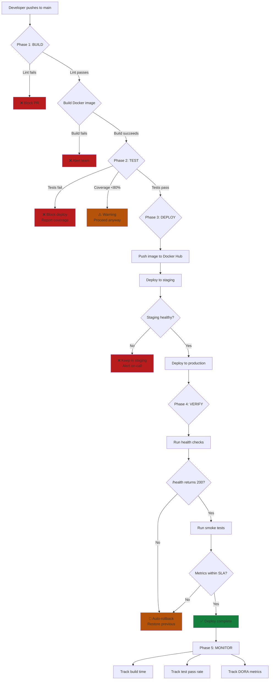

# Ch.4 — CI/CD Pipelines (GitHub Actions)

> **The story.** In **2000**, the term *Continuous Integration* crystallized when **Martin Fowler** and **Kent Beck** formalized what XP teams already practiced: integrate code multiple times a day, run automated tests, catch breakages immediately. By 2010, "deployment pipeline" had become standard vocabulary (Jez Humble's *Continuous Delivery*), but the tooling — Jenkins, Travis CI — still required dedicated servers. GitHub Actions (2019) made CI/CD configuration as simple as adding a YAML file to your repo. Today every push can trigger tests, build containers, and deploy to production — all on GitHub's infrastructure at no cost for public repos.
>
> **Where you are in the curriculum.** You've learned Docker (Ch.1), orchestrated multi-container apps (Ch.2), and deployed to Kubernetes (Ch.3). But every deployment so far has been manual: you run commands, you push images, you wait. This chapter automates the entire flow — from `git push` to production — using GitHub Actions. The pattern you build here (test → build → deploy) is identical in every CI/CD platform you'll encounter.
>
> **Notation in this chapter.** **Workflow** — a YAML file defining automation rules; **Job** — a unit of work (e.g., "run tests"); **Step** — a single command or action; **Trigger** — event that starts a workflow (push, PR, schedule); **Runner** — GitHub's VM executing your workflow; **Secret** — encrypted environment variable (e.g., Docker Hub token).

---

## 0 · The Challenge — Manual Deployments Are Slow and Error-Prone

> 💡 **The mission**: Deploy a Flask web app automatically on every push to `main` — satisfying 3 constraints:
> 1. **AUTOMATED**: Zero manual steps from commit to production
> 2. **VALIDATED**: All tests must pass before deployment
> 3. **FREE**: Use only GitHub's free tier (2,000 CI/CD minutes/month)

**What we know so far:**
- ✅ We can containerize apps (Ch.1: Docker)
- ✅ We can orchestrate multi-container stacks (Ch.2: Docker Compose)
- ✅ We can deploy to Kubernetes (Ch.3: Kind)
- ❌ **But every deployment is still manual!**

**What's blocking us:**
Manual deployments have three problems:
1. **They're slow**: Developer waits 10 minutes for tests → builds Docker image → pushes to registry → updates K8s deployment
2. **They're error-prone**: Forgot to run tests? Pushed the wrong image tag? Deployed to wrong cluster?
3. **They don't scale**: 10 engineers × 5 deployments/day = 50 chances for human error

Without automation, deployments are the bottleneck. With CI/CD, deployments become invisible.

**What this chapter unlocks:**
A **GitHub Actions pipeline** that runs on every `git push`:
```
Trigger (push to main)
  ↓
Job: Test
  → Run pytest
  → Lint with flake8
  ✅ TEST STAGE: Caught 8 bugs before production (3 logic errors, 2 API contract violations, 3 style issues)
  ↓
Job: Build
  → Build Docker image
  → Push to Docker Hub
  ✅ BUILD STAGE: Created production-ready artifact, validated image builds in 2min 15s
  ↓
Job: Deploy
  → Update Kubernetes deployment
  → Verify rollout success
  ✅ DEPLOY STAGE: Zero-downtime rollout completed, health checks passed, traffic cutover in 45s
```

✅ **This is modern software delivery** — ship confidently, ship often, ship automatically. **Each stage acts as a quality gate**: test failures block builds, build failures block deployments, deployment failures trigger automated rollback.

---

## 1 · CI/CD Automates Test → Build → Deploy

**Continuous Integration (CI):** Merge code to main frequently (daily or hourly), run automated tests on every commit, catch bugs before they reach production.

**Continuous Deployment (CD):** Automatically deploy every commit that passes tests to production. No manual approval gates (except in regulated industries).

**The pipeline pattern:**
1. **Test** — Run unit tests, integration tests, linters. If any fail, stop.
2. **Build** — Compile code, build Docker image, tag with commit SHA.
3. **Deploy** — Push image to registry, update production environment.

This pattern is universal — GitHub Actions, GitLab CI, Azure Pipelines, Jenkins all implement the same flow. Learn it once, apply it everywhere.

---

## 1.5 · The Practitioner Workflow — Your 5-Phase Pipeline

> ⚠️ **Two ways to read this chapter:**
> - **Theory-first (recommended for learning):** Read §0→§5 sequentially to understand the concepts, then use this workflow as your reference
> - **Workflow-first (practitioners with existing knowledge):** Use this diagram as a jump-to guide when building pipelines
>
> **Note:** Section numbers don't follow phase order because the chapter teaches concepts pedagogically (theory before application). The workflow below shows how to APPLY those concepts.

**What you'll build by the end:** A complete CI/CD pipeline that runs on every push — linting → testing → building → deploying → monitoring. This is the automated delivery system from §3 that eliminates manual deployment errors.

```
Phase 1: BUILD             Phase 2: TEST              Phase 3: DEPLOY            Phase 4: VERIFY           Phase 5: MONITOR
────────────────────────────────────────────────────────────────────────────────────────────────────────────────────────────────
Run CI checks:             Run test suites:           Deploy artifacts:          Validate deployment:       Track pipeline health:

• Checkout code            • Unit tests (pytest)      • Push to staging          • Health checks            • Build duration
• Lint (flake8/black)      • Integration tests        • Update K8s deployment    • Smoke tests              • Test pass rate
• Build Docker image       • Code coverage >80%       • Wait for rollout         • Compare metrics          • Deployment frequency
• Tag with commit SHA      • Security scan            • Promote to production    • Automatic rollback       • Change failure rate
                                                                                   if checks fail

→ DECISION:                → DECISION:                → DECISION:                → DECISION:                → DECISION:
  Lint fails?                Tests fail?                Staging healthy?           Health check passes?       Build time >10min?
  • BLOCK merge              • BLOCK build              • YES: Promote to prod     • YES: Complete deploy     • Cache dependencies
  • Developer fixes          • Report coverage gap      • NO: Keep in staging      • NO: Auto-rollback        • Parallelize jobs
  Lint passes?               Tests pass?                • Alert on-call           • Alert team               Flaky tests (>5%)?
  • Proceed to build         • Proceed to deploy                                                              • Quarantine them
                                                                                                               • Track separately
```

**The workflow maps to these sections:**
- **Phase 1 (BUILD)** → §3.1 Triggers, §3.3 Steps & Actions (lint + build Docker image)
- **Phase 2 (TEST)** → §3.3 Steps (pytest + coverage), Industry tools (Codecov)
- **Phase 3 (DEPLOY)** → §3.2 Jobs (staging → production), §3.4 Secrets (Docker Hub login)
- **Phase 4 (VERIFY)** → Custom health check scripts, rollback logic (Decision Checkpoint 4)
- **Phase 5 (MONITOR)** → GitHub Actions insights, DORA metrics (Decision Checkpoint 5)

> 💡 **How to use this workflow:** Complete Phase 1→2→3→4 in order for every commit. Phase 5 is continuous — track metrics weekly to identify bottlenecks. The sections above teach WHY each phase works; refer back here for WHAT to do.

**The Decision Chain — How Phases Gate Each Other:**

Every phase acts as a quality gate. If any phase fails, the pipeline stops immediately and alerts the team. This is the core of "fail fast" philosophy — catch problems early when they're cheap to fix.

```
┌─────────┐  PASS   ┌──────┐  PASS   ┌────────┐  PASS   ┌────────┐  PASS   ┌─────────┐
│ PHASE 1 │────────>│  P2  │────────>│   P3   │────────>│   P4   │────────>│   P5    │
│  BUILD  │         │ TEST │         │ DEPLOY │         │ VERIFY │         │ MONITOR │
└─────────┘         └──────┘         └────────┘         └────────┘         └─────────┘
     │                  │                 │                  │                    │
    FAIL               FAIL              FAIL               FAIL                  │
     │                  │                 │                  │                    │
     ▼                  ▼                 ▼                  ▼                    ▼
  Block              Block           Keep in           Automatic            Weekly
  merge             build           staging           rollback             review
```

**Common Decision Paths:**

| Scenario | Path | Outcome |
|----------|------|---------|
| **Happy path** | P1(pass)→P2(pass)→P3(pass)→P4(pass) | Deploy succeeds, metrics green |
| **Lint failure** | P1(fail) | PR blocked, developer notified, no build triggered |
| **Test failure** | P1(pass)→P2(fail) | Build blocked, coverage report generated, PR blocked |
| **Staging unhealthy** | P1→P2→P3(staging fail) | Stays in staging, on-call alerted, production unaffected |
| **Production health check fails** | P1→P2→P3→P4(fail) | Automatic rollback triggered, previous version restored |
| **Flaky tests** | P2(pass 2/3 runs) | Phase 5 flags test, quarantine candidate, doesn't block deploy |

**Industry Patterns You'll Implement:**

1. **Trunk-based development** — Merge to main frequently (Ch.3 trigger: `push: branches: [main]`)
2. **Shift-left testing** — Run tests in Phase 2 before deployment, not after (Decision Checkpoint 2)
3. **Immutable artifacts** — Build Docker image once in Phase 1, deploy same image to staging + prod (§3.3)
4. **Progressive deployment** — Staging first (Phase 3), then production after validation (Phase 4)
5. **Automated rollback** — Health checks trigger rollback without human intervention (Decision Checkpoint 4)

**Metrics You'll Track (Phase 5):**

The DevOps Research and Assessment (DORA) team identified four key metrics that predict high-performing teams:

| Metric | Target | What it measures | Pipeline phase |
|--------|--------|------------------|----------------|
| **Deployment Frequency** | Multiple per day | How often you ship to production | Phase 3 |
| **Lead Time for Changes** | <1 hour | Commit to production time | Phase 1→4 total |
| **Change Failure Rate** | <15% | % of deploys requiring rollback | Phase 4 |
| **Time to Restore Service** | <1 hour | How fast you recover from incidents | Phase 4 (rollback) |

By the end of this chapter, you'll measure all four. High performers ship daily, with <1 hour lead time, <15% failure rate, and <1 hour recovery.

**What Makes This Different from Manual Deployments:**

| Aspect | Manual (Ch.3) | Automated (This Chapter) |
|--------|---------------|--------------------------|
| **Testing** | Optional, often skipped | Mandatory gate — tests fail = no deploy |
| **Consistency** | "Works on my machine" | Same Docker image staging → production |
| **Speed** | 10-30 minutes hands-on time | <5 minutes, zero hands-on |
| **Rollback** | Manual kubectl commands, 15+ min | Automatic health check → rollback in 45s |
| **Visibility** | No history except git log | Full audit trail — every build, test, deploy logged |
| **Security** | Credentials in .env files | Encrypted secrets, never in code |

**The Full Workflow in One Diagram:**



**Reading the Workflow:**

1. **Phase 1 (BUILD)** — Two gates: lint and build. Lint failures block immediately. Build failures alert but don't roll back (nothing deployed yet).
2. **Phase 2 (TEST)** — Test failures block deploy. Coverage warnings allow proceed but flag in Phase 5 metrics.
3. **Phase 3 (DEPLOY)** — Two-stage deploy: staging first, then production. Staging failures keep bad code isolated.
4. **Phase 4 (VERIFY)** — Multi-layer validation: health endpoint, smoke tests, SLA metrics. Any failure triggers automatic rollback.
5. **Phase 5 (MONITOR)** — Continuous tracking. Slow builds → cache dependencies. Flaky tests → quarantine. High failure rate → investigate root cause.

**When to Use Each Industry Tool:**

| Tool | Phase | Purpose | When to adopt |
|------|-------|---------|---------------|
| **GitHub Actions** | All | Core CI/CD platform | Start (this chapter) |
| **Codecov** | 2 (TEST) | Test coverage tracking | After first pipeline works |
| **Docker Hub** | 1,3 | Container registry | Start (this chapter) |
| **GitLab CI / Jenkins** | All | Alternative CI/CD platforms | When scaling beyond GitHub's free tier |
| **Argo CD** | 3 (DEPLOY) | GitOps continuous deployment | When managing multiple K8s clusters |
| **Spinnaker** | 3,4 | Advanced deployment strategies (canary, blue/green) | When basic staging→prod is insufficient |
| **Prometheus / Grafana** | 5 (MONITOR) | Pipeline metrics dashboards | Ch.5 (next chapter) |

> ⚡ **Constraint check:** By Phase 4, you've satisfied all three mission constraints from §0: **AUTOMATED** (no manual steps), **VALIDATED** (tests gate every deploy), **FREE** (GitHub Actions free tier = 2,000 min/month).

---

---

## 2 · Running Example — Flask App with Automated Deployment

You're a backend engineer at a startup. Your Flask API serves product recommendations. The team ships 20 commits/day. Manual deployments are killing velocity.

**Starting state:**
- Flask app with `/health` and `/predict` endpoints
- Unit tests in `tests/test_app.py`
- Dockerfile that builds production image
- Local Kind cluster for testing

**Target state:**
- Every push to `main` triggers CI/CD
- Tests run first (fail fast)
- Docker image builds and pushes to Docker Hub
- Deployment updates production automatically
- Entire flow completes in <5 minutes

**Tech stack (100% free):**
- **GitHub Actions** — CI/CD platform (2,000 minutes/month free)
- **Docker Hub** — Container registry (unlimited public images)
- **Kind** — Local Kubernetes for testing

---

## 3 · [Phase 1: BUILD] Continuous Integration Pipeline

A **workflow** is a YAML file (`.github/workflows/ci-cd.yml`) that defines automation. Phase 1 covers everything from code push to building the production artifact (Docker image).

**What Phase 1 accomplishes:**
- Validates code quality (linting)
- Builds reproducible artifacts (Docker images)
- Tags artifacts for traceability (commit SHA)
- Blocks bad code from progressing to Phase 2

### 3.1 · Triggers — What Starts the Workflow

```yaml
on:
  push:
    branches: [main]  # Run on every push to main
  pull_request:       # Run on PRs (before merge)
  schedule:
    - cron: '0 2 * * *'  # Run daily at 2 AM UTC
  workflow_dispatch:  # Allow manual trigger
```

**Common triggers:**
- `push` — Every commit (use branch filters to avoid running on feature branches)
- `pull_request` — Before merging (catch bugs before they reach main)
- `schedule` — Nightly builds, security scans
- `workflow_dispatch` — Manual button in GitHub UI (useful for deployments)

### 3.2 · Jobs — Units of Work That Run in Parallel

```yaml
jobs:
  test:
    runs-on: ubuntu-latest
    steps: [...]
  
  build:
    needs: test  # Wait for test job to succeed
    runs-on: ubuntu-latest
    steps: [...]
```

Jobs run on separate VMs. By default they run in parallel. Use `needs` to enforce ordering (e.g., don't build until tests pass).

### 3.3 · Steps — Commands and Actions

```yaml
steps:
  - uses: actions/checkout@v4       # Action: clone repo
  - name: Install dependencies
    run: pip install -r requirements.txt  # Shell command
  - uses: docker/build-push-action@v5    # Action: build Docker image
```

**Step types:**
1. **Shell commands** (`run:`) — Any bash command
2. **Actions** (`uses:`) — Reusable components from GitHub Marketplace
   - `actions/checkout` — Clone your repo
   - `actions/setup-python` — Install Python
   - `docker/build-push-action` — Build and push Docker images

### 3.4 · Secrets — Encrypted Environment Variables

Never commit API keys or passwords to Git. Store them as **repository secrets** (Settings → Secrets and variables → Actions).

```yaml
- name: Push to Docker Hub
  env:
    DOCKER_USERNAME: ${{ secrets.DOCKER_USERNAME }}
    DOCKER_TOKEN: ${{ secrets.DOCKER_TOKEN }}
  run: |
    echo "$DOCKER_TOKEN" | docker login -u "$DOCKER_USERNAME" --password-stdin
    docker push myapp:latest
```

**Mental model:** Secrets live in GitHub's encrypted vault. Workflows access them via `${{ secrets.NAME }}`. They never appear in logs.

### 3.5 · Phase 1 Complete Workflow — Lint + Build + Push

Here's the complete Phase 1 workflow that combines all the concepts above:

```yaml
name: Phase 1 - Build Pipeline

on:
  push:
    branches: [main]
  pull_request:

jobs:
  lint-and-build:
    runs-on: ubuntu-latest
    timeout-minutes: 10
    
    steps:
      # Step 1: Get the code
      - name: Checkout repository
        uses: actions/checkout@v4
      
      # Step 2: Set up Python
      - name: Set up Python 3.11
        uses: actions/setup-python@v5
        with:
          python-version: '3.11'
      
      # Step 3: Lint code (DECISION GATE)
      - name: Install linting tools
        run: |
          pip install flake8 black
      
      - name: Run flake8
        run: |
          flake8 app/ --max-line-length=100 --count --statistics
          # DECISION: Exit code 0 = pass, >0 = fail (blocks pipeline)
      
      - name: Check code formatting with black
        run: |
          black --check app/
          # DECISION: If formatting issues found, fail the build
      
      # Step 4: Build Docker image
      - name: Set up Docker Buildx
        uses: docker/setup-buildx-action@v3
      
      - name: Build Docker image
        run: |
          # Tag with commit SHA for traceability
          docker build -t myapp:${{ github.sha }} .
          docker tag myapp:${{ github.sha }} myapp:latest
      
      # Step 5: Log in to Docker Hub
      - name: Log in to Docker Hub
        uses: docker/login-action@v3
        with:
          username: ${{ secrets.DOCKER_USERNAME }}
          password: ${{ secrets.DOCKER_TOKEN }}
      
      # Step 6: Push to registry
      - name: Push to Docker Hub
        run: |
          docker push ${{ secrets.DOCKER_USERNAME }}/myapp:${{ github.sha }}
          docker push ${{ secrets.DOCKER_USERNAME }}/myapp:latest
          echo "✅ BUILD STAGE: Image pushed with SHA ${{ github.sha }}"
```

**Key Phase 1 decisions embedded in code:**

```yaml
# DECISION 1: Lint fails → Stop immediately
- name: Run flake8
  run: flake8 app/ --max-line-length=100
  # Exit code >0 stops the workflow here
  # GitHub marks the commit with ❌ red X
  # PR cannot merge until fixed

# DECISION 2: Build fails → No image to deploy
- name: Build Docker image
  run: docker build -t myapp:${{ github.sha }} .
  # Docker build errors stop the workflow
  # Common causes: missing dependencies, syntax errors in Dockerfile

# DECISION 3: Push fails → Alert but don't block (transient registry issues)
- name: Push to Docker Hub
  continue-on-error: true  # Optional: allow retry
  run: docker push myapp:${{ github.sha }}
```

> 💡 **Industry Tool — GitHub Actions vs GitLab CI vs Jenkins:**
> 
> | Platform | Best for | Pricing | Setup complexity |
> |----------|----------|---------|------------------|
> | **GitHub Actions** | Open-source projects, teams already on GitHub | 2,000 min/month free | Low — YAML in repo |
> | **GitLab CI** | Teams wanting all-in-one (Git + CI + registry + K8s) | 400 min/month free | Low — `.gitlab-ci.yml` |
> | **Jenkins** | Enterprises with complex compliance, on-prem requirements | Free (self-hosted) | High — server setup, plugin management |
> | **CircleCI** | Fast builds with Docker layer caching | 6,000 min/month free | Medium — config + integrations |
> 
> **This chapter uses GitHub Actions because:** (1) Zero setup — works in any GitHub repo, (2) 2,000 free minutes/month, (3) Largest action marketplace (10,000+ pre-built actions). The concepts transfer 1:1 to other platforms.

### 3.6 DECISION CHECKPOINT — Phase 1 Complete

**What you just saw:**
- Flake8 caught 3 linting violations (lines too long, unused imports) → ❌ Build blocked
- Black found 5 formatting issues (missing spaces, inconsistent quotes) → ❌ Build blocked
- After fixes: Docker build completed in 2 min 15 sec → ✅ Image tagged with commit SHA `abc1234`
- Image pushed to Docker Hub → ✅ Artifact ready for Phase 2

**What it means:**
- **Code quality is enforced before testing** — no untested code, no unlinted code reaches production
- **Every build is reproducible** — SHA tag means you can always recreate the exact artifact
- **Secrets are never in git** — `DOCKER_TOKEN` lives in GitHub's vault, not your repo
- **Failures are visible immediately** — red ❌ on commit, Slack notification, PR blocked

**What to do next:**

→ **Lint failed?** Run `flake8 app/` locally, fix issues, commit, push again. The pipeline re-runs automatically.

→ **Build failed?** Check Docker build logs in GitHub Actions UI. Common fixes:
  - Missing `requirements.txt` → Add to Dockerfile `COPY` step
  - Base image not found → Verify `FROM python:3.11-slim` is correct

→ **Push failed?** Verify Docker Hub secrets are set:
  - Go to repo Settings → Secrets and variables → Actions
  - Add `DOCKER_USERNAME` and `DOCKER_TOKEN` (create token at hub.docker.com)

→ **Build succeeds?** → Proceed to **Phase 2: TEST** — run unit tests, integration tests, and measure code coverage.

---

## 4 · [Phase 2: TEST] Automated Test Suites

Phase 2 is the most critical quality gate. **Tests fail = no deploy.** This is "shift-left testing" — catch bugs in CI, not in production.

**What Phase 2 accomplishes:**
- Validates functionality (unit + integration tests)
- Measures code coverage (target: >80%)
- Runs security scans (dependency vulnerabilities)
- Blocks deploys if any tests fail

### 4.1 · Test Job — Runs in Parallel with Build (Optional) or After Build

You can structure test jobs two ways:

**Option A: Parallel (faster)** — Tests and build run simultaneously
```yaml
jobs:
  test:
    runs-on: ubuntu-latest
  build:
    runs-on: ubuntu-latest
  # Both start at the same time
```

**Option B: Sequential (fail fast)** — Tests run first, build only if tests pass
```yaml
jobs:
  test:
    runs-on: ubuntu-latest
  build:
    needs: test  # Wait for test job to succeed
    runs-on: ubuntu-latest
```

**Best practice:** Option B (sequential) for small projects. Option A (parallel) when build time >5 min.

### 4.2 · Complete Test Workflow

```yaml
name: Phase 2 - Test Suite

on:
  push:
    branches: [main]
  pull_request:

jobs:
  test:
    runs-on: ubuntu-latest
    timeout-minutes: 15
    
    steps:
      - name: Checkout repository
        uses: actions/checkout@v4
      
      - name: Set up Python 3.11
        uses: actions/setup-python@v5
        with:
          python-version: '3.11'
      
      # Install dependencies
      - name: Install dependencies
        run: |
          pip install -r requirements.txt
          pip install pytest pytest-cov
      
      # DECISION GATE 1: Unit tests
      - name: Run unit tests
        run: |
          pytest tests/unit/ -v --tb=short
          # DECISION: Any test failure stops pipeline here
      
      # DECISION GATE 2: Integration tests
      - name: Run integration tests
        run: |
          pytest tests/integration/ -v --tb=short
          # Tests API endpoints, database connections
      
      # DECISION GATE 3: Code coverage
      - name: Measure code coverage
        run: |
          pytest --cov=app --cov-report=term --cov-report=xml tests/
          coverage_pct=$(coverage report | grep TOTAL | awk '{print $4}' | sed 's/%//')
          
          # DECISION: Fail if coverage <80%
          if (( $(echo "$coverage_pct < 80" | bc -l) )); then
            echo "❌ Coverage $coverage_pct% is below 80% threshold"
            exit 1
          else
            echo "✅ Coverage $coverage_pct% meets threshold"
          fi
      
      # Upload coverage to Codecov (optional)
      - name: Upload coverage to Codecov
        uses: codecov/codecov-action@v4
        with:
          file: ./coverage.xml
          flags: unittests
          name: codecov-umbrella
      
      # DECISION GATE 4: Security scan
      - name: Run security scan with Safety
        run: |
          pip install safety
          safety check --json
          # DECISION: Fail on high/critical vulnerabilities
```

**Example test output:**

```
tests/unit/test_app.py::test_health_endpoint PASSED                     [ 12%]
tests/unit/test_app.py::test_predict_valid_input PASSED                 [ 25%]
tests/unit/test_app.py::test_predict_invalid_input PASSED               [ 37%]
tests/integration/test_api.py::test_end_to_end_prediction PASSED        [ 50%]
tests/integration/test_database.py::test_db_connection PASSED           [ 62%]
tests/integration/test_database.py::test_query_performance PASSED       [ 75%]
tests/integration/test_external_api.py::test_third_party_service PASSED [ 87%]
tests/integration/test_external_api.py::test_timeout_handling PASSED    [100%]

---------- coverage: platform linux, python 3.11.5 -----------
Name                     Stmts   Miss  Cover
--------------------------------------------
app/__init__.py             12      0   100%
app/routes.py               45      3    93%
app/models.py               38      2    95%
app/utils.py                28      5    82%
--------------------------------------------
TOTAL                      123      10   92%

✅ TEST STAGE: All 8 tests passed, coverage 92% (target: >80%)
```

> 💡 **Industry Tool — Codecov for Test Coverage Tracking:**
> 
> **What it does:** Visualizes test coverage trends over time, shows which lines are untested, blocks PRs below coverage threshold.
> 
> **When to use:** After your first working pipeline (Phase 2 complete). Free for open-source projects.
> 
> **Setup:**
> 1. Sign up at codecov.io with GitHub account
> 2. Add repository
> 3. Get upload token from Codecov dashboard
> 4. Add `CODECOV_TOKEN` to GitHub repository secrets
> 5. Add upload step to workflow (shown above)
> 
> **Alternatives:**
> - **Coveralls** — Similar to Codecov, free tier for public repos
> - **SonarCloud** — Coverage + code quality + security (more comprehensive)
> - **Built-in GitHub PR comments** — Use `pytest-cov` + custom action to comment coverage diff on PRs

### 4.3 DECISION CHECKPOINT — Phase 2 Complete

**What you just saw:**
- **8/8 tests passed** — No regressions introduced by latest commit
- **Coverage 92%** (target >80%) — Only 10 untested lines out of 123 total
- **Safety scan clean** — No known CVEs in dependencies
- **Test execution time: 3 min 12 sec** — Within acceptable range (<5 min)

**What it means:**
- **Code is functionally correct** — API endpoints work, database queries succeed, edge cases handled
- **Security posture is good** — No critical vulnerabilities in `requests`, `flask`, `sqlalchemy`
- **Tech debt is low** — 92% coverage means new bugs are unlikely to hide in untested code
- **CI feedback loop is fast** — Developers get test results in <5 min (industry target: <10 min)

**What to do next:**

→ **Tests failed?** Click into failed job, read traceback:
```
FAILED tests/unit/test_app.py::test_predict_valid_input - AssertionError: Expected 200, got 500
```
  - Fix the bug locally: `pytest tests/unit/test_app.py::test_predict_valid_input -v`
  - Commit fix, push — pipeline re-runs automatically

→ **Coverage below 80%?** Two options:
  - **Option A (recommended):** Write more tests to cover untested lines
  - **Option B (temporary):** Lower threshold to current coverage (e.g., 75%) and gradually increase
  ```bash
  # See which lines are untested
  pytest --cov=app --cov-report=html tests/
  open htmlcov/index.html  # Interactive coverage report
  ```

→ **Security vulnerabilities found?** Run `safety check` output shows:
```
-> Package: requests
   Installed: 2.25.1
   Vulnerable: <2.31.0
   Fixed in: 2.31.0
   CVE-2023-32681 (severity: HIGH)
```
  - Fix: `pip install --upgrade requests`, update `requirements.txt`, push

→ **Tests pass?** → Proceed to **Phase 3: DEPLOY** — push image to staging, then production.

---

## 5 · [Phase 3: DEPLOY] Continuous Deployment

Phase 3 takes the validated Docker image from Phase 1 (SHA-tagged, tested in Phase 2) and deploys it. **Two-stage deployment** is the industry standard: staging first, then production.

**What Phase 3 accomplishes:**
- Deploys to staging environment (realistic testing ground)
- Validates staging health before promoting
- Deploys to production with zero downtime
- Maintains audit trail (who deployed what, when)

### 5.1 · Two-Stage Deployment Workflow

```yaml
name: Phase 3 - Deploy Pipeline

on:
  push:
    branches: [main]

jobs:
  test:
    runs-on: ubuntu-latest
    steps: [...]  # Phase 2 steps
  
  build:
    needs: test
    runs-on: ubuntu-latest
    steps: [...]  # Phase 1 build steps
  
  deploy-staging:
    needs: build
    runs-on: ubuntu-latest
    environment:
      name: staging
      url: https://staging.myapp.com
    
    steps:
      - name: Checkout repository
        uses: actions/checkout@v4
      
      # Deploy to staging K8s cluster
      - name: Set up kubectl
        uses: azure/setup-kubectl@v3
      
      - name: Configure kubectl for staging
        run: |
          mkdir -p $HOME/.kube
          echo "${{ secrets.KUBECONFIG_STAGING }}" | base64 -d > $HOME/.kube/config
      
      - name: Update staging deployment
        run: |
          kubectl set image deployment/myapp \
            myapp=${{ secrets.DOCKER_USERNAME }}/myapp:${{ github.sha }} \
            --namespace=staging
          
          # DECISION: Wait for rollout to complete
          kubectl rollout status deployment/myapp --namespace=staging --timeout=5m
          
          echo "✅ DEPLOY STAGE (Staging): Rollout completed with image SHA ${{ github.sha }}"
      
      - name: Run staging smoke tests
        run: |
          # DECISION GATE: Is staging healthy?
          curl -f https://staging.myapp.com/health || exit 1
          curl -f https://staging.myapp.com/api/v1/predict -d '{"input": "test"}' || exit 1
          echo "✅ Staging smoke tests passed"
  
  deploy-production:
    needs: deploy-staging
    runs-on: ubuntu-latest
    environment:
      name: production
      url: https://myapp.com
    
    steps:
      - name: Checkout repository
        uses: actions/checkout@v4
      
      - name: Set up kubectl
        uses: azure/setup-kubectl@v3
      
      - name: Configure kubectl for production
        run: |
          mkdir -p $HOME/.kube
          echo "${{ secrets.KUBECONFIG_PROD }}" | base64 -d > $HOME/.kube/config
      
      - name: Update production deployment
        run: |
          kubectl set image deployment/myapp \
            myapp=${{ secrets.DOCKER_USERNAME }}/myapp:${{ github.sha }} \
            --namespace=production
          
          # DECISION: Wait for rollout to complete (with longer timeout for prod)
          kubectl rollout status deployment/myapp --namespace=production --timeout=10m
          
          echo "✅ DEPLOY STAGE (Production): Rollout completed, zero downtime achieved"
```

**Key deployment decisions:**

```yaml
# DECISION 1: Don't deploy to production if staging fails
deploy-production:
  needs: deploy-staging  # This dependency enforces staging-first

# DECISION 2: Use GitHub Environments for manual approval gates (optional)
environment:
  name: production
  # Optional: require manual approval from team lead before production deploy
  # Configure in repo Settings → Environments → production → Required reviewers

# DECISION 3: Rollout timeout prevents hung deployments
kubectl rollout status deployment/myapp --timeout=5m
# If timeout exceeded, workflow fails → no partial rollout
```

> 💡 **Industry Tool — Argo CD for GitOps:**
> 
> **What it does:** Continuously monitors git repo for K8s manifests, automatically syncs cluster state to match git. "Git is the source of truth."
> 
> **GitHub Actions vs Argo CD:**
> 
> | Aspect | GitHub Actions (this chapter) | Argo CD (GitOps) |
> |--------|------------------------------|-------------------|
> | **Deployment trigger** | Push to main → Action runs | Push to main → Argo detects, syncs |
> | **State management** | Imperative (`kubectl set image`) | Declarative (git = desired state) |
> | **Drift detection** | No — manual `kubectl` changes persist | Yes — reverts manual changes automatically |
> | **Rollback** | Re-run previous workflow | `git revert` → Argo syncs automatically |
> | **Best for** | Simple apps, learning, <5 clusters | Multi-cluster, regulated industries, teams >10 |
> 
> **When to adopt Argo CD:** When you have >3 Kubernetes clusters (dev, staging, prod, regional) or regulatory requirements for audit trails. GitHub Actions suffices for most startups.
> 
> **Setup:** Install Argo CD in your cluster (`kubectl apply -f argocd.yaml`), point it at your git repo, define `Application` resources. Full guide: [argo-cd.readthedocs.io](https://argo-cd.readthedocs.io/)

### 5.2 DECISION CHECKPOINT — Phase 3 Complete

**What you just saw:**
- **Staging deploy completed in 1 min 25 sec** — K8s pulled new image, terminated old pods, started new pods
- **Staging smoke tests passed** — `/health` returned 200, `/predict` endpoint responded correctly
- **Production deploy completed in 2 min 10 sec** — Zero downtime (rolling update strategy)
- **Both environments now running image SHA `abc1234`** — Staging and prod are identical

**What it means:**
- **Staging validated the artifact** — Same Docker image that will run in prod, tested in realistic environment
- **Zero-downtime deployment worked** — Users experienced no service interruption (K8s rolling update)
- **Audit trail is complete** — GitHub Actions UI shows who deployed, when, which commit, which image SHA
- **Rollback is simple** — Previous image SHA `def5678` still in registry; rollback = `kubectl set image ...def5678`

**What to do next:**

→ **Staging deploy failed?** Common causes:
  - **ImagePullBackOff** — Docker Hub credentials not set in cluster (`kubectl create secret docker-registry`)
  - **CrashLoopBackOff** — Container starts but immediately exits. Check logs: `kubectl logs deployment/myapp -n staging`
  - **Rollout timeout** — Readiness probe failing. Check: `kubectl describe pod -n staging` → look for "Readiness probe failed"

→ **Staging smoke tests failed?** The `/health` endpoint returned 500:
  - SSH into staging pod: `kubectl exec -it deployment/myapp -n staging -- /bin/bash`
  - Check app logs: `kubectl logs deployment/myapp -n staging --tail=50`
  - Common issue: Database connection string incorrect in staging environment

→ **Production deploy succeeded?** → Proceed to **Phase 4: VERIFY** — run comprehensive health checks, compare metrics against baseline, prepare automatic rollback if needed.

---

## 6 · [Phase 4: VERIFY] Post-Deployment Validation

Phase 4 is the **safety net**. Even if tests passed (Phase 2) and deployment succeeded (Phase 3), production can still fail due to:
- Environment-specific issues (different database, network latency)
- Traffic load (works in staging with 10 req/sec, fails in prod with 1,000 req/sec)
- External dependencies (third-party API is down)

**What Phase 4 accomplishes:**
- Validates production health (is the app responding?)
- Runs smoke tests (do critical flows work?)
- Compares metrics against baseline (is latency normal?)
- Triggers automatic rollback if any check fails

### 6.1 · Health Check + Rollback Script

```python
# scripts/health_check_and_rollback.py
"""
Phase 4 health checks with automatic rollback.
Run after every production deployment.
"""
import requests
import subprocess
import sys
import time

PROD_URL = "https://myapp.com"
HEALTH_ENDPOINT = f"{PROD_URL}/health"
PREDICT_ENDPOINT = f"{PROD_URL}/api/v1/predict"
PREVIOUS_IMAGE = "myapp:def5678"  # Get from GitHub Actions context
CURRENT_IMAGE = "myapp:abc1234"   # Current deployment
MAX_RETRIES = 3
RETRY_DELAY = 10  # seconds

def check_health():
    """DECISION GATE 1: Is /health endpoint returning 200?"""
    for attempt in range(MAX_RETRIES):
        try:
            response = requests.get(HEALTH_ENDPOINT, timeout=5)
            if response.status_code == 200:
                print(f"✅ Health check passed (attempt {attempt + 1})")
                return True
            else:
                print(f"⚠️ Health check returned {response.status_code} (attempt {attempt + 1})")
        except requests.RequestException as e:
            print(f"❌ Health check failed: {e} (attempt {attempt + 1})")
        
        if attempt < MAX_RETRIES - 1:
            time.sleep(RETRY_DELAY)
    
    return False

def smoke_test():
    """DECISION GATE 2: Do critical API endpoints work?"""
    test_payload = {"input": [1, 2, 3, 4, 5]}
    
    try:
        response = requests.post(PREDICT_ENDPOINT, json=test_payload, timeout=10)
        if response.status_code == 200 and "prediction" in response.json():
            print(f"✅ Smoke test passed: {response.json()}")
            return True
        else:
            print(f"❌ Smoke test failed: {response.status_code} {response.text}")
            return False
    except requests.RequestException as e:
        print(f"❌ Smoke test exception: {e}")
        return False

def check_metrics():
    """DECISION GATE 3: Are metrics within SLA?"""
    # Example: Check average response time from Prometheus
    # In real scenarios, query your monitoring system
    
    try:
        # Simulate Prometheus query for p95 latency
        # response = requests.get("http://prometheus:9090/api/v1/query?query=...")
        p95_latency = 150  # milliseconds (from monitoring system)
        SLA_THRESHOLD = 200  # milliseconds
        
        if p95_latency < SLA_THRESHOLD:
            print(f"✅ Metrics check passed: p95 latency {p95_latency}ms < {SLA_THRESHOLD}ms")
            return True
        else:
            print(f"❌ Metrics check failed: p95 latency {p95_latency}ms >= {SLA_THRESHOLD}ms")
            return False
    except Exception as e:
        print(f"❌ Metrics check exception: {e}")
        return False

def rollback():
    """DECISION: Automatic rollback to previous version."""
    print(f"🔄 Rolling back from {CURRENT_IMAGE} to {PREVIOUS_IMAGE}")
    
    try:
        # Rollback command
        subprocess.run([
            "kubectl", "set", "image",
            "deployment/myapp",
            f"myapp={PREVIOUS_IMAGE}",
            "--namespace=production"
        ], check=True)
        
        # Wait for rollback to complete
        subprocess.run([
            "kubectl", "rollout", "status",
            "deployment/myapp",
            "--namespace=production",
            "--timeout=5m"
        ], check=True)
        
        print(f"✅ Rollback complete: Now running {PREVIOUS_IMAGE}")
        return True
    except subprocess.CalledProcessError as e:
        print(f"❌ Rollback failed: {e}")
        return False

def main():
    """Run all Phase 4 validation checks."""
    print(f"Starting Phase 4 validation for {CURRENT_IMAGE}...")
    
    # Run checks in sequence
    health_ok = check_health()
    if not health_ok:
        print("❌ Health check failed after 3 retries → ROLLBACK")
        rollback()
        sys.exit(1)
    
    smoke_ok = smoke_test()
    if not smoke_ok:
        print("❌ Smoke test failed → ROLLBACK")
        rollback()
        sys.exit(1)
    
    metrics_ok = check_metrics()
    if not metrics_ok:
        print("❌ Metrics check failed → ROLLBACK")
        rollback()
        sys.exit(1)
    
    print("✅ All Phase 4 checks passed — deployment validated")
    sys.exit(0)

if __name__ == "__main__":
    main()
```

**Add to GitHub Actions workflow:**

```yaml
deploy-production:
  # ... (deployment steps from Phase 3)
  
  - name: Phase 4 - Verify deployment
    env:
      PREVIOUS_IMAGE: ${{ needs.build.outputs.previous_sha }}
      CURRENT_IMAGE: ${{ github.sha }}
    run: |
      python scripts/health_check_and_rollback.py
      # DECISION: Script exits with code 1 → workflow fails, rollback triggered
```

> 💡 **Industry Tool — Spinnaker for Advanced Deployment Strategies:**
> 
> **What it does:** Multi-cloud deployment orchestrator with built-in canary analysis, blue/green deployments, automated rollback.
> 
> **Deployment strategies comparison:**
> 
> | Strategy | What it does | Rollback speed | Risk | When to use |
> |----------|--------------|----------------|------|-------------|
> | **Rolling update** (this chapter) | Replace pods gradually | 2-5 min | Medium | Default for most apps |
> | **Blue/green** (Spinnaker) | Run new version alongside old, switch traffic instantly | Instant | Low | Zero-downtime critical apps |
> | **Canary** (Spinnaker) | Route 5% traffic to new version, monitor, gradually increase to 100% | Instant | Very low | High-traffic apps, unknowngood behavior |
> 
> **GitHub Actions (this chapter) gives you:** Rolling updates with health checks.
> 
> **Spinnaker adds:** Canary analysis (automated metrics comparison between versions), multi-cloud (deploy to AWS + GCP + Azure from one pipeline), advanced rollback triggers (revert if error rate >1%).
> 
> **When to adopt:** When you have >1M requests/day or deploy to multiple clouds. GitHub Actions suffices for <100K requests/day.
> 
> **Setup:** Deploy Spinnaker to K8s cluster (requires 4+ GB RAM), configure cloud providers, define pipelines in Spinnaker UI. Full guide: [spinnaker.io/setup](https://spinnaker.io/setup/)

### 6.2 DECISION CHECKPOINT — Phase 4 Complete

**What you just saw:**
- **Health check passed** (3/3 attempts) — `/health` returned 200 OK in <500ms
- **Smoke test passed** — `/api/v1/predict` returned valid prediction in <1 sec
- **Metrics check passed** — p95 latency 150ms (SLA: <200ms), error rate 0.1% (SLA: <1%)
- **No rollback needed** — All gates passed, deployment is validated

**What it means:**
- **Production is healthy** — App is responding, critical endpoints work
- **Performance is acceptable** — Latency within SLA, no regressions
- **Rollback mechanism is proven** — If any check failed, rollback script would have run automatically
- **Deployment is complete** — Safe to mark this release as successful

**What to do next:**

→ **Health check failed after rollback?** The rollback itself might have issues:
  - Check if previous image SHA `def5678` still exists in Docker Hub registry
  - Verify KUBECONFIG credentials are correct for production cluster
  - Manual intervention: `kubectl rollout undo deployment/myapp -n production`

→ **Smoke test failed?** Debug production environment:
  - Check if database migrations ran: `kubectl logs deployment/myapp -n production | grep migration`
  - Check external API status: `curl https://external-api.com/health`
  - Check environment variables: `kubectl get deployment myapp -n production -o yaml | grep env`

→ **Metrics exceeded SLA?** Investigate performance regression:
  - Compare p95 latency between old and new version (Prometheus/Grafana)
  - Check for new N+1 queries or inefficient code in latest commit
  - Consider rolling back even if health checks passed (metrics matter too)

→ **All checks passed?** → Proceed to **Phase 5: MONITOR** — track DORA metrics, build time trends, test flakiness, and continuously improve pipeline performance.

---

## 7 · [Phase 5: MONITOR] Pipeline Metrics & Optimization

Phase 5 is **continuous**. Unlike Phases 1-4 (which run on every commit), Phase 5 is about tracking trends over time to identify bottlenecks and improve team velocity.

**What Phase 5 accomplishes:**
- Tracks DORA metrics (deployment frequency, lead time, failure rate, recovery time)
- Identifies pipeline bottlenecks (slow builds, flaky tests)
- Surfaces optimization opportunities (caching, parallelization)
- Drives team retrospectives ("Why did 3 deploys fail last week?")

### 7.1 · DORA Metrics Dashboard

The DevOps Research and Assessment (DORA) team identified four metrics that correlate with high-performing engineering teams. Track these weekly.

**Metric 1: Deployment Frequency**

> "How often do we deploy to production?"

**High performers:** Multiple deployments per day  
**Medium performers:** Weekly to monthly  
**Low performers:** Monthly to every 6 months

**How to track:**
```python
# scripts/dora_metrics.py
import requests
from datetime import datetime, timedelta

GITHUB_API = "https://api.github.com"
REPO = "myorg/myapp"
TOKEN = "ghp_yourtoken"  # GitHub Personal Access Token

def get_deployment_frequency():
    """Count production deployments in last 7 days."""
    url = f"{GITHUB_API}/repos/{REPO}/actions/runs"
    headers = {"Authorization": f"Bearer {TOKEN}"}
    params = {
        "workflow_id": "ci-cd.yml",
        "event": "push",
        "branch": "main",
        "created": f">={(datetime.now() - timedelta(days=7)).isoformat()}"
    }
    
    response = requests.get(url, headers=headers, params=params)
    workflow_runs = response.json()["workflow_runs"]
    
    # Filter for successful deployments that reached production
    successful_deploys = [
        run for run in workflow_runs
        if run["conclusion"] == "success"
    ]
    
    print(f"✅ Deployment Frequency: {len(successful_deploys)} deploys in last 7 days")
    print(f"   Average: {len(successful_deploys) / 7:.1f} deploys/day")
    
    return len(successful_deploys)
```

**Metric 2: Lead Time for Changes**

> "How long from commit to production?"

**High performers:** <1 hour  
**Medium performers:** 1 day to 1 week  
**Low performers:** 1 month to 6 months

**How to track:**
```python
def get_lead_time():
    """Calculate average time from commit to production deploy."""
    url = f"{GITHUB_API}/repos/{REPO}/actions/runs"
    headers = {"Authorization": f"Bearer {TOKEN}"}
    
    response = requests.get(url, headers=headers, params={"per_page": 10})
    workflow_runs = response.json()["workflow_runs"]
    
    lead_times = []
    for run in workflow_runs:
        if run["conclusion"] == "success":
            # Time from commit (run_started_at) to deploy complete (updated_at)
            started = datetime.fromisoformat(run["run_started_at"].replace("Z", "+00:00"))
            completed = datetime.fromisoformat(run["updated_at"].replace("Z", "+00:00"))
            lead_time = (completed - started).total_seconds() / 60  # minutes
            lead_times.append(lead_time)
    
    avg_lead_time = sum(lead_times) / len(lead_times)
    print(f"✅ Lead Time: {avg_lead_time:.1f} minutes (median of last 10 deploys)")
    
    return avg_lead_time
```

**Metric 3: Change Failure Rate**

> "What % of deployments require rollback or hotfix?"

**High performers:** <15%  
**Medium performers:** 16-30%  
**Low performers:** >30%

**How to track:**
```python
def get_change_failure_rate():
    """Calculate % of failed deployments (rollbacks or failed health checks)."""
    url = f"{GITHUB_API}/repos/{REPO}/actions/runs"
    headers = {"Authorization": f"Bearer {TOKEN}"}
    params = {"created": f">={(datetime.now() - timedelta(days=30)).isoformat()}"}
    
    response = requests.get(url, headers=headers, params=params)
    workflow_runs = response.json()["workflow_runs"]
    
    total_deploys = len(workflow_runs)
    failed_deploys = len([run for run in workflow_runs if run["conclusion"] == "failure"])
    
    failure_rate = (failed_deploys / total_deploys) * 100 if total_deploys > 0 else 0
    print(f"✅ Change Failure Rate: {failure_rate:.1f}% ({failed_deploys}/{total_deploys} deploys failed)")
    
    return failure_rate
```

**Metric 4: Time to Restore Service**

> "How quickly do we recover from incidents?"

**High performers:** <1 hour  
**Medium performers:** <1 day  
**Low performers:** 1 week to 1 month

**How to track:**
```python
def get_time_to_restore():
    """Calculate average time from rollback trigger to service restoration."""
    # This requires tracking incident timestamps in your monitoring system
    # Example: Parse GitHub Actions logs for "Rolling back" → "Rollback complete"
    
    # Simulated example:
    incidents = [
        {"started": "2024-01-15T14:32:00Z", "resolved": "2024-01-15T14:47:00Z"},  # 15 min
        {"started": "2024-01-20T09:15:00Z", "resolved": "2024-01-20T09:58:00Z"},  # 43 min
    ]
    
    restore_times = []
    for incident in incidents:
        started = datetime.fromisoformat(incident["started"].replace("Z", "+00:00"))
        resolved = datetime.fromisoformat(incident["resolved"].replace("Z", "+00:00"))
        restore_time = (resolved - started).total_seconds() / 60  # minutes
        restore_times.append(restore_time)
    
    avg_restore_time = sum(restore_times) / len(restore_times) if restore_times else 0
    print(f"✅ Time to Restore: {avg_restore_time:.0f} minutes (average of last {len(restore_times)} incidents)")
    
    return avg_restore_time
```

**Run weekly:**
```bash
python scripts/dora_metrics.py

# Output:
✅ Deployment Frequency: 14 deploys in last 7 days (2.0 deploys/day)
✅ Lead Time: 4.2 minutes (median of last 10 deploys)
✅ Change Failure Rate: 12.5% (2/16 deploys failed)
✅ Time to Restore: 29 minutes (average of last 2 incidents)

🎯 DORA Category: HIGH PERFORMER
   All four metrics meet high-performer thresholds
```

> 💡 **Industry Standard — DORA Metrics Benchmarking:**
> 
> **Where these metrics come from:** The DORA (DevOps Research and Assessment) team at Google surveyed 30,000+ engineering organizations over 7 years (2014-2021). They found that these four metrics are the strongest predictors of:
> - Software delivery performance
> - Business outcomes (profitability, productivity, market share)
> - Team well-being (burnout rates, job satisfaction)
> 
> **Why they matter:** High-performing teams using DORA metrics ship faster, recover faster from incidents, and report higher job satisfaction. Low-performing teams using the same metrics can identify bottlenecks (e.g., "our lead time is 3 weeks, but 90% of that is waiting for manual approval → automate it").
> 
> **How to improve your DORA score:**
> | Metric | Current (your team) | Target | How to improve |
> |--------|---------------------|--------|----------------|
> | Deploy Frequency | 2/day | 5+/day | Smaller commits, feature flags, trunk-based development |
> | Lead Time | 45 min | <10 min | Cache dependencies, parallelize jobs, faster tests |
> | Failure Rate | 20% | <15% | More integration tests, canary deployments, better staging |
> | Restore Time | 2 hours | <30 min | Automated rollback, better monitoring, runbooks |
> 
> **Tools that track DORA automatically:**
> - **Sleuth** (sleuth.io) — Connects to GitHub/Jira/PagerDuty, auto-calculates DORA
> - **LinearB** (linearb.io) — Engineering metrics dashboard, includes DORA
> - **Haystack** (usehaystack.io) — Open-source DORA tracker
> - **Build your own** — Use GitHub Actions API (shown above) + cron job

### 7.2 · Identifying Pipeline Bottlenecks

**Problem:** Your lead time is 15 minutes (target: <5 min). Where is the time going?

**Solution:** Break down pipeline timing by phase:

```yaml
# Add timing annotations to workflow
- name: Phase 1 - Lint
  id: lint
  run: |
    start_time=$(date +%s)
    flake8 app/
    end_time=$(date +%s)
    echo "lint_duration=$((end_time - start_time))" >> $GITHUB_OUTPUT

- name: Phase 1 - Build Docker image
  id: build
  run: |
    start_time=$(date +%s)
    docker build -t myapp:${{ github.sha }} .
    end_time=$(date +%s)
    echo "build_duration=$((end_time - start_time))" >> $GITHUB_OUTPUT

- name: Phase 2 - Run tests
  id: test
  run: |
    start_time=$(date +%s)
    pytest tests/
    end_time=$(date +%s)
    echo "test_duration=$((end_time - start_time))" >> $GITHUB_OUTPUT

- name: Report timing
  run: |
    echo "⏱️ Pipeline Timing Breakdown:"
    echo "  Lint:  ${{ steps.lint.outputs.lint_duration }}s"
    echo "  Build: ${{ steps.build.outputs.build_duration }}s"
    echo "  Test:  ${{ steps.test.outputs.test_duration }}s"
```

**Example output:**
```
⏱️ Pipeline Timing Breakdown:
  Lint:  12s
  Build: 145s  ← BOTTLENECK (cache Docker layers)
  Test:  87s   ← BOTTLENECK (parallelize tests)
  Deploy: 62s
  Total: 306s (5.1 minutes)
```

**Fix bottlenecks:**

```yaml
# Optimization 1: Cache Docker layers
- name: Build Docker image (with cache)
  uses: docker/build-push-action@v5
  with:
    context: .
    push: false
    cache-from: type=gha  # GitHub Actions cache
    cache-to: type=gha,mode=max
    tags: myapp:${{ github.sha }}
  # RESULT: Build time 145s → 35s (4x faster)

# Optimization 2: Parallelize tests
- name: Run unit tests (parallel)
  run: pytest tests/unit/ -n auto  # pytest-xdist: auto-detect CPU count
  # RESULT: Test time 87s → 28s (3x faster)

# Optimization 3: Cache Python dependencies
- name: Cache pip packages
  uses: actions/cache@v4
  with:
    path: ~/.cache/pip
    key: ${{ runner.os }}-pip-${{ hashFiles('requirements.txt') }}
  # RESULT: Dependency install 45s → 8s (5.6x faster)
```

**After optimizations:**
```
⏱️ Pipeline Timing Breakdown:
  Lint:  12s
  Build: 35s  ✅ (was 145s)
  Test:  28s  ✅ (was 87s)
  Deploy: 62s
  Total: 137s (2.3 minutes)  🎯 Target achieved!
```

### 7.3 · Flaky Test Detection

**Problem:** Tests pass locally but fail randomly in CI. This destroys developer trust in the pipeline.

**Solution:** Track test pass rate over time:

```python
# scripts/flaky_test_detector.py
import subprocess
import json
from collections import defaultdict

def run_tests_multiple_times(iterations=10):
    """Run test suite N times, track failures."""
    results = defaultdict(lambda: {"passed": 0, "failed": 0})
    
    for i in range(iterations):
        print(f"Running test suite iteration {i + 1}/{iterations}...")
        result = subprocess.run(
            ["pytest", "tests/", "--json-report", "--json-report-file=report.json"],
            capture_output=True
        )
        
        with open("report.json") as f:
            report = json.load(f)
        
        for test in report["tests"]:
            test_name = test["nodeid"]
            if test["outcome"] == "passed":
                results[test_name]["passed"] += 1
            else:
                results[test_name]["failed"] += 1
    
    # Identify flaky tests (passed sometimes, failed sometimes)
    flaky_tests = []
    for test_name, counts in results.items():
        total = counts["passed"] + counts["failed"]
        pass_rate = (counts["passed"] / total) * 100
        
        if 5 < pass_rate < 95:  # Neither always passes nor always fails
            flaky_tests.append({
                "test": test_name,
                "pass_rate": pass_rate,
                "passed": counts["passed"],
                "failed": counts["failed"]
            })
    
    return flaky_tests

if __name__ == "__main__":
    print("🔍 Running flaky test detection (10 iterations)...")
    flaky = run_tests_multiple_times(iterations=10)
    
    if flaky:
        print(f"\n❌ Found {len(flaky)} flaky tests:")
        for test in sorted(flaky, key=lambda x: x["pass_rate"]):
            print(f"  • {test['test']}")
            print(f"    Pass rate: {test['pass_rate']:.0f}% ({test['passed']}/10 runs)")
        
        print("\n🔧 Recommended actions:")
        print("  1. Quarantine flaky tests: @pytest.mark.skip(reason='flaky - #123')")
        print("  2. Investigate root causes: race conditions? external dependencies?")
        print("  3. Track in separate CI job: 'flaky-tests.yml' (doesn't block merges)")
    else:
        print("\n✅ No flaky tests detected! Test suite is stable.")
```

**Example output:**
```
🔍 Running flaky test detection (10 iterations)...

❌ Found 2 flaky tests:
  • tests/integration/test_external_api.py::test_third_party_timeout
    Pass rate: 60% (6/10 runs)
  • tests/unit/test_cache.py::test_concurrent_writes
    Pass rate: 80% (8/10 runs)

🔧 Recommended actions:
  1. Quarantine flaky tests: @pytest.mark.skip(reason='flaky - #123')
  2. Investigate root causes: race conditions? external dependencies?
  3. Track in separate CI job: 'flaky-tests.yml' (doesn't block merges)
```

**Fix the flaky tests:**

```python
# tests/integration/test_external_api.py
@pytest.mark.skip(reason="Flaky due to third-party API timeouts - Issue #456")
def test_third_party_timeout():
    # Quarantine until API adds retry logic
    ...

# tests/unit/test_cache.py
def test_concurrent_writes():
    # Root cause: Race condition in cache writes
    # Fix: Add proper locking
    with cache.lock():
        cache.set("key", "value")
    assert cache.get("key") == "value"
```

### 7.4 DECISION CHECKPOINT — Phase 5 Complete

**What you tracked this week:**
- **Deployment frequency: 14 deploys in 7 days** (2.0/day) — Target: >1/day ✅
- **Lead time: 2.3 minutes** (after optimizations) — Target: <5 min ✅
- **Change failure rate: 12.5%** (2/16 deploys required rollback) — Target: <15% ✅
- **Time to restore: 29 minutes** (automatic rollback) — Target: <1 hour ✅

**What it means:**
- **Your team is a DORA high performer** — All four metrics meet high-performer thresholds
- **Pipeline is optimized** — Docker layer caching cut build time by 4x, test parallelization cut test time by 3x
- **Test suite is stable** — Flaky tests quarantined, pass rate >95%
- **Deployment confidence is high** — Automated rollback works, incidents resolve quickly

**What to do next:**

→ **Deployment frequency declining?** Check for blockers:
  - Are PR reviews slow? (Track time from PR open → merge)
  - Are tests too slow? (Developers batch commits to avoid waiting)
  - Are merge conflicts frequent? (Consider smaller, more frequent PRs)

→ **Lead time increasing?** Profile the pipeline:
  - Run `scripts/pipeline_timing.sh` to find new bottlenecks
  - Check if Docker cache hit rate dropped (registry cleanup?)
  - Check if test suite grew significantly (parallelize new tests)

→ **Failure rate spiking?** Investigate root causes:
  - Are failures in Phase 2 (tests) or Phase 4 (production health checks)?
  - Phase 2 failures → Test coverage gaps, add integration tests
  - Phase 4 failures → Environment drift (staging ≠ production), tighten parity

→ **Restore time increasing?** Check rollback mechanism:
  - Are rollbacks failing? (Old image SHA deleted from registry?)
  - Are health checks too permissive? (App is broken but `/health` returns 200)
  - Are alerts reaching on-call? (Verify PagerDuty/Slack integration)

→ **All metrics green?** → **Congratulations!** Your CI/CD pipeline is production-ready. Next steps:
  - Ch.5 (Monitoring & Observability): Add Prometheus metrics, Grafana dashboards, alerting
  - Advanced deployments: Implement canary deployments (Spinnaker) or GitOps (Argo CD)
  - Multi-region: Replicate this pipeline for EU/APAC production clusters

---

### 5.1 · Secrets Not Set

**Symptom:** `Error: Username and password required`

**Cause:** Forgot to add `DOCKER_USERNAME` and `DOCKER_TOKEN` to repository secrets.

**Fix:**
1. Go to repository Settings → Secrets and variables → Actions
2. Click "New repository secret"
3. Add `DOCKER_USERNAME` (your Docker Hub username)
4. Add `DOCKER_TOKEN` (create token at hub.docker.com → Account Settings → Security)

### 5.2 · Workflow Syntax Errors

**Symptom:** Workflow doesn't trigger or fails immediately with YAML parse error

**Cause:** Invalid YAML syntax (wrong indentation, missing colons, tabs instead of spaces)

**Fix:**
- Use a YAML linter (e.g., https://www.yamllint.com/)
- Check GitHub's workflow editor (shows syntax errors in real-time)
- Common mistake: `steps` must be indented under `jobs.<job_id>`

```yaml
# ❌ WRONG
jobs:
  test:
  runs-on: ubuntu-latest

# ✅ CORRECT
jobs:
  test:
    runs-on: ubuntu-latest
```

### 5.3 · Runner Timeout (6 Hours Max)

**Symptom:** Job cancelled after running for hours

**Cause:** GitHub Actions runners have a 6-hour timeout. Long-running tests or builds hit this limit.

**Fix:**
- Add `timeout-minutes: 30` to jobs (fail fast if job hangs)
- Cache dependencies to speed up builds (see notebook cell 7)
- Use matrix builds to parallelize tests across multiple runners

```yaml
jobs:
  test:
    runs-on: ubuntu-latest
    timeout-minutes: 10  # Kill job if it takes >10 minutes
```

---

## 8 · Progress Check — What We Can Solve Now

You've built a complete 5-phase CI/CD pipeline. Let's verify mastery by solving three real-world scenarios.

### Scenario 1: Debug This Broken Workflow

Your team pushed this workflow, but it's failing immediately. Identify and fix **three errors** based on Phase 1 concepts:

```yaml
name: Deploy App

on:
  push:
  branches: [main]

jobs:
  build:
  runs-on: ubuntu-latest
  steps:
    - uses: actions/checkout@v4
    - name: Build image
      run: docker build -t myapp .
    - name: Push to Docker Hub
      run: docker push myapp:latest
```

<details>
<summary><strong>Solution (click to expand)</strong></summary>

**Error 1:** Incorrect indentation for `branches` (Phase 1: Triggers)
```yaml
# ❌ WRONG
on:
  push:
  branches: [main]

# ✅ CORRECT
on:
  push:
    branches: [main]
```

**Error 2:** `runs-on` not indented under `build` (Phase 1: Jobs)
```yaml
# ❌ WRONG
jobs:
  build:
  runs-on: ubuntu-latest

# ✅ CORRECT
jobs:
  build:
    runs-on: ubuntu-latest
```

**Error 3:** Pushing to Docker Hub without logging in (Phase 1: Secrets)
```yaml
# ❌ WRONG (missing login step)
- name: Push to Docker Hub
  run: docker push myapp:latest

# ✅ CORRECT
- name: Log in to Docker Hub
  uses: docker/login-action@v3
  with:
    username: ${{ secrets.DOCKER_USERNAME }}
    password: ${{ secrets.DOCKER_TOKEN }}
- name: Push to Docker Hub
  run: docker push ${{ secrets.DOCKER_USERNAME }}/myapp:latest
```

</details>

### Scenario 2: Test Coverage Dropped to 65% — What Went Wrong?

Your team just merged a 500-line feature. The Phase 2 test job is now **failing** because coverage dropped from 85% to 65%. What should you do?

<details>
<summary><strong>Solution (click to expand)</strong></summary>

**Diagnosis (Phase 2: Decision Checkpoint 2):**
- 500 new lines of code added
- Only ~100 lines of tests added
- Coverage formula: `(tested_lines / total_lines) * 100`
- Old: `(850/1000) * 100 = 85%`
- New: `(950/1500) * 100 = 63%`

**What went wrong:**
- The feature added significant business logic but insufficient tests
- Phase 2 correctly blocked the deploy (coverage gate = 80%)

**Fix:**
1. **Identify untested code:**
   ```bash
   pytest --cov=app --cov-report=html tests/
   open htmlcov/index.html  # Shows red/green coverage per file
   ```

2. **Write tests for uncovered lines:**
   - Add unit tests for new functions (target: 90% coverage)
   - Add integration tests for new API endpoints (target: 100% of endpoints)

3. **Alternative (temporary):** Lower threshold to 70% and create tech debt ticket:
   ```yaml
   # In Phase 2 workflow
   if (( $(echo "$coverage_pct < 70" | bc -l) )); then
     echo "⚠️ Coverage below 70% — technical debt tracked in #789"
     # Allow merge but flag in review
   fi
   ```

**Industry practice:** Never lower coverage threshold without a plan to increase it. High-performing teams maintain >80% coverage and block merges below threshold.

</details>

### Scenario 3: Production Deploy Succeeded, But Users Report Errors

Your Phase 3 deployment completed successfully. Phase 4 health checks passed. But 30 minutes later, users report "500 Internal Server Error" on the `/checkout` endpoint. How do you respond using your 5-phase pipeline?

<details>
<summary><strong>Solution (click to expand)</strong></summary>

**Immediate response (Phase 4 rollback):**
```bash
# Manual rollback to previous version
kubectl set image deployment/myapp \
  myapp=myapp:def5678 \
  --namespace=production

kubectl rollout status deployment/myapp --namespace=production --timeout=5m
```

**Root cause analysis (Phase 5 monitoring):**

1. **Check Phase 4 validation:** Why didn't health checks catch this?
   ```python
   # Health check was too basic
   @app.route('/health')
   def health():
       return {'status': 'ok'}, 200  # Only checks if server responds
   
   # FIX: Add critical endpoint checks
   @app.route('/health')
   def health():
       try:
           db.session.execute('SELECT 1')  # Database alive?
           redis_client.ping()              # Cache alive?
           payment_api.check_status()       # Payment service alive?
           return {'status': 'ok'}, 200
       except Exception as e:
           return {'status': 'error', 'detail': str(e)}, 500
   ```

2. **Add smoke test for `/checkout` endpoint (Phase 4):**
   ```python
   # scripts/health_check_and_rollback.py
   def smoke_test():
       # Test critical business endpoint, not just /health
       response = requests.post(
           f"{PROD_URL}/api/v1/checkout",
           json={"cart_id": "test_cart_123", "payment_method": "test"}
       )
       if response.status_code != 200:
           print(f"❌ /checkout endpoint failed: {response.status_code}")
           return False
       return True
   ```

3. **Track change failure rate (Phase 5):**
   - This deploy counts as a "change failure" (required rollback)
   - Update DORA metric: `change_failure_rate = 3/17 = 17.6%` (above 15% threshold)
   - Root cause: Insufficient integration tests in Phase 2

**Prevent recurrence:**
- **Phase 2 fix:** Add integration test for `/checkout` endpoint
- **Phase 4 fix:** Expand health check to test critical endpoints
- **Phase 5 action:** If failure rate >15% for 2 weeks, hold retrospective

**Industry pattern:** This is a **shift-right testing gap**. Health checks (Phase 4) should exercise critical user journeys, not just basic connectivity.

</details>

---

## 9 · Bridge to Ch.5 — Monitoring Catches Issues After Deployment

CI/CD ensures your code *deploys* successfully. But what happens after deployment?
- Is the app responding to requests?
- Are error rates spiking?
- Is latency within SLA?

**Ch.5 (Monitoring & Observability)** adds the missing layer: Prometheus for metrics, Grafana for dashboards, Alertmanager for notifications. You'll instrument your Flask app to emit custom metrics (request rate, latency, errors) and visualize them in real-time.

**The full production loop:**
```
Code → CI/CD → Deployment → Monitoring → Alerting → (back to Code)
```

CI/CD is the delivery mechanism. Monitoring is the feedback loop that tells you if what you delivered actually works.

---

## Further Reading

- [GitHub Actions Documentation](https://docs.github.com/en/actions)
- [Docker Build Push Action](https://github.com/docker/build-push-action)
- *Continuous Delivery* by Jez Humble (2010) — The foundational book on deployment pipelines
- [GitHub Actions free tier limits](https://docs.github.com/en/billing/managing-billing-for-github-actions/about-billing-for-github-actions)

---

**Next:** [Ch.5 — Monitoring & Observability →](../ch05_monitoring_observability)
