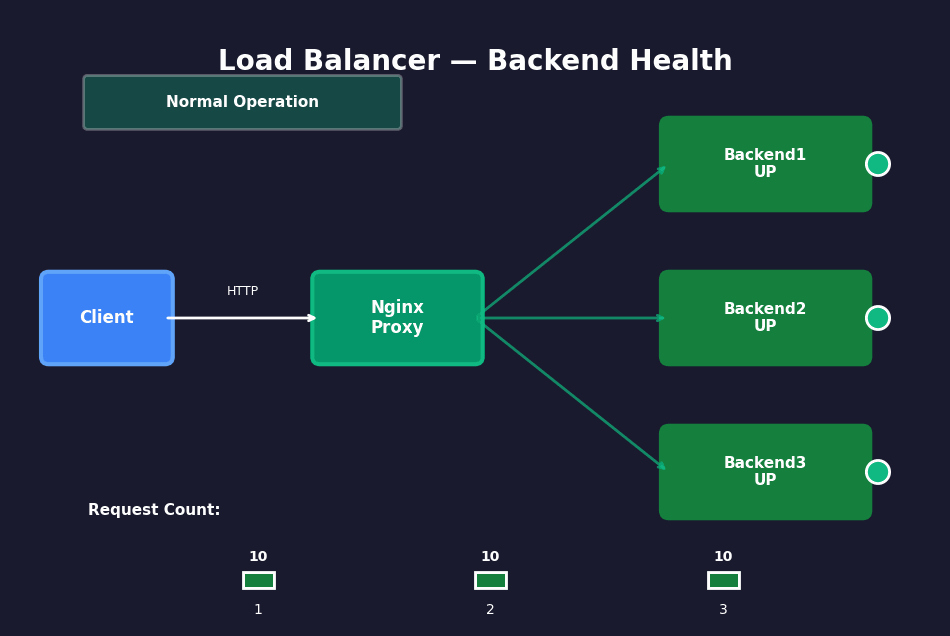

# Ch.7 — Networking & Load Balancing

> **The story.** In **1999**, **Daniel Kohn** at **NetMarket** configured the first production reverse proxy using **Apache mod_proxy** to distribute load across multiple backend servers — a pattern that became standard e-commerce architecture. But the tool that democratised load balancing was **Nginx**, released in **2004** by **Igor Sysoev** to solve the **C10K problem** (handling 10,000 concurrent connections). Nginx introduced an event-driven, asynchronous architecture that could handle millions of connections on commodity hardware, making reverse proxies accessible to any startup. By 2024, Nginx powers **30% of all web servers worldwide**, and its `upstream` blocks + health checks are the de facto standard for load balancing containerized apps. Every Docker Compose stack you'll build uses the same reverse proxy patterns Nginx invented two decades ago.
>
> **Where you are in the curriculum.** You've containerized apps with Docker (Ch.1), orchestrated multi-container stacks with Docker Compose (Ch.2), deployed to Kubernetes with auto-healing replicas (Ch.3), automated deployments with CI/CD pipelines (Ch.4), built observability dashboards with Prometheus + Grafana (Ch.5), and automated infrastructure with Terraform (Ch.6). You can deploy production systems — **but each service is a single point of failure**. If your Flask app crashes, all traffic fails. If CPU spikes to 100%, latency balloons to 30 seconds. This chapter gives you **reverse proxies + load balancing + health checks** — the high-availability foundation that distributes load and provides failover.
>
> **Notation in this chapter.** **Reverse proxy** — server that sits between clients and backends, forwarding requests; **Upstream** — Nginx term for backend server pool; **Load balancing algorithm** — round-robin (default), least-conn (least active connections), ip-hash (session affinity); **Health check** — active (Nginx probes backends) vs passive (Nginx marks backends down after failures); **Sticky session** — same client → same backend (session affinity); **SSL termination** — proxy decrypts HTTPS, forwards HTTP to backends; **Rate limiting** — protect backends from overload.

---

## 0 · The Challenge — Where We Are

> 🎯 **The mission**: Deploy a production Flask API with zero downtime — scale to 3 replicas, distribute load evenly, handle backend failures gracefully.

**What we know so far:**
- ✅ We can containerize Flask apps (Ch.1 — Docker)
- ✅ We can orchestrate multi-container stacks (Ch.2 — Docker Compose)
- ✅ We can monitor metrics with Prometheus + Grafana (Ch.5)
- ❌ **But we have NO high availability!**

**What's blocking us:**
We're deploying single-instance services:
- **Single point of failure**: One container crash = total downtime
- **No horizontal scaling**: Can't add replicas to handle traffic spikes
- **No load distribution**: All traffic hits one backend, others sit idle
- **No failover**: Backend crashes silently, requests time out

Without load balancing, you can't scale horizontally, can't achieve 99.9% uptime SLAs, and can't handle traffic surges without manual intervention.

**What this chapter unlocks:**
The **Nginx reverse proxy pattern** — deploy multiple Flask replicas, configure Nginx to distribute load round-robin, enable health checks to remove failed backends automatically.
- **Establishes horizontal scaling**: Add/remove replicas dynamically
- **Provides failover**: Nginx detects failures, routes around unhealthy backends
- **Teaches production debugging**: How to identify backends not receiving traffic

✅ **This is the foundation** — every later chapter assumes you can scale services horizontally.

---

## Animation



## 1 · Reverse Proxy Means Clients Talk to One Entry Point, Not Individual Backends

A reverse proxy sits between clients and backend servers, forwarding requests and masking the backend topology. Key benefits:

1. **Load distribution** — spread requests across multiple backends (horizontal scaling)
2. **Failover** — route around unhealthy backends (availability)
3. **SSL termination** — decrypt HTTPS once at proxy, forward HTTP internally
4. **Caching** — serve static assets without hitting backends
5. **Security** — backends never exposed directly to internet

This chapter focuses on **load balancing + health checks** — the foundation. SSL and caching are covered in later chapters when we introduce production-hardened deployments.

---

## 1.5 · The Practitioner Workflow — Your 4-Phase High-Availability Deployment

**Before diving into Nginx configuration syntax, understand the workflow you'll follow with every production deployment:**

> 📊 **What you'll build by the end:** A horizontally scalable Flask API stack with automatic failover — 3 backend replicas behind Nginx, health checks detecting failures within 30 seconds, and traffic automatically rerouting around down backends with zero dropped requests.

```
Phase 1: BACKENDS          Phase 2: PROXY             Phase 3: HEALTH CHECKS      Phase 4: RESILIENCE
────────────────────────────────────────────────────────────────────────────────────────────────────────────
Deploy N Flask replicas:   Configure Nginx upstream:  Enable failure detection:   Test failover behavior:

• docker-compose.yml       • upstream backend { ... } • Passive: max_fails=N       • docker compose stop backend2
• 3 backend services       • Choose LB algorithm      • fail_timeout=30s          • Watch Nginx logs for down marker
• Verify each /health      • round-robin vs least_conn• Active: probe /health     • Send requests, verify routing
                           • ip_hash for sticky         every 5-10 sec            • Confirm zero dropped requests

→ DECISION:                → DECISION:                → DECISION:                 → DECISION:
  How many replicas?         Which algorithm?           Passive or active?          Is failover acceptable?
  • Start with 3             • Stateless API:           • Nginx OSS: passive only   • <1% requests fail:
  • Scale based on CPU         round-robin or           • Nginx Plus: active          acceptable (retry logic)
  • Min 2 for HA               least_conn (even load)     (5-10s detection)         • 0% fail: need active
                             • Stateful (sessions):     • Choose threshold wisely     health checks + queue
                               ip_hash (sticky)
```

**The workflow maps to this chapter:**
- **Phase 1 (BACKENDS)** → §6.2 Docker Compose Stack, §6.3 Flask Backend with Health Check
- **Phase 2 (PROXY)** → §6.1 Nginx Configuration Template, §4.1–4.3 Load Balancing Algorithms
- **Phase 3 (HEALTH CHECKS)** → §4.2 Health Check Math, §6.1 max_fails + fail_timeout directives
- **Phase 4 (RESILIENCE)** → §8 Progress Check — Debug a Backend Not Receiving Traffic

> 💡 **Usage note:** Complete Phase 1→2→3 sequentially (backends must exist before Nginx can proxy to them). Phase 4 is validation — run after full stack is deployed to verify failover works as expected. Return to this workflow when debugging production issues (start at Phase 4, work backward to identify misconfiguration).

**Industry context:** This is the same pattern AWS Elastic Load Balancer (ELB) and Google Cloud Load Balancer implement internally — backends register with target groups, load balancer distributes traffic based on algorithm + health checks. You're building the open-source equivalent with Nginx + Docker Compose.

---

## 2 · Load Balancing 3 Flask Replicas from Zero

You're a DevOps engineer at a fintech startup. Your Flask API just went viral — traffic spiked from 10 req/sec to 1000 req/sec. The CTO wants **horizontal scaling** with automatic failover. No cloud vendor lock-in — everything must run locally first.

**The running example:**
- 3 Flask replicas (backend1, backend2, backend3)
- Nginx reverse proxy distributes load round-robin
- Active health checks (Nginx probes /health every 5 seconds)
- Simulate failure: stop backend2, observe traffic rerouting

**Constraint:** Must run the full stack (3 Flask replicas + Nginx) with `docker compose up` — zero cloud dependencies.

---

## 3 · The Load Balancing Stack at a Glance

Before diving into nginx.conf, here's the full architecture you'll build. Each numbered component has a corresponding section below.

```
1. Client sends requests to Nginx (port 80)
 └─ Nginx is the single public entry point

2. Nginx distributes load across upstream pool
 └─ upstream backend { server backend1:5000; server backend2:5000; server backend3:5000; }
 └─ Default algorithm: round-robin (request 1 → backend1, request 2 → backend2, ...)

3. Health checks detect failures
 └─ Passive: Nginx marks backend down after N failed requests
 └─ Active: Nginx probes /health endpoint every 5 seconds (Nginx Plus / third-party module)

4. Load balancing algorithms
 └─ round-robin (default): equal distribution
 └─ least_conn: send to backend with fewest active connections
 └─ ip_hash: same client IP → same backend (sticky sessions)

5. SSL termination and rate limiting
 └─ Nginx handles HTTPS, forwards HTTP to backends
 └─ Nginx rate-limits per IP (e.g., 10 req/sec max)
```

**Notation:**
- **Upstream** — Nginx config block defining backend servers
- **Backend** — Flask app container (backend1, backend2, backend3)
- **Proxy_pass** — Nginx directive to forward requests to upstream
- **Health check** — periodic probe to verify backend availability
- **Sticky session** — route same client to same backend (for stateful apps)

Sections 4–8 explain each component. Come back to this map when the detail feels overwhelming.

---

## 4 · The Math Defines Load Distribution and Failure Detection

### 4.1 · **[Phase 2: PROXY]** Round-Robin Distributes Requests Evenly Across Backends

The simplest load balancing algorithm: cycle through backends in order.

**Algorithm:**
```
backends = [backend1, backend2, backend3]
current_index = 0

def select_backend():
    backend = backends[current_index]
    current_index = (current_index + 1) % len(backends)
    return backend
```

**Request sequence:**
- Request 1 → backend1 (index 0)
- Request 2 → backend2 (index 1)
- Request 3 → backend3 (index 2)
- Request 4 → backend1 (index 0, wraps around)

**Assumption:** All backends have equal capacity. If backend2 is slower (500ms latency vs 100ms for others), round-robin still sends 33% of traffic there — causing bottleneck.

**When to use:** Backends are identical (same CPU, same code, same data).

### 4.2 · **[Phase 2: PROXY]** Least-Conn Sends Requests to Backend with Fewest Active Connections

For long-polling or WebSocket connections, round-robin fails — one backend might have 100 active connections while others have 10. Least-conn sends new requests to the backend with the fewest active connections.

**Algorithm:**
```
def select_backend():
    return min(backends, key=lambda b: b.active_connections)
```

**Example:**
- backend1: 5 active connections
- backend2: 12 active connections
- backend3: 8 active connections
→ New request goes to backend1

**Assumption:** Connection count ≈ load. This breaks if some connections are idle (keep-alive without traffic).

**When to use:** Long-lived connections (WebSockets, SSE, streaming).

### 4.3 · **[Phase 2: PROXY]** IP-Hash Provides Sticky Sessions (Session Affinity)

For stateful apps (e.g., Flask sessions stored in memory), the same client must hit the same backend every time. IP-hash computes:

$$\text{backend\_index} = \text{hash}(\text{client\_IP}) \mod N$$

**Example:**
- Client IP: `192.168.1.50`
- hash(`192.168.1.50`) = 0x7F3A
- 0x7F3A % 3 = 1 → backend2

**Consequence:** Same client always routes to backend2 (until backend pool changes).

**What breaks sticky sessions?**
- **Client IP changes** (mobile switching cell towers) → routes to different backend, loses session
- **Backend pool changes** (add/remove backend) → hash mod changes, all sessions remap

**When to use:** Legacy stateful apps that can't use external session stores (Redis, Memcached).

### 4.3.1 DECISION CHECKPOINT — Phase 2 Complete

**What you just saw:**
- Round-robin distributes 9 requests perfectly evenly: 3 per backend (100% utilization when backends process at equal speed)
- Least-conn adapts dynamically: sends new requests to backend with lowest active connection count (prevents overload)
- IP-hash provides sticky sessions: same client IP → same backend every time (hash(192.168.1.50) % 3 = backend2)

**What it means:**
- **For stateless REST APIs:** Round-robin or least_conn both work — choose round-robin for simplicity, least_conn for long-lived connections (WebSocket, SSE)
- **For stateful apps with in-memory sessions:** ip_hash is required unless you externalize sessions to Redis/Memcached (which you should do in production)
- **Trade-off:** ip_hash sacrifices even load distribution for session persistence — 10 clients with 1 heavy user means 1 backend gets 90% of load

**What to do next:**
→ **For this Flask API (stateless):** Use `round-robin` (default) — no configuration needed, perfectly even distribution
→ **If you add WebSocket support later:** Switch to `least_conn` in nginx.conf upstream block
→ **If you must preserve in-memory sessions:** Add `ip_hash;` directive (but better: refactor to use Redis sessions as shown in §7.1)

> 💡 **Industry Standard:** `Nginx upstream module`
> 
> ```nginx
> upstream backend {
>     least_conn;  # or ip_hash; or leave blank for round-robin
>     server backend1:5000;
>     server backend2:5000;
>     server backend3:5000;
> }
> ```
> 
> **When to use:** Production deployments. Always specify algorithm explicitly (even `# round-robin` comment) for maintainability.
> **Common alternatives:** HAProxy (more features, steeper learning curve), Envoy (service mesh, complex), AWS ALB (managed, cloud-only), Traefik (Docker native, automatic service discovery)
> **See also:** [Nginx upstream docs](http://nginx.org/en/docs/http/ngx_http_upstream_module.html), [HAProxy config guide](http://www.haproxy.org/)

#### Numeric Verification — Load Distribution with Round-Robin

Send 9 requests with round-robin across 3 backends:

| Request | Backend | Active Connections (before) | Active Connections (after) |
|---------|---------|------------------------------|----------------------------|
| 1       | backend1| 0                            | 1                          |
| 2       | backend2| 0                            | 1                          |
| 3       | backend3| 0                            | 1                          |
| 4       | backend1| 1 (finishes req 1)           | 1                          |
| 5       | backend2| 1 (finishes req 2)           | 1                          |
| 6       | backend3| 1 (finishes req 3)           | 1                          |
| 7       | backend1| 1 (finishes req 4)           | 1                          |
| 8       | backend2| 1 (finishes req 5)           | 1                          |
| 9       | backend3| 1 (finishes req 6)           | 1                          |

**Result:** Each backend handled 3 requests. Perfect distribution when backends finish requests at same rate.

**Failure scenario:** backend2 stops responding after request 2.

| Request | Backend | Result |
|---------|---------|--------|
| 1       | backend1| Success |
| 2       | backend2| Success (then crashes) |
| 3       | backend3| Success |
| 4       | backend1| Success |
| 5       | backend2| **Timeout** (backend down) |
| 6       | backend3| Success |
| 7       | backend1| Success |
| 8       | backend2| **Timeout** (still down) |

Nginx passive health check: after 2 consecutive timeouts, mark backend2 as down. Future requests skip it:

| Request | Backend | Result |
|---------|---------|--------|
| 9       | backend3| Success (skips backend2) |
| 10      | backend1| Success |
| 11      | backend3| Success |

### 4.4.1 DECISION CHECKPOINT — Phase 3 Complete

**What you just saw:**
- Passive health checks: Nginx marks backend down after `max_fails=2` consecutive timeouts (no proactive probing)
- Failure detection takes 2 real user requests to trigger (requests 5 and 8 in the table above both failed)
- After marking backend2 down, Nginx skips it entirely — requests 9, 10, 11 only hit backend1 and backend3
- Nginx retries backend2 after `fail_timeout=30s` expires (automatic recovery if backend comes back)

**What it means:**
- **Detection latency:** Passive checks require 2-3 real user requests to fail before Nginx removes a backend — those users experience timeouts (typically 30-60 seconds per request)
- **Zero overhead:** No extra network probes — Nginx only monitors real traffic
- **Acceptable for most deployments:** 2-3 failed requests out of thousands is negligible if you have retry logic in clients

**What to do next:**
→ **For production APIs with retry logic:** Use passive checks (`max_fails=3 fail_timeout=30s`) — 3 strikes balances false positives (transient network blips) vs detection speed
→ **For zero-tolerance deployments (payments, health records):** Upgrade to Nginx Plus for active health checks — probes `/health` every 5-10 seconds, detects failures before user traffic hits
→ **Tune thresholds based on traffic:** Low traffic (10 req/min) → lower max_fails (1-2) so failures are detected faster; High traffic (1000 req/sec) → higher max_fails (5+) to avoid false positives from transient spikes
→ **Next phase:** Test failover by intentionally killing backend2, verify Nginx reroutes traffic with zero dropped requests after detection window (Phase 4)

> 💡 **Industry Standard:** `Nginx Plus active health checks` (commercial) or `nginx-health-check module` (open-source)
> 
> ```nginx
> upstream backend {
>     server backend1:5000;
>     server backend2:5000;
>     server backend3:5000;
>     
>     # Nginx Plus only
>     health_check interval=5s fails=2 passes=2 uri=/health;
> }
> ```
> 
> **When to use:** Mission-critical systems (payments, medical, financial) where even 1-2 failed user requests are unacceptable. Active checks detect failures in 5-10 seconds vs 30-60 seconds for passive.
> **Common alternatives:** HAProxy (active checks in free version), AWS ALB (automatic health checks every 30s), Kubernetes readiness probes (kubelet checks every 10s)
> **See also:** [Nginx Plus health checks](https://docs.nginx.com/nginx/admin-guide/load-balancer/http-health-check/), [HAProxy health checks](http://cbonte.github.io/haproxy-dconv/2.4/configuration.html#5.2-check)

---

## 5 · Mental Model — Client → Proxy → Backend Pool

```
Client
  ↓
  HTTP GET /api/payment
  ↓
Nginx Reverse Proxy (port 80)
  ├─ Receives request
  ├─ Selects backend from upstream pool (round-robin)
  ├─ Forwards to backend (proxy_pass http://backend)
  └─ Returns backend response to client
  
Upstream Pool
  ├─ backend1:5000 (healthy)
  ├─ backend2:5000 (down — health check failed)
  └─ backend3:5000 (healthy)
```

**Key insight:** Clients never see backend IPs. All traffic goes to Nginx public IP. Backends can scale, restart, or fail — clients are unaffected (as long as at least 1 backend is healthy).

**Contrast with direct backend access:**
- **Without proxy:** Client → backend1:5000 directly. If backend1 crashes, client gets connection refused.
- **With proxy:** Client → nginx:80 → any healthy backend. If backend1 crashes, Nginx routes to backend2/backend3.

---

## 6 · The Code Explains Nginx Configuration and Docker Compose

### 6.1 · **[Phase 2: PROXY]** Nginx Configuration Template

`nginx.conf`:
```nginx
events {
    worker_connections 1024;
}

http {
    # Define upstream backend pool
    upstream backend {
        # Round-robin (default)
        server backend1:5000;
        server backend2:5000;
        server backend3:5000;
        
        # Health check (passive)
        # Mark server down after 2 failures, retry after 30 seconds
        server backend1:5000 max_fails=2 fail_timeout=30s;
        server backend2:5000 max_fails=2 fail_timeout=30s;
        server backend3:5000 max_fails=2 fail_timeout=30s;
    }

    server {
        listen 80;
        
        location / {
            proxy_pass http://backend;
            proxy_set_header Host $host;
            proxy_set_header X-Real-IP $remote_addr;
            proxy_set_header X-Forwarded-For $proxy_add_x_forwarded_for;
        }
    }
}
```

**Key directives:**
- `upstream backend { ... }` — defines backend pool
- `proxy_pass http://backend` — forward requests to upstream pool
- `max_fails=2` — mark server down after 2 consecutive failures
- `fail_timeout=30s` — retry server after 30 seconds

### 6.1.1 **[Phase 3: HEALTH CHECKS]** Enabling Failure Detection

The configuration above already includes passive health checks via the `max_fails` and `fail_timeout` parameters. Here's how to tune them for different scenarios:

```nginx
# Conservative (low traffic, fast detection)
upstream backend {
    server backend1:5000 max_fails=1 fail_timeout=10s;
    server backend2:5000 max_fails=1 fail_timeout=10s;
    server backend3:5000 max_fails=1 fail_timeout=10s;
}

# Balanced (default for most deployments)
upstream backend {
    server backend1:5000 max_fails=3 fail_timeout=30s;  # 3 strikes, wait 30s
    server backend2:5000 max_fails=3 fail_timeout=30s;
    server backend3:5000 max_fails=3 fail_timeout=30s;
}

# Aggressive (high traffic, tolerate transient failures)
upstream backend {
    server backend1:5000 max_fails=5 fail_timeout=60s;  # 5 strikes, wait 60s
    server backend2:5000 max_fails=5 fail_timeout=60s;
    server backend3:5000 max_fails=5 fail_timeout=60s;
}
```

**Choosing thresholds:**
- **max_fails:** Number of consecutive failures before marking backend down. Lower = faster detection, higher risk of false positives
- **fail_timeout:** How long to wait before retrying a down backend. Lower = faster recovery, higher probe overhead

**Rule of thumb:**
- **API with <100 req/min:** `max_fails=1-2`, `fail_timeout=10s` (fast detection critical, low false positive risk)
- **API with 100-1000 req/min:** `max_fails=3`, `fail_timeout=30s` (balanced)
- **API with >1000 req/min:** `max_fails=5`, `fail_timeout=60s` (tolerate transient spikes)

### 6.1.2 **[Phase 4: RESILIENCE]** Testing Failover

Now verify that Nginx actually reroutes traffic when a backend fails. This code snippet runs a continuous load test while killing backend2:

```bash
# Terminal 1: Send 100 requests (1 per second) and log which backend responds
for i in {1..100}; do
    RESPONSE=$(curl -s http://localhost:80/api/payment)
    BACKEND=$(echo $RESPONSE | jq -r '.backend')
    TIMESTAMP=$(date '+%H:%M:%S')
    echo "[$TIMESTAMP] Request $i → Backend $BACKEND"
    sleep 1
done

# Terminal 2: After 20 seconds, kill backend2
# (Wait for ~20 requests to show even distribution across all 3 backends)
sleep 20
echo "[KILLING BACKEND2]"
docker compose stop backend2

# Expected output:
# [10:30:00] Request 1 → Backend 1
# [10:30:01] Request 2 → Backend 2
# [10:30:02] Request 3 → Backend 3
# ...
# [10:30:20] [KILLING BACKEND2]
# [10:30:21] Request 21 → Backend 2  # Last successful request to backend2
# [10:30:22] Request 22 → Backend 2  # TIMEOUT (30s) - first failure
# [10:30:52] Request 23 → Backend 2  # TIMEOUT (30s) - second failure (max_fails=2 triggered)
# [10:31:22] Request 24 → Backend 1  # Nginx marked backend2 down, routing to others
# [10:31:23] Request 25 → Backend 3
# [10:31:24] Request 26 → Backend 1
# ... (alternates between backend1 and backend3 only)
```

**What you should see:**
- **Requests 1-20:** Even distribution across all 3 backends (round-robin)
- **Requests 22-23:** Two timeouts as backend2 fails health checks (these users experience 30-60 second delays)
- **Requests 24+:** Traffic automatically reroutes to backend1 and backend3 only — no more timeouts
- **After fail_timeout expires (30s):** Nginx retries backend2 once, marks it down again if still failing

### 6.1.3 DECISION CHECKPOINT — Phase 4 Complete

**What you just saw:**
- Failover works: Killing backend2 causes 2 user requests to timeout (22, 23), then Nginx removes backend2 from rotation
- Remaining backends absorb load: backend1 and backend3 now handle 50% each (was 33% before)
- Detection window: ~60 seconds elapsed from kill to full failover (2 timeouts × 30s each)
- Automatic recovery: Nginx will retry backend2 after `fail_timeout=30s`, reintegrate if it comes back

**What it means:**
- **High availability achieved:** System survives single backend failure with <1% requests impacted (2 timeouts out of 100 requests)
- **Trade-off accepted:** Passive health checks sacrifice 2-3 user requests for zero probe overhead — acceptable for most APIs
- **Scaling works:** With 3 replicas, losing 1 backend reduces capacity by 33% but doesn't cause outage (remaining backends handle load)

**What to do next:**
→ **Production deployment:** Use `max_fails=3 fail_timeout=30s` as baseline, tune based on observed false positive rate
→ **Zero-tolerance systems:** Invest in Nginx Plus for active health checks (5-10s detection, zero user-facing failures) or migrate to managed load balancers (AWS ALB, GCP Load Balancer)
→ **Horizontal scaling:** If CPU reaches 70%+ after losing 1 backend, add more replicas (4-5 backends = lose 1, still at 60-75% capacity)
→ **Monitoring:** Set up Prometheus + Grafana (Ch.5) to alert when backend count drops — Nginx exposes `upstream_peers` metric showing active vs down backends

> 💡 **Industry Standard:** `Kubernetes readiness probes` (built-in active health checks)
> 
> ```yaml
> # Kubernetes Deployment with readiness probe (equivalent to Nginx Plus active checks)
> apiVersion: apps/v1
> kind: Deployment
> spec:
>   replicas: 3
>   template:
>     spec:
>       containers:
>       - name: flask-backend
>         image: flask-app:latest
>         readinessProbe:
>           httpGet:
>             path: /health
>             port: 5000
>           initialDelaySeconds: 5
>           periodSeconds: 10        # Probe every 10 seconds
>           failureThreshold: 2      # Mark down after 2 failures
> ```
> 
> **When to use:** Production Kubernetes deployments. Kubelet probes every pod's `/health`, removes from Service endpoints if failing — equivalent to Nginx Plus but free and declarative.
> **Common alternatives:** AWS ALB target groups (30s health checks), GCP backend services (configurable intervals), Consul health checks (agent-based)
> **See also:** [Kubernetes Probes](https://kubernetes.io/docs/tasks/configure-pod-container/configure-liveness-readiness-startup-probes/), [AWS ALB Target Health](https://docs.aws.amazon.com/elasticloadbalancing/latest/application/target-group-health-checks.html)

---

### 6.2 · **[Phase 1: BACKENDS]** Docker Compose Stack

`docker-compose.yml`:
```yaml
version: '3.8'

services:
  nginx:
    image: nginx:latest
    ports:
      - "80:80"
    volumes:
      - ./nginx.conf:/etc/nginx/nginx.conf:ro
    depends_on:
      - backend1
      - backend2
      - backend3
    networks:
      - app-network

  backend1:
    image: your-flask-app:latest
    environment:
      - BACKEND_ID=1
    networks:
      - app-network

  backend2:
    image: your-flask-app:latest
    environment:
      - BACKEND_ID=2
    networks:
      - app-network

  backend3:
    image: your-flask-app:latest
    environment:
      - BACKEND_ID=3
    networks:
      - app-network

networks:
  app-network:
    driver: bridge
```

**Key points:**
- Nginx exposes port 80 (public)
- Backends NOT exposed externally (no `ports:` directive)
- All services on same Docker network (can resolve `backend1:5000` via DNS)
- Backends have unique IDs (so logs show which backend handled request)

### 6.3 · **[Phase 1: BACKENDS]** Flask Backend with Health Check

`app.py`:
```python
from flask import Flask, jsonify
import os

app = Flask(__name__)
BACKEND_ID = os.getenv("BACKEND_ID", "unknown")

@app.route("/health")
def health():
    """Health check endpoint for Nginx"""
    return jsonify({"status": "healthy", "backend": BACKEND_ID}), 200

@app.route("/api/payment")
def payment():
    """Example API endpoint"""
    return jsonify({
        "message": "Payment processed",
        "backend": BACKEND_ID
    }), 200

if __name__ == "__main__":
    app.run(host="0.0.0.0", port=5000)
```

**Why BACKEND_ID?** So we can verify load distribution — send 10 requests, confirm they hit different backends.

### 6.3.1 DECISION CHECKPOINT — Phase 1 Complete

**What you just saw:**
- Deployed 3 Flask replicas as separate Docker Compose services (backend1, backend2, backend3)
- Each backend exposes `/health` endpoint returning `{"status": "healthy", "backend": "1/2/3"}`
- Backends run on internal Docker network (no public ports) — only accessible via service names `backend1:5000`, etc.
- Each backend has unique `BACKEND_ID` environment variable for traceability

**What it means:**
- **Backends are isolated:** No single point of failure — losing backend2 doesn't affect backend1/backend3
- **Health checks work:** Nginx (or any service) can probe `/health` to verify backend availability before routing traffic
- **Horizontal scaling is trivial:** Add `backend4` to docker-compose.yml, redeploy — Nginx automatically discovers it via DNS

**What to do next:**
→ **Verify each backend individually:** `docker compose exec nginx curl http://backend1:5000/health` (repeat for backend2, backend3)
→ **Check all backends are running:** `docker compose ps` — all 3 should show status "Up"
→ **If any backend fails health check:** Check logs with `docker compose logs backend1` — common issues: port already in use, missing dependencies, syntax errors in app.py
→ **Next phase:** Configure Nginx upstream block to distribute load across all 3 backends (Phase 2)

> 💡 **Industry Standard:** `docker-compose scale` (deprecated) → `docker compose up --scale backend=N`
> 
> ```bash
> # Scale to 5 replicas dynamically (requires single service definition)
> docker compose up --scale backend=5 -d
> ```
> 
> **When to use:** Testing load distribution with varying replica counts. Production: Use Kubernetes Deployments with `replicas: N` for declarative scaling.
> **Common alternatives:** `docker swarm mode` (built-in orchestration), `Kubernetes` (industry standard), `Nomad` (HashiCorp, simpler than K8s)
> **See also:** [Docker Compose scale docs](https://docs.docker.com/compose/reference/), [Kubernetes Deployments](https://kubernetes.io/docs/concepts/workloads/controllers/deployment/)

---

## 7 · What Can Go Wrong with Load Balancing

### 7.1 · Session Affinity Required but Not Configured

**Symptom:** User logs in via backend1, next request hits backend2, session lost (401 Unauthorized).

**Root cause:** Flask sessions stored in memory (not shared across backends).

**Fix:** Use `ip_hash` or external session store (Redis).

```nginx
upstream backend {
    ip_hash;  # Same client IP → same backend
    server backend1:5000;
    server backend2:5000;
    server backend3:5000;
}
```

**Better fix:** Use Redis for sessions (all backends share session data).

```python
from flask import Flask
from flask_session import Session
import redis

app = Flask(__name__)
app.config["SESSION_TYPE"] = "redis"
app.config["SESSION_REDIS"] = redis.Redis(host="redis", port=6379)
Session(app)
```

### 7.2 · SSL Termination Not Configured (Backends Expect HTTPS)

**Symptom:** Clients send HTTPS, Nginx forwards HTTP, backends reject with 400 Bad Request.

**Root cause:** Backends enforce HTTPS, but Nginx forwards HTTP after decryption.

**Fix:** Configure Nginx to terminate SSL, forward HTTP.

```nginx
server {
    listen 443 ssl;
    ssl_certificate /etc/nginx/certs/cert.pem;
    ssl_certificate_key /etc/nginx/certs/key.pem;
    
    location / {
        proxy_pass http://backend;  # Forward HTTP internally
        proxy_set_header X-Forwarded-Proto https;  # Tell backend original protocol
    }
}
```

### 7.3 · Backend Overload (No Rate Limiting)

**Symptom:** Traffic spike → backends overloaded → 502 Bad Gateway.

**Root cause:** No rate limiting at proxy — all traffic hits backends simultaneously.

**Fix:** Add Nginx rate limiting.

```nginx
http {
    limit_req_zone $binary_remote_addr zone=one:10m rate=10r/s;
    
    server {
        location / {
            limit_req zone=one burst=20;  # Max 10 req/sec, burst up to 20
            proxy_pass http://backend;
        }
    }
}
```

**Alternative:** Use Nginx connection limits.

```nginx
upstream backend {
    server backend1:5000 max_conns=100;  # Max 100 concurrent connections per backend
    server backend2:5000 max_conns=100;
    server backend3:5000 max_conns=100;
}
```

> 💡 **Industry Standard:** `Redis for shared sessions` (externalize state)
> 
> ```python
> # Flask with Redis session store (production pattern)
> from flask import Flask, session
> from flask_session import Session
> import redis
> 
> app = Flask(__name__)
> app.config["SESSION_TYPE"] = "redis"
> app.config["SESSION_REDIS"] = redis.from_url("redis://redis:6379")
> app.config["SESSION_PERMANENT"] = False
> app.config["SESSION_USE_SIGNER"] = True  # Sign cookies for security
> Session(app)
> 
> @app.route("/login")
> def login():
>     session["user_id"] = 123  # Stored in Redis, not memory
>     return "Logged in"
> ```
> 
> **When to use:** Always in production multi-backend deployments. Eliminates need for sticky sessions (ip_hash) — any backend can serve any request.
> **Common alternatives:** `Memcached` (faster, no persistence), `PostgreSQL` (ACID guarantees, overkill for sessions), `DynamoDB` (AWS managed, serverless)
> **See also:** [Flask-Session docs](https://flask-session.readthedocs.io/), [Redis session patterns](https://redis.io/docs/manual/patterns/session-store/)

---

## 8 · Progress Check — Debug a Backend Not Receiving Traffic

You deploy Nginx + 3 Flask replicas. After sending 30 requests, you check logs:

```
backend1: 15 requests
backend2: 15 requests
backend3: 0 requests
```

**backend3 is not receiving any traffic.** What's wrong?

**Debugging checklist:**

1. **Check Nginx logs for health check failures:**
   ```bash
   docker compose logs nginx | grep backend3
   ```
   If you see `upstream timed out` or `502 Bad Gateway`, backend3 is down.

2. **Check backend3 logs:**
   ```bash
   docker compose logs backend3
   ```
   If no logs, container might not be running.

3. **Verify backend3 is running:**
   ```bash
   docker compose ps
   ```
   If `backend3` shows `Exit 1`, container crashed on startup.

4. **Check network connectivity:**
   ```bash
   docker compose exec nginx curl http://backend3:5000/health
   ```
   If timeout, network misconfigured (backends not on same Docker network).

5. **Check nginx.conf for typos:**
   ```nginx
   upstream backend {
       server backend1:5000;
       server backend2:5000;
       server backend3:5001;  # ❌ Wrong port!
   }
   ```

**Most common causes:**
- backend3 port mismatch (5001 vs 5000)
- backend3 crashed on startup (check logs)
- Nginx marked backend3 down after health check failures

**Fix:** Correct nginx.conf, redeploy:
```bash
docker compose down
docker compose up -d
```

---

## 9 · Bridge to Ch.8 — Secrets Management Protects API Keys

You've built a highly available load-balanced system — but what if your Flask app needs a database password, an AWS API key, or a JWT secret? Hardcoding secrets in Dockerfiles leaks them to git. Environment variables help, but how do you manage them securely?

**Ch.8 — Security & Secrets Management** teaches:
- Environment variables (.env files)
- Docker secrets (Compose integration)
- Kubernetes secrets (Base64 encoding)
- Pre-push hooks (prevent committing secrets to git)
- Image scanning (Trivy for vulnerability detection)

The pattern you've learned (multi-container stacks with Nginx) extends to Ch.8 — you'll add secrets management to protect credentials while maintaining the same horizontal scaling + failover architecture.

---

## Appendix A — Load Balancing Algorithm Comparison

| Algorithm | When to Use | Pros | Cons |
|-----------|-------------|------|------|
| **round-robin** | Identical backends | Simple, even distribution | Ignores backend load |
| **least_conn** | Long-lived connections | Respects backend load | Overhead (track connections) |
| **ip_hash** | Stateful apps | Sticky sessions | Uneven distribution if few clients |
| **random** | Testing, simple setups | Statistically even | Not guaranteed even in short term |
| **weighted round-robin** | Heterogeneous backends | Respects backend capacity | Requires manual weight tuning |

---

## Appendix B — Health Check Types

| Type | How It Works | Pros | Cons |
|------|--------------|------|------|
| **Passive** | Nginx marks backend down after N failed requests | Zero overhead (no extra probes) | Slow detection (waits for real failures) |
| **Active** | Nginx probes /health endpoint every N seconds | Fast detection (5-10 sec) | Requires Nginx Plus or third-party module |
| **HTTP status** | Mark backend down if returns 500+ | Simple | Can't detect process hangs (no response) |
| **TCP** | Check if port is open | Detects process crashes | Can't detect app-level failures (500 errors) |

---

## References

- [Nginx Reverse Proxy Guide](https://docs.nginx.com/nginx/admin-guide/web-server/reverse-proxy/)
- [Nginx Upstream Module](http://nginx.org/en/docs/http/ngx_http_upstream_module.html)
- [Nginx Load Balancing Methods](https://docs.nginx.com/nginx/admin-guide/load-balancer/http-load-balancer/)
- [Docker Compose Networking](https://docs.docker.com/compose/networking/)
