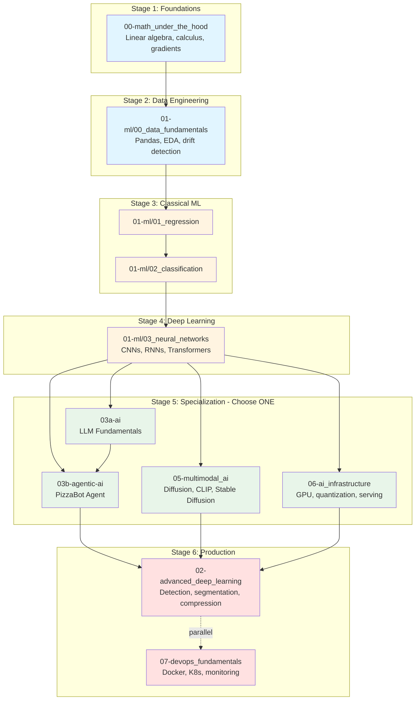

# AI Portfolio — Notes

→ Interview prep: [ML Interview Guide](interview-guides/interview-guide.md)

A personal learning library covering machine learning foundations and modern AI engineering. Five core tracks take you from GPU silicon to deployed multi-agent systems, with additional supporting collections for math, interview prep, and archives.

---

## Who This Is For

**Target audience:** Software engineers and developers who write code for a living but have little or no prior ML or AI background. You are comfortable reading Python, you have used an API before, and you know what a matrix is — but you have never trained a model or built a RAG pipeline from scratch.

This is not a course for data scientists or academic researchers. It is a practitioner's curriculum designed to answer the question a working engineer actually asks: *"I know how to build software — now how do I understand and build AI systems?"*

### Prerequisites

| Prerequisite | Level needed |
|---|---|
| Python | Comfortable reading and writing Python — functions, classes, list comprehensions |
| Linear algebra | Know what a matrix multiplication is; you do not need to be fluent in proofs |
| Statistics | Mean, variance, probability — high-school level is enough to start |
| APIs / HTTP | Have called a REST API before; used JSON |
| Command line | Can navigate directories, run scripts, activate a virtual environment |

**You do not need:** prior ML experience, a GPU, a math degree, or familiarity with PyTorch/TensorFlow before you start.

### What Makes This Different

Every ML chapter derives the math from scratch before using it. All chapters in the Regression topic use the same California Housing dataset, so the delta between chapters is the concept, not a new dataset to understand. Every note ends with an **Interview Checklist** (Must Know / Likely Asked / Trap to Avoid). Every core AI note has a companion `_Supplement.md` for production depth. Every notebook runs on a stock developer laptop — no A100, no cloud GPU budget required.

---

## Recommended Full Path

This curriculum takes you from software engineer to hireable AI engineer. Work at your own pace — the sequence below is ordered by dependency, not by deadline.

### The Complete Learning Path



### Prerequisites by Track

| Track | Prerequisites | What You'll Build |
|-------|--------------|-------------------|
| **00-math_under_the_hood** | High-school algebra | Can derive gradient descent by hand |
| **01-ml/00_data_fundamentals** | Math track OR equivalent calculus | RealtyML production data pipeline |
| **01-ml/01_regression** | Data fundamentals | California Housing price predictor (MAE $70k → $32k) |
| **01-ml/02_classification** | Regression | Binary/multi-class classifiers with precision/recall tuning |
| **01-ml/03_neural_networks** | Regression + Classification | Transformer implementation from scratch |
| **01-ml/04-08** (specializations) | Neural Networks Ch.1-6 | Recommender systems, anomaly detection, RL, clustering, ensembles |
| **03a-ai** | **ML Ch.18 (Transformers)** — MANDATORY | LLM Literacy Kit (GPT-4 vs Claude benchmarks) |
| **03b-agentic-ai** | **03a-ai complete** | PizzaBot RAG pipeline with tool use (8%→32% conversion) |
| **04-multi_agent_ai** | AI track Ch.1-6 | OrderFlow multi-agent purchase-order system |
| **05-multimodal_ai** | **ML Ch.18 (Transformers)** + AI Ch.4 (Embeddings) | PixelSmith local image generation studio |
| **06-ai_infrastructure** | ML Ch.4-8 (Neural Networks, CNNs, RNNs) | InferenceBase cost optimization (API $80k/mo → self-hosted) |
| **07-devops_fundamentals** | None (can start anytime) | ProductionStack Flask API with 99% uptime |
| **02-advanced_deep_learning** | **ML Ch.1-10 (all core ML) + CNNs** | ProductionCV shelf monitoring (6.8 MB model, 35ms latency) |

**CRITICAL SEQUENCING**:
- **02-advanced_deep_learning comes LAST** — do NOT start here. It assumes you already know CNNs, backpropagation, regularization, and hyperparameter tuning from ML Ch.1-10.
- **Transformers (ML Ch.18) before AI/Multimodal** — you cannot understand RAG, CLIP, or Stable Diffusion without self-attention.
- **Math before ML** — gradient descent appears in every chapter. Derive it once by hand, use it forever.

### Why This Sequence?

**Math first** (Stage 1): You'll see `∂L/∂w` hundreds of times. Derive it once by hand now, internalize it forever.

**Data prep before modeling** (Stage 2): 80% of production ML failures are data quality issues. Learn to detect outliers, handle drift, and validate distributions BEFORE you waste time tuning a model on garbage data.

**Transformers before specializations** (Stage 4):
 Transformers are the foundation for:
 - **AI track**: GPT-4 is a Transformer + RLHF
 - **Multimodal track**: CLIP and Stable Diffusion use Transformer encoders
 - **Advanced Deep Learning**: Vision Transformers replace CNNs in modern architectures

 Nail self-attention in ML Ch.18, then specialize.

**Advanced Deep Learning LAST**
 ResNets, YOLOv5, and Mask R-CNN assume you already understand:
 - Loss functions and gradient descent (ML Ch.1-2)
 - Backpropagation (ML Ch.5)
 - CNNs and regularization (ML Ch.7, Ch.6)
 - Hyperparameter tuning (ML Ch.6)

 If you skip ML Ch.1-10 and jump straight to object detection, you'll be lost. The Advanced Deep Learning track is NOT a beginner-friendly entry point — it's a capstone.

### Track Overview

| Track | Dependency Chain |
|-------|-----------------|
| **00-math_under_the_hood** | Start here |
| **01-ml/00_data_fundamentals** | Math → Data |
| **01-ml (core: regression, classification, neural nets)** | Data → Regression → Classification → Neural Nets |
| **01-ml (specializations: recommender, anomaly, RL, clustering, ensembles)** | Neural Nets → pick any |
| **03a-ai** | **ML Ch.18 Transformers** → 03a-ai |
| **03b-agentic-ai** | 03a-ai → 03b-agentic-ai |
| **04-multi_agent_ai** | 03b-agentic-ai Ch.1-6 → Multi-Agent |
| **05-multimodal_ai** | **ML Ch.18 Transformers** + AI Ch.4 → Multimodal |
| **06-ai_infrastructure** | ML Ch.4-8 → Infrastructure |
| **07-devops_fundamentals** | Can start anytime (no ML prereqs) |
| **02-advanced_deep_learning** | **ML Ch.1-10 (all core)** + CNNs → Advanced Deep Learning |

**Minimum path to "hireable"**: Math + Data + ML Core + AI track + DevOps.

### What This Repo Does NOT Cover

This curriculum targets software engineers becoming AI/ML practitioners — not data scientists, cloud platform specialists, or academic researchers. Topics that are better served by vendor-specific documentation (SQL, Spark, mobile ML SDKs, MLOps platforms), require a specialisation background beyond the assumed prerequisites (federated learning, graph neural networks, full Bayesian inference), or are planned for future versions (time series in v1.1, distributed training labs in v2.0) have been intentionally excluded to keep the path coherent and completable. For each excluded topic, the gaps register links to two or more external resources so learners know exactly where to go next.

→ **Full list with rationale and external resources**: [README.md — What This Repo Does NOT Cover](../README.md#what-this-repo-does-not-cover)

---

## Nomenclature

| Term | Scope | Example |
|------|-------|---------|
| **Topic** | A folder directly under `notes/`. Covers a broad domain. | `01-ML/`, `AI/`, `MultiAgentAI/` |
| **Chapter** | A leaf-level folder inside a topic (excluding utility folders like `GenScripts/` and `img/`). Contains a `README.md` + `notebook.ipynb` covering one concept. | `AI/PromptEngineering/`, `01-ML/01_regression/ch04_regularization/` |

Some topics have a flat chapter layout (e.g. `AI/PromptEngineering/`), while others group chapters under sub-topics (e.g. `ML/01-Regression/ch01-linear-regression/`). Either way, the leaf folder with a README + notebook is a **chapter**.

Utility folders that appear alongside chapters:

- `gen_scripts/` — standalone scripts that generate diagrams or data (not a chapter).
- `img/` — images produced by notebooks or `gen_scripts` (not a chapter).

---

## Repository Structure

```
notes/
├── 00-math_under_the_hood/ ← Math foundations: linear & non-linear algebra, calculus, 1-D optimisation, matrices, gradients & chain rule, probability
├── 01-ml/ ← Machine Learning: topics grouped by domain (Regression, Classification, …)
├── 03a-ai/ ← LLM Fundamentals: GPT-4 vs Claude investigation, prompting, CoT, RAG (5 chapters)
├── 03b-agentic-ai/ ← Agentic AI: PizzaBot Grand Challenge — tool use, safety, eval, cost, fine-tuning (6 chapters)
├── 04-multi_agent_ai/ ← Multi-agent protocols and coordination patterns (+ notebooks)
├── 05-multimodal_ai/ ← Diffusion, CLIP, vision transformers, text-to-video (+ notebooks)
├── 06-ai_infrastructure/ ← GPU hardware to production serving platforms (+ notebooks)
├── 07-devops_fundamentals/ ← Docker, Kubernetes, CI/CD, monitoring
├── 02-advanced_deep_learning/ ← Production computer vision: ResNets, detection, segmentation, compression (+ notebooks)
├── archived/ ← Historical HTML/PDF chronicles and archived storyboard assets
└── interview_guides/ ← Consolidated interview prep — rapid-fire Q&A + checklist index
```

---

## Track 1 — Machine Learning (`01-ml/`)

A bottom-up curriculum organised by topic. Each topic groups chapters that build on each other. Every chapter has a technical README and a runnable Jupyter notebook.

> See [01-ml/authoring-guide.md](01-ml/authoring-guide.md) for the chapter authoring guide and build tracker.

### How We Got Here — A Short History of Machine Learning

The chapters below are not in arbitrary order. They follow the actual historical sequence in which each idea was invented, frustrated, and then rescued by the next one. **The detailed timeline now lives in each chapter's own prelude** — every ML chapter opens with a *"The story"* blockquote that names the people, dates, and tensions behind that specific idea. The big-picture arc across the portfolio tracks is summarised in the era table at the top of the [repo root README](../README.md#how-the-tracks-fit-together--the-historical-arc).

**The through-line in one paragraph:** Linear regression established the foundations (gradient descent, loss minimisation). Multiple features and polynomial expansion added expressiveness but risked overfitting. Regularisation (Ridge/Lasso) tamed complexity. Classification introduced the Perceptron, which failed at XOR (1969), motivating hidden layers and neural networks. Backprop made training possible; CNNs added spatial priors; RNNs added memory. When neural nets stalled in the 1990s, classical methods (SVMs, decision trees, ensembles) carried the field. Unsupervised learning (clustering, PCA) matured. Attention scaled into the Transformer — the foundation the rest of this portfolio stands on.

> Want to feel backprop in your hands? Spend ten minutes on the [**TensorFlow Playground**](https://playground.tensorflow.org/) — a browser-based neural network trainer that animates every weight, activation, and decision boundary as you tweak the architecture.

**Setup:** run the single uber-setup from the repo root — it installs everything (ML, AIInfrastructure, MultiAgentAI) and registers all Jupyter kernels:
```powershell
# Windows
.\scripts\setup.ps1
# macOS / Linux
bash scripts/setup.sh
```

| Topic | Chapters | Domain |
|-------|----------|--------|
| [01_regression](01-ml/01_regression) | Linear → Multiple → Polynomial → Regularisation → Metrics → Hyperparameter Tuning | Continuous prediction, California Housing, $70k→$32k MAE |
| [02_classification](01-ml/02_classification) | Logistic Regression → Classical Classifiers → Metrics → SVM → Hyperparameter Tuning | Discrete prediction, decision boundaries |
| [03_neural_networks](01-ml/03_neural_networks) | XOR → Dense Nets → Backprop → Regularisation → CNNs → RNNs → MLE → TensorBoard → Attention → Transformers | Deep learning, from Perceptron to Transformer |
| [04_recommender_systems](01-ml/04_recommender_systems) | Fundamentals → Collaborative Filtering → Matrix Factorization → Neural CF → Hybrid Systems → Cold Start/Production | Personalization and recommendation pipelines |
| [05_anomaly_detection](01-ml/05_anomaly_detection) | Statistical Methods → Isolation Forest → Autoencoders → One-Class SVM → Ensemble Anomaly → Production | Imbalanced anomaly detection and fraud patterns |
| [06_reinforcement_learning](01-ml/06_reinforcement_learning) | MDPs → Dynamic Programming → Q-Learning → DQN → Policy Gradients → Modern RL | Theory-first reinforcement learning fundamentals |
| [07_unsupervised_learning](01-ml/07_unsupervised_learning) | Clustering → Dimensionality Reduction → Unsupervised Metrics | K-Means, PCA, t-SNE, silhouette |
| [08_ensemble_methods](01-ml/08_ensemble_methods) | Ensembles | Bagging, boosting, XGBoost |

---

## Track 2a — LLM Fundamentals (`03a-ai/`)

Five chapters investigating GPT-4 and Claude 3.5 Sonnet through the **Intelligence Audit** arc — producing an AI Literacy Kit.

| Document | What it covers |
|---|---|
| [ai-primer.md](03a-ai/ai-primer.md) | Entry point — Intelligence Audit investigation framework, document map, reading paths |
| [llm-fundamentals](03a-ai/ch01-llm-fundamentals) | BPE tokenisation, pretraining → SFT → RLHF, temperature, context windows |
| [prompt-engineering](03a-ai/ch02-prompt-engineering) | System prompts, few-shot, structured output, prompt injection |
| [cot-reasoning](03a-ai/ch03-cot-reasoning) | Chain-of-Thought, hidden reasoning tokens, Self-Consistency, Tree of Thoughts |
| [rag-and-embeddings](03a-ai/ch04-rag-and-embeddings) | Transformer encoders, contrastive training, chunking, full RAG pipeline |
| [vector-dbs](03a-ai/ch05-vector-dbs) | ANN index types (HNSW, IVF, DiskANN), distance metrics, production architecture |

---

## Track 2b — Agentic AI (`03b-agentic-ai/`)

Six chapters taking Mamma Rosa's PizzaBot from broken prototype (8% conversion) to production agent (32% conversion). Requires completing **03a-ai** first.

| Document | What it covers |
|---|---|
| [react-and-semantic-kernel](03b-agentic-ai/ch01-react-and-semantic-kernel) | ReAct loop, LangChain vs Semantic Kernel, LangGraph, Plan-and-Execute |
| [safety-and-hallucination](03b-agentic-ai/ch02-safety-and-hallucination) | Hallucination types, mitigation stack, jailbreaks, alignment failures |
| [evaluating-ai-systems](03b-agentic-ai/ch03-evaluating-ai-systems) | RAGAS metrics, LLM-as-judge, hallucination detection, pipeline evaluation |
| [cost-and-latency](03b-agentic-ai/ch04-cost-and-latency) | Token budgets, model cost tiers, KV caching, streaming |
| [fine-tuning](03b-agentic-ai/ch05-fine-tuning) | When to fine-tune vs RAG vs prompting, LoRA math, QLoRA |
| [advanced-agentic-patterns](03b-agentic-ai/ch06-advanced-agentic-patterns) | Reflection, multi-agent debate, hierarchical orchestration, HITL |

Every core note has a companion `_Supplement.md` for production-depth details.

---

## Track 3 — Multi-Agent AI (`03-MultiAgentAI/`)

7-chapter track on protocols and coordination patterns for multi-agent systems. Running scenario: **OrderFlow**, a B2B purchase-order automation platform.

> → [03-MultiAgentAI/README.md](04-multi_agent_ai/README.md) for the full reading map and setup instructions.

**Setup:** use the single uber-setup from the repo root — it already installs all MultiAgentAI dependencies and registers the `multi-agent-ai` kernel:
```powershell
# Windows
.\scripts\setup.ps1
# macOS / Linux
bash scripts/setup.sh
```

| Chapter | What it covers |
|---|---|
| [MessageFormats/](04-multi_agent_ai/ch01_message_formats) | OpenAI message envelope, token counting, handoff strategies, context trimming |
| [MCP/](04-multi_agent_ai/ch02_mcp) | Model Context Protocol — JSON-RPC 2.0, Resources/Tools/Prompts, transport options |
| [A2A/](04-multi_agent_ai/ch03_a2a) | Agent-to-Agent protocol — Agent Cards, task lifecycle, SSE streaming, MCP+A2A composition |
| [EventDrivenAgents/](04-multi_agent_ai/ch04_event_driven_agents) | Pub/sub bus, DLQ, correlation/causation IDs, idempotency, fan-out/fan-in |
| [SharedMemory/](04-multi_agent_ai/ch05_shared_memory) | Blackboard pattern, write-once guards, compare-and-swap, checkpoint/resume |
| [TrustAndSandboxing/](04-multi_agent_ai/ch06_trust_and_sandboxing) | Prompt injection, output schema validation, HMAC signing, timing attacks |
| [AgentFrameworks/](04-multi_agent_ai/ch07_agent_frameworks) | LangGraph StateGraph, AutoGen multi-agent debate, Semantic Kernel, framework comparison |

---

## Track 4 — Multimodal AI (`04-MultimodalAI/`)

13-chapter track on generative image and video models, plus text-to-audio. Running example: **PixelSmith**, a local AI-powered creative studio that must run on a stock developer laptop.

> → [04-MultimodalAI/README.md](05-multimodal_ai/README.md) for the full reading map.

| Chapter | What it covers |
|---|---|
| [MultimodalFoundations/](05-multimodal_ai/ch01_multimodal_foundations) | Signals → tensors → tokens; patch embeddings; cross-modal alignment |
| [VisionTransformers/](05-multimodal_ai/ch02_vision_transformers) | ViT architecture, patch tokenisation, CLS token, attention maps |
| [CLIP/](05-multimodal_ai/ch03_clip) | Contrastive pre-training, zero-shot classification, text-image retrieval |
| [DiffusionModels/](05-multimodal_ai/ch04_diffusion_models) | DDPM forward/reverse process, noise schedules, score matching |
| [LatentDiffusion/](05-multimodal_ai/ch06_latent_diffusion) | VAE latent space, Stable Diffusion architecture, CFG |
| [Schedulers/](05-multimodal_ai/ch05_schedulers) | DDIM, DPM-Solver, Euler-a — speed vs quality tradeoffs |
| [GuidanceConditioning/](05-multimodal_ai/ch07_guidance_conditioning) | Classifier-free guidance, ControlNet, img2img, inpainting |
| [TextToImage/](05-multimodal_ai/ch08_text_to_image) | End-to-end prompt → pixel pipeline, prompt engineering for images |
| [TextToVideo/](05-multimodal_ai/ch09_text_to_video) | Temporal attention, video diffusion, consistency across frames |
| [MultimodalLLMs/](05-multimodal_ai/ch10_multimodal_llms) | Vision encoders in LLMs, visual question answering, GPT-4V patterns |
| [GenerativeEvaluation/](05-multimodal_ai/ch12_generative_evaluation) | FID, IS, CLIP score, human preference alignment |
| [LocalDiffusionLab/](05-multimodal_ai/ch13_local_diffusion_lab) | Running Stable Diffusion locally — memory optimisation, quantisation |
| [AudioGeneration/](05-multimodal_ai/ch11_audio_generation) | Text-to-speech, local synthesis, vocoder stacks — CPU-first quick wins |

---

## Track 5 — AI Infrastructure (`05-AIInfrastructure/`)

5 implemented chapters (with additional chapters planned) from GPU silicon through inference optimization. Running scenario: **InferenceBase**, a startup evaluating whether to self-host Llama-3-8B instead of paying $80k/month in API bills.

> → [05-AIInfrastructure/README.md](06-ai_infrastructure/README.md) for the full reading map.

| Chapter | What it covers |
|---|---|
| [GPUArchitecture/](06-ai_infrastructure/ch01_gpu_architecture) | CUDA cores, tensor cores, VRAM, memory bandwidth, roofline model |
| [MemoryAndComputeBudgets/](06-ai_infrastructure/ch02_memory_and_compute_budgets) | VRAM estimation: parameters, KV cache, optimizer states, activations |
| [QuantizationAndPrecision/](06-ai_infrastructure/quantization_and_precision) | FP16/BF16/INT8/INT4, GPTQ, AWQ, perplexity vs compression tradeoffs |
| [ParallelismAndDistributedTraining/](06-ai_infrastructure/parallelism_and_distributed_training) | Data/tensor/pipeline parallelism, ZeRO stages, FSDP |
| [InferenceOptimization/](06-ai_infrastructure/ch05_inference_optimization) | KV cache, speculative decoding, flash attention, kernel fusion |
| *(planned, not yet in tree)* Serving Frameworks | vLLM, TensorRT-LLM, TGI — continuous batching, PagedAttention |
| *(planned, not yet in tree)* Networking & Cluster Architecture | InfiniBand, NVLink, RDMA, collective ops (AllReduce, AllGather) |
| *(planned, not yet in tree)* MLOps & Experiment Management | MLflow, W&B, experiment tracking, model registry, CI for ML |
| *(planned, not yet in tree)* Production AI Platform | SLOs, autoscaling, shadow deployment, cost monitoring |
| *(planned, not yet in tree)* Cloud AI Infrastructure | Azure/AWS/GCP GPU offerings, spot instances, cost vs throughput |

---

## Track 6 — DevOps Fundamentals (`07-devops_fundamentals/`)

8-chapter track covering Docker, Kubernetes, CI/CD, monitoring, and secrets management. Running example: **ProductionStack** — deploying a Flask API with PostgreSQL and Redis from laptop to production.

> → [07-devops_fundamentals/README.md](07-devops_fundamentals/README.md) for the full reading map and Grand Challenge.

| Chapter | What it covers |
|---|---|
| [DockerFundamentals/](07-devops_fundamentals/ch01_docker_fundamentals) | Containers vs VMs, Dockerfile, images, layers, volumes |
| [ContainerOrchestration/](07-devops_fundamentals/ch02_container_orchestration) | Docker Compose, health checks, dependency ordering |
| [KubernetesBasics/](07-devops_fundamentals/ch03_kubernetes_basics) | Pods, Services, Deployments, 5 essential kubectl commands |
| [CICDPipelines/](07-devops_fundamentals/ch04_cicd_pipelines) | GitHub Actions, workflow triggers, Docker Hub integration |
| [MonitoringObservability/](07-devops_fundamentals/ch05_monitoring_observability) | Prometheus, Grafana, metrics collection, alerting |
| [InfrastructureAsCode/](07-devops_fundamentals/ch06_infrastructure_as_code) | Terraform, state management, resource graphs |
| [NetworkingLoadBalancing/](07-devops_fundamentals/ch07_networking_load_balancing) | Nginx reverse proxy, load balancing algorithms, health checks |
| [SecuritySecretsManagement/](07-devops_fundamentals/ch08_security_secrets_management) | Environment variables, Docker secrets, Kubernetes secrets, pre-push hooks |

**Grand Challenge:** ProductionStack achieves 99% uptime, <5min MTTD, zero secrets in git, and deploys in <5min.

---

## Track 7 — Advanced Deep Learning (`02-advanced_deep_learning/`)

10-chapter production computer vision track from ResNets to edge deployment. Running challenge: **ProductionCV** — autonomous retail shelf monitoring achieving 82% mAP, 71% IoU, 35ms latency, 6.8 MB model size, trained on <1,000 labeled images.

> → [02-advanced_deep_learning/README.md](02-advanced_deep_learning/README.md) for the full reading map and Grand Challenge details.

| Chapter | What it covers |
|---|---|
| [ResidualNetworks/](02-advanced_deep_learning/ch01_residual_networks) | Skip connections, vanishing gradients, ResNet-18/50/101 |
| [EfficientArchitectures/](02-advanced_deep_learning/ch02_efficient_architectures) | MobileNetV2, EfficientNet, depthwise separable convolutions |
| [TwoStageDetectors/](02-advanced_deep_learning/ch03_two_stage_detectors) | Faster R-CNN, RPN, RoI pooling, multi-task loss |
| [OneStageDetectors/](02-advanced_deep_learning/ch04_one_stage_detectors) | YOLOv5, RetinaNet, focal loss, grid-based detection |
| [SemanticSegmentation/](02-advanced_deep_learning/ch05_semantic_segmentation) | FCN, U-Net, DeepLabV3+, atrous convolutions |
| [InstanceSegmentation/](02-advanced_deep_learning/ch06_instance_segmentation) | Mask R-CNN, RoIAlign, per-instance masks |
| [ContrastiveLearning/](02-advanced_deep_learning/ch07_contrastive_learning) | SimCLR, MoCo, NT-Xent loss, momentum encoder |
| [SelfSupervisedVision/](02-advanced_deep_learning/ch08_self_supervised_vision) | DINO, MAE, masked autoencoding, emergent attention |
| [KnowledgeDistillation/](02-advanced_deep_learning/ch09_knowledge_distillation) | Teacher-student, temperature scaling, soft labels |
| [PruningMixedPrecision/](02-advanced_deep_learning/ch10_pruning_mixed_precision) | Magnitude pruning, AMP, FP16 training, 14× compression |

**Grand Challenge:** ProductionCV compresses 97 MB ResNet-50 → 6.8 MB pruned MobileNetV2, achieving all 5 constraints (detection, segmentation, latency, model size, data efficiency).

---

## Projects (`../projects/`)

Working Python experiments that accompany the theory.

| Project | What it does |
|---|---|
| [`projects/ml/linear-regression/`](../projects/ml/linear_regression) | End-to-end linear regression pipeline: data loading, model fitting, evaluation metrics, sklearn and custom implementations |
| [`projects/ai/rag-pipeline/`](../projects/ai/rag_pipeline) | RAG pipeline implementation — ingestion, embedding, retrieval, reranking |

---

## How to Consume This Content — Reading Paths

### Path A — Interview Prep (2–4 hours)

```
1. InterviewGuides/ ← single consolidated interview prep entry point
2. AI/AIPrimer.md ← understand the agentic systems architecture (Part 2)
3. ML/AUTHORING_GUIDE.md ← skim Chapter Summaries for ML concepts
4. MultiAgentAI/README.md ← multi-agent protocol interview checklist
```

### Path B — AI Engineering Deep Dive (~10–14 hours)

```
Step 1 — Reasoning layer
 → AI/ch03_CoTReasoning/
 → AI/ch03_CoTReasoning/CoTReasoning_Supplement.md

Step 2 — Knowledge layer
 → AI/ch04_RAGAndEmbeddings/
 → AI/ch04_RAGAndEmbeddings/RAGAndEmbeddings_Supplement.md
 → AI/ch05_VectorDBs/

Step 3 — Orchestration layer
 → AI/ch06_ReActAndSemanticKernel/
 → AI/ch06_ReActAndSemanticKernel/ReActAndSemanticKernel_Supplement.md

Step 4 — Multi-agent
 → MultiAgentAI/ch01_MessageFormats/ → ch02_MCP/ → ch03_A2A/ → ch07_AgentFrameworks/

Step 5 — Synthesis
 → InterviewGuides/ (now reads as a self-test)
```

### Path C — ML from Scratch (~40–50 hours)

```
0. Math on-ramp (skip if `ŷ = wx + b`, gradients, and matrix multiply already feel like tools):
 MathUnderTheHood/ ch01 → ch07 — knuckleball free-kick thread, README + notebook each
1. Run: .\scripts\setup.ps1 (Windows) or bash scripts/setup.sh (macOS/Linux)
2. Work through ML topics in order: 01-Regression → 02-Classification → 03-NeuralNetworks → 07-UnsupervisedLearning → 08-EnsembleMethods (then 04/05/06 as specialization tracks)
3. After Regression + Classification fundamentals, you have enough ML to start Path B in parallel
```

### Path D — Multimodal & Generative AI (~12–16 hours)

```
Prerequisite: Path B Step 2 (transformers, embeddings)

MultimodalAI/ch01_MultimodalFoundations/
→ MultimodalAI/ch02_VisionTransformers/
→ MultimodalAI/ch03_CLIP/
→ MultimodalAI/ch04_DiffusionModels/
→ MultimodalAI/ch06_LatentDiffusion/
→ MultimodalAI/ch05_Schedulers/
→ MultimodalAI/ch08_TextToImage/
→ MultimodalAI/ch13_LocalDiffusionLab/
```

### Path E — Infrastructure & Production (~8–12 hours)

```
Prerequisite: any track above (context for why infrastructure decisions matter)

AIInfrastructure/ch01_GPUArchitecture/
→ AIInfrastructure/ch02_MemoryAndComputeBudgets/
→ AIInfrastructure/ch03_QuantizationAndPrecision/
→ AIInfrastructure/ch04_ParallelismAndDistributedTraining/
→ AIInfrastructure/ch05_InferenceOptimization/
→ planned: Serving Frameworks → Networking & Cluster Architecture → MLOps & Production Platform
```

---

### Cross-track connections

| From | To | Connection |
|---|---|---|
| ML Ch.4 Neural Networks | AI/RAGAndEmbeddings | Transformer encoders are neural networks — the same math |
| ML Ch.5 Backprop | AI/RAGAndEmbeddings | Contrastive learning (InfoNCE) is trained with the same gradient machinery |
| ML Ch.8 RNNs/LSTMs | ML Ch.17 Sequences to Attention | LSTMs motivate *why* attention was invented; Ch.17 introduces attention without transformers |
| ML Ch.17 Sequences to Attention | ML Ch.18 Transformers | Soft-lookup intuition → learned Q/K/V projections, multi-head, positional encoding |
| ML Ch.18 Transformers | AI track (all) | Load-bearing bridge — read before the AI track |
| ML Ch.12 Clustering | AI/VectorDBs | HDBSCAN discovers topic clusters in a vector index |
| AI/ReActAndSemanticKernel | MultiAgentAI/ | Multi-agent is an extension of single-agent — not a replacement |
| AI/RAGAndEmbeddings | MultimodalAI/CLIP | CLIP uses the same contrastive training as text embedding models |
| AIInfrastructure/InferenceOptimization | MLOps/Production | Inference-level throughput and latency constraints set the floor on what your SLOs can guarantee |

---

## Getting Started

```bash
# Clone
git clone <repo-url>
cd ai-portfolio

# Launch the full dev environment (installs everything into a .venv)
# Windows
.\scripts\setup.ps1
# Optional: add --enable-slm-assistant to install the Kilo Code + Ollama bundle
# Optional: add --enable-mkdocs-server to launch the local MkDocs docs server

# macOS / Linux
bash scripts/setup.sh
# Optional: add --enable-slm-assistant to install the Kilo Code + Ollama bundle
# Optional: add --enable-mkdocs-server to launch the local MkDocs docs server
```

The single uber setup script creates a `.venv` at the repo root, installs the full AI/ML package stack used across every track (ML, AI, MultiAgentAI, MultimodalAI, AIInfrastructure), registers all Jupyter kernels (`ai-ml-dev`, `ml-notes`, `ai-infrastructure`, `multi-agent-ai`), and starts Jupyter Lab. Pass `--enable-slm-assistant` if you also want VS Code + the **Kilo Code** extension wired to a local Ollama-served DeepSeek-R1 model. Pass `--enable-mkdocs-server` if you want the local MkDocs docs server.
