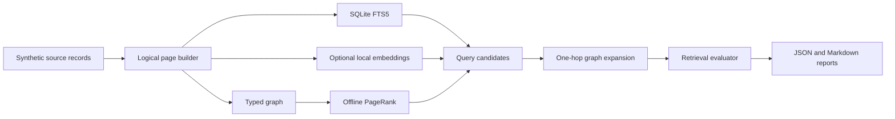

# Linked Page Retrieval Lab

> Can logical pages, typed links, and an authority score reduce the indexing and query cost of
> vector-only RAG without losing retrieval quality?

**Evidence status:** Planned. This directory currently contains the experiment design and
implementation plan. No benchmark result is claimed yet.

## The problem

A vector-first RAG system commonly turns every source into overlapping chunks, embeds every chunk,
and periodically rebuilds or updates a vector index. That works, but it can spend compute and
storage on content that an exact text index could retrieve cheaply.

The tempting alternative is to make every coherent unit a logical page, connect related pages, and
rank the graph once with PageRank. That removes much of the vector machinery.

It also creates a new failure:

```text
PageRank can identify an important page
-> it cannot determine whether that page answers this query
-> a popular but obsolete global policy can outrank the current regional policy
```

This POC will therefore test PageRank as an **authority signal**, not as a standalone replacement
for query-aware retrieval.

## Hypotheses

The experiment will try to falsify three claims:

1. **Linked-page retrieval:** BM25 seeds plus one-hop typed-link expansion can match the vector
   baseline on exact, freshness, and multi-page questions while using no document embeddings.
2. **Hybrid retrieval:** lexical, semantic, and graph signals together can achieve the best overall
   retrieval quality without embedding every logical page.
3. **Incremental maintenance:** updating changed pages and their local graph neighborhood is faster
   and writes fewer index bytes than re-embedding all affected overlapping chunks.

The POC is useful even if all three claims fail. Its deliverable is a reproducible measurement, not
a predetermined win for graph retrieval.

## What is a logical page?

A logical page is the smallest independently useful and citeable unit in the test corpus. It is
split on source structure rather than a fixed token window.

```json
{
  "page_id": "returns-eu-enterprise-v3",
  "title": "EU enterprise returns",
  "body": "Current policy text...",
  "source_id": "returns-policy",
  "source_uri": "local://policies/returns.md",
  "version": 3,
  "valid_from": "2026-01-01",
  "status": "current",
  "metadata": {
    "region": "EU",
    "customer_tier": "enterprise"
  },
  "links": [
    {
      "type": "supersedes",
      "target": "returns-eu-enterprise-v2"
    },
    {
      "type": "references",
      "target": "refund-methods-eu"
    }
  ]
}
```

The source records remain authoritative. Full-text, vector, and graph representations are derived
indexes that can be deleted and rebuilt.

## Proposed local architecture



The first implementation will remain deliberately small:

- Python 3.11 or newer;
- SQLite FTS5 for lexical search and persisted page metadata;
- NetworkX for inspectable graph construction and PageRank;
- a pinned Sentence Transformers model for the vector baseline;
- exact NumPy cosine search, avoiding a vector database so the experiment measures retrieval
  behavior before infrastructure behavior;
- pytest for contracts and regression tests;
- local JSONL and Markdown benchmark reports.

The embedding model may require a one-time download. After it is cached, evaluation will run without
an API key or cloud service.

## One corpus, six retrieval strategies

Every strategy will receive the same pages, queries, filters, and relevance judgments.

| Strategy | Query relevance | Authority | Semantic matching | Purpose |
|---|---:|---:|---:|---|
| PageRank only | No | Yes | No | Negative control proving that authority alone is insufficient |
| SQLite FTS5 | Yes | No | No | Cheap lexical baseline |
| Vector | Yes | No | Yes | Conventional semantic-retrieval baseline |
| Linked page | BM25 seeds | Yes | No | Proposed embedding-free path |
| Selective hybrid | BM25 plus selected vectors | Yes | Yes | Proposed cost/quality compromise |
| Full hybrid | BM25 plus all vectors | Yes | Yes | Quality ceiling for this POC |

Linked-page retrieval will first select lexical seed pages, expand allowed typed edges by one hop,
and then rerank the candidates using query relevance, authority, freshness, and link type. PageRank
will never be allowed to introduce an otherwise query-unrelated page by itself.

The selective hybrid will embed only pages that are difficult to retrieve lexically, based on a
rule fixed on the development set. It must not use test-set labels to decide which pages to embed.

## Evaluation corpus

The project will generate a deterministic, fictional support-policy corpus. A synthetic corpus
keeps the POC redistributable, makes every relevant page knowable, and lets the benchmark include
deliberate traps such as a highly linked obsolete policy.

The initial target is approximately 60 source records, 150 logical pages, and 150 hand-reviewed
queries:

| Query class | Count | Failure being exposed |
|---|---:|---|
| Exact terminology and identifiers | 30 | Semantic search is unnecessary overhead |
| Paraphrases | 30 | Lexical search misses different wording |
| Multi-page evidence | 30 | One retrieved page is insufficient |
| Freshness and supersession | 25 | Authority can favor obsolete content |
| Authority traps | 20 | PageRank is not query relevance |
| Unanswerable questions | 15 | Retrieval should abstain rather than force a match |

Fifty queries will form a visible development set for choosing fixed weights and thresholds. The
remaining 100 will be a locked test set. Each query record will declare:

- relevant page IDs;
- the complete required evidence set for multi-page questions;
- expected facts or an explicit `unanswerable` label;
- query-class tags;
- metadata filters, when applicable.

No LLM will grade the primary retrieval benchmark. Ground-truth page IDs and deterministic metrics
avoid evaluator-model cost and circularity.

## Measurements

### Retrieval quality

- Recall@5 and Recall@10;
- mean reciprocal rank at 10;
- nDCG@10;
- complete evidence-set coverage at 10;
- stale-page hit rate;
- unanswerable false-positive rate.

Metrics will be reported overall and by query class. An aggregate score is not allowed to hide a
failure on paraphrases, freshness, or multi-page evidence.

### Efficiency

- cold index-build time;
- incremental update time for a fixed change manifest;
- p50 and p95 warm-query latency;
- bytes written per index;
- peak resident memory;
- number and percentage of pages embedded.

The report will record the CPU, operating system, Python version, embedding model revision, corpus
hash, and run seed. Model download time and cached model size will be reported separately from
index-build time and index size.

### Optional answer generation

Retrieval will be evaluated first. A later optional adapter may send the same evidence packet to a
local Ollama-compatible model and measure:

- required-fact coverage;
- citation precision;
- unsupported-claim rate;
- abstention accuracy;
- generation latency and tokens.

Generation results will not be used to conceal retrieval failures.

## Decision gates

The linked-page idea will be considered promising only if the locked test run shows all of the
following:

1. linked-page Recall@10 is within 2 percentage points of the full-vector baseline overall;
2. linked-page complete-evidence coverage is not worse than the vector baseline on multi-page
   queries;
3. stale-page hit rate is lower than the PageRank-only and vector-only strategies;
4. the selective hybrid embeds at least 50% fewer pages than the full-vector baseline while staying
   within 2 percentage points of its Recall@10;
5. incremental updates write fewer bytes and finish faster than the full-vector baseline on the
   fixed update manifest.

These are POC decision thresholds, not production SLOs. If the result varies by hardware, the report
will emphasize relative ratios and include the raw measurements.

## Expected repository shape

```text
linked-page-retrieval/
|-- README.md
|-- plan.md
|-- pyproject.toml
|-- src/linked_page_retrieval/
|   |-- corpus.py
|   |-- pages.py
|   |-- lexical.py
|   |-- graph.py
|   |-- vector.py
|   |-- retrieval.py
|   `-- evaluation.py
|-- data/
|   |-- sources/
|   |-- queries/
|   `-- manifests/
|-- tests/
`-- reports/
```

Generated indexes, downloaded models, and ad hoc run artifacts will remain untracked. A compact
benchmark summary and its machine-readable metrics will be retained when a named run passes the
reproducibility checks.

## Planned local workflow

The commands below describe the target interface; they are not implemented yet.

```powershell
python -m venv .venv
.\.venv\Scripts\python -m pip install -e ".[dev]"
.\.venv\Scripts\python -m linked_page_retrieval build
.\.venv\Scripts\python -m linked_page_retrieval evaluate --suite test
.\.venv\Scripts\pytest
```

See [plan.md](plan.md) for the ordered implementation and validation plan.

## Boundaries

This POC will not claim to measure:

- web-scale crawling or distributed PageRank;
- production concurrency or high availability;
- managed vector-database pricing;
- arbitrary PDFs, OCR, or table extraction;
- automatic link generation with an LLM;
- tenant authorization or confidential-data isolation;
- production answer quality from a tiny local generator.

Those become relevant only if the local evidence justifies a larger prototype.
