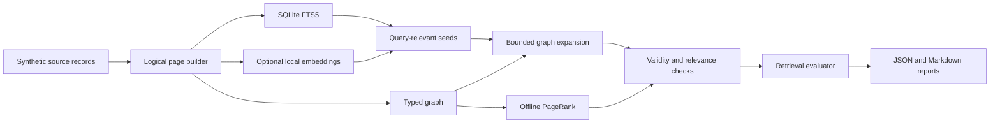

# Linked Page Retrieval Lab

> Can query-seeded graph retrieval improve authoritative, multi-page evidence selection while
> matching plain vector RAG quality with fewer embeddings and cheaper updates?

**Evidence status:** Planned. This directory currently contains the experiment design and
implementation plan. No benchmark result is claimed yet.

## The problem

A vector-first RAG system commonly turns every source into overlapping chunks, embeds every chunk,
and periodically rebuilds or updates a vector index. That works, but it can spend compute and
storage on content that an exact text index could retrieve cheaply.

The tempting alternative is to make every coherent unit a logical page, connect related pages, and
rank the graph once with PageRank. That removes much of the vector machinery.

It also creates a new failure:

```text
PageRank can identify an important page
-> it cannot determine whether that page answers this query
-> a popular but obsolete global policy can outrank the current regional policy
```

This POC will therefore test PageRank as an **authority signal**, not as a standalone replacement
for query-aware retrieval.

## Value proposition, worked backwards

PageRank does not make text semantically searchable, detect freshness, or remove the need for a
query-relevance stage. Its realistic job is narrower: among already relevant and valid candidates,
prefer pages that the rest of the trusted corpus treats as canonical.

The complete project has three mechanisms. The evaluation must not credit one mechanism for another
mechanism's result.

| Desired outcome | Plain-RAG limitation being tested | Mechanism that could help | Metric that proves it |
|---|---|---|---|
| Put the canonical source before an ancillary mention | Similar chunks can receive similar vector scores | Bounded PageRank prior over trusted, endorsement-like links | Canonical@1 and authority-weighted nDCG@10 |
| Retrieve all evidence for a compound question | Independent top-k retrieval can find only one part | Query-seeded, typed one-hop expansion | Complete Evidence Rate@10 |
| Preserve general retrieval quality | Graph signals can displace a relevant result | Lexical/semantic relevance remains the dominant score | Recall@10, MRR@10, and context precision@10 |
| Embed and rewrite less data | Overlapping chunks multiply derived records | Logical pages plus selective semantic indexing | Embedded-unit ratio and update amplification |
| Keep interactive latency | Query embedding and broad vector search add work | Precomputed authority plus bounded candidates | Warm p50/p95 latency at matched quality |

The query path is therefore:

```text
validity and metadata filters
-> BM25 and/or vector seeds
-> bounded typed-link expansion
-> query-relevance scoring
-> small PageRank authority adjustment
-> final evidence set
```

PageRank never creates relevance. It can only reorder candidates that have already crossed a
query-relevance threshold. Expired, deleted, or otherwise ineligible pages are filtered before
PageRank is applied; freshness gains must not be attributed to PageRank.

## Falsifiable hypotheses

1. **PageRank earns a ranking role:** adding PageRank to an otherwise identical candidate set
   improves canonical-source ranking without a meaningful loss in relevance recall or precision.
2. **Graph expansion earns a retrieval role:** typed expansion improves complete evidence coverage
   on multi-page questions without flooding the context with merely adjacent pages.
3. **Selective semantic indexing earns a cost role:** the selective hybrid remains non-inferior to
   plain vector RAG while embedding and rewriting materially fewer units.
4. **The combined design earns a system role:** the graph-plus-selective-vector path lies on the
   quality/cost Pareto frontier rather than being dominated by a simpler baseline.

The POC is useful even if every hypothesis fails. Its deliverable is a reproducible decision about
which mechanisms to keep, not a predetermined win for PageRank.

## What is a logical page?

A logical page is the smallest independently useful and citeable unit in the test corpus. It is
split on source structure rather than a fixed token window.

```json
{
  "page_id": "returns-eu-enterprise-v3",
  "title": "EU enterprise returns",
  "body": "Current policy text...",
  "source_id": "returns-policy",
  "source_uri": "local://policies/returns.md",
  "version": 3,
  "valid_from": "2026-01-01",
  "status": "current",
  "metadata": {
    "region": "EU",
    "customer_tier": "enterprise"
  },
  "links": [
    {
      "type": "supersedes",
      "target": "returns-eu-enterprise-v2"
    },
    {
      "type": "references",
      "target": "refund-methods-eu"
    }
  ]
}
```

The source records remain authoritative. Full-text, vector, and graph representations are derived
indexes that can be deleted and rebuilt.

## Proposed local architecture



The first implementation will remain deliberately small:

- Python 3.11 or newer;
- SQLite FTS5 for lexical search and persisted page metadata;
- NetworkX for inspectable graph construction and PageRank;
- a pinned Sentence Transformers model for the vector baseline;
- exact NumPy cosine search as a correctness oracle;
- a CPU HNSW index as the operational dense-retrieval baseline;
- a pinned CPU cross-encoder shared by graph and non-graph reranking finalists;
- pytest for contracts and regression tests;
- local JSONL and Markdown benchmark reports.

The embedding model may require a one-time download. After it is cached, evaluation will run without
an API key or cloud service.

## Fair baselines and ablations

Every strategy receives the same sources, queries, eligibility filters, evidence budget, and
relevance judgments. The generator, if enabled, also receives the same prompt and evidence-token
budget. This prevents a larger context window or better freshness filter from masquerading as a
PageRank win.

| Strategy | Unit | Semantic index | Expansion | PageRank | Question answered |
|---|---|---:|---:|---:|---|
| PageRank only | Page | No | No | Yes | Negative control: authority without relevance |
| SQLite FTS5 | Page | No | No | No | Cheapest lexical floor |
| Plain vector RAG | Fixed overlapping chunk | All chunks | No | No | Existing conventional baseline |
| Page vector RAG | Logical page | All pages | No | No | Was any gain caused only by better segmentation? |
| Page hybrid + reranker | Logical page | All pages | No | No | Strong non-graph baseline |
| Page hybrid + PageRank | Logical page | All pages | No | Yes | Isolate PageRank's ranking contribution |
| Page hybrid + expansion | Logical page | All pages | Yes | No | Isolate graph traversal's coverage contribution |
| Full graph hybrid | Logical page | All pages | Yes | Yes | Measure the combined quality ceiling |
| Selective graph hybrid | Logical page | Selected pages | Yes | Yes | Measure the proposed quality/cost compromise |

Two PageRank variants will be retained:

- **raw global PageRank**, a deliberately naive control over all links;
- **eligible typed PageRank**, computed over current eligible pages and only endorsement-like links
  such as `references`, `defines`, and `supported_by`.

Validity labels and canonical-source judgments are authored independently of graph link counts. A
benchmark where “most links wins” defines both the feature and the answer would prove nothing.

The selective hybrid will embed only pages that are difficult to retrieve lexically, based on a
rule fixed on the development set. It must not use locked-test labels to choose pages.

Final graph and non-graph contenders use the same cross-encoder candidate budget. Graph robustness
is also tested after dropping, adding, reversing, and concentrating links so a clean synthetic graph
cannot hide PageRank's sensitivity.

## Evaluation corpus

The project will generate a deterministic, fictional support-policy corpus. A synthetic corpus
keeps the POC redistributable, makes every relevant page knowable, and lets the benchmark include
deliberate traps such as a highly linked obsolete policy.

The quality corpus will contain approximately 80 source records, 200 logical pages, and 240
hand-reviewed queries:

| Query class | Count | Failure being exposed |
|---|---:|---|
| Exact terminology and identifiers | 40 | Semantic search is unnecessary overhead |
| Paraphrases | 40 | Lexical search misses different wording |
| Multi-page evidence | 50 | One retrieved page is insufficient |
| Freshness and supersession | 40 | Eligibility must beat obsolete authority |
| Canonical-source and authority ties | 50 | PageRank must distinguish equally relevant pages |
| Unanswerable questions | 20 | Retrieval should abstain rather than force a match |

Eighty stratified queries will form a visible development set for choosing fixed weights and
thresholds. The remaining 160 will be a locked test set. Each query record will declare:

- relevant page IDs;
- the complete required evidence set for multi-page questions;
- a canonical page and independent authority grade where one exists;
- expected facts or an explicit `unanswerable` label;
- query-class tags;
- metadata filters, when applicable.

The same judged core will be surrounded by deterministic non-relevant pages at approximately 200,
2,000, and 20,000 total pages. These scale tiers test latency, storage, update amplification, and
retrieval robustness without pretending that 200 pages predict web-scale behavior.

No LLM will grade the primary retrieval benchmark. Ground-truth page IDs and deterministic metrics
avoid evaluator-model cost and circularity.

## Measurements

### Retrieval quality

- **Recall@5/10:** fraction of judged relevant evidence retrieved;
- **MRR@10:** how early the first relevant page appears;
- **nDCG@10:** graded relevance quality across the ranking;
- **Context precision@10:** fraction of retrieved pages that are relevant;
- **Complete Evidence Rate@10:** fraction of answerable queries for which every required evidence
  page is retrieved;
- **Canonical@1:** fraction of canonical-source queries with the canonical page ranked first;
- **authority-weighted nDCG@10:** ranking quality using independently authored authority grades;
- **current-over-stale win rate:** fraction of freshness traps where the current page outranks its
  obsolete counterpart;
- **stale exposure@10:** obsolete pages returned for non-historical queries;
- **unanswerable false-positive rate:** unsupported questions that cross the answer threshold.

Metrics will be reported overall and by query class. An aggregate score is not allowed to hide a
failure on paraphrases, freshness, or multi-page evidence.

Every PageRank result must include the paired delta against the identical strategy with PageRank
disabled. Every expansion result must include the paired delta against the identical strategy
without expansion. Quality deltas will use query-level paired bootstrap 95% confidence intervals.

### Efficiency

- cold index-build time;
- PageRank build and recomputation time as a separate line item;
- incremental update time for a fixed change manifest;
- p50 and p95 warm-query latency;
- source-to-index byte ratio;
- peak resident memory;
- number and percentage of units embedded;
- vectors recomputed per changed source page;
- **update amplification:** derived records or bytes rewritten per changed source page;
- candidates scored and graph edges traversed per query;
- HNSW construction/search work and exact-versus-approximate recall;
- link acquisition, validation effort, and edge churn;
- evidence tokens passed to the generator.

The report will record the CPU, operating system, Python version, embedding model revision, corpus
hash, and run seed. Model download time and cached model size will be reported separately from
index-build time and index size.

The primary efficiency comparison is **cost at matched quality**, not raw speed. The report will
show the minimum embedding coverage, update work, storage, and p95 latency among strategies whose
Recall@10 and Complete Evidence Rate@10 are non-inferior to the plain vector baseline. It will also
plot the quality/cost Pareto frontier so a cheap but inaccurate strategy cannot be called better.

### Answer generation

Retrieval will be evaluated and frozen first. The same evidence packet will then run through two
generator profiles:

- an official Phi-4 Mini ONNX INT4 deployment on local CPU;
- a metadata-first Microsoft Foundry deployment.

Both profiles measure:

- required-fact coverage;
- citation precision;
- unsupported-claim rate;
- abstention accuracy;
- generation latency and tokens.

Each model is compared with closed-book, oracle-context, plain-vector, page-hybrid, and graph-hybrid
conditions. Model identity, version, artifact or deployment metadata, prompt, evidence budget, and
judge identity are recorded before scoring. Generation results will not be used to conceal retrieval
failures. See [plan.md](plan.md) for the benchmark map and provider contracts.

## Decision gates

### PageRank earns its place only if

Compared with the same candidate generation and expansion configuration with PageRank disabled:

1. eligible typed PageRank improves authority-weighted nDCG@10 with a paired 95% confidence interval
   above zero and a target point improvement of at least 0.05;
2. Canonical@1 improves by at least 10 percentage points on the authority-tie slice;
3. the lower confidence bound for Recall@10 change is no worse than -0.02;
4. context precision@10 falls by no more than 0.02;
5. warm p95 query latency increases by no more than 5%.

If graph expansion passes but PageRank fails these gates, the project keeps the graph and drops
PageRank. That is a successful, evidence-based result.

### Graph expansion earns its place only if

Compared with the same retriever without expansion:

1. Complete Evidence Rate@10 improves by at least 10 percentage points on multi-page queries;
2. Recall@10 remains non-inferior within a -0.02 margin;
3. context precision@10 falls by no more than 0.05;
4. the configured candidate and edge-traversal bounds are never exceeded.

### The selective architecture earns its place only if

1. Recall@10 and Complete Evidence Rate@10 are non-inferior to plain vector RAG using a -0.02
   margin and paired 95% confidence intervals;
2. at least 50% fewer units are embedded than in full page-vector indexing;
3. update amplification and vectors recomputed fall by at least 50%;
4. warm p95 query latency is no more than 10% worse than plain vector RAG;
5. no deleted or ineligible page is returned.

These are POC decision thresholds, not production SLOs. If the result varies by hardware, the report
will emphasize paired deltas and relative ratios while retaining every raw measurement.

## How the evidence selects the solution

| Result | Decision |
|---|---|
| PageRank and expansion both pass | Keep the full graph reranker and test it on a real corpus |
| Expansion passes, PageRank fails | Keep query-seeded graph traversal; remove PageRank |
| PageRank passes only authority-tie queries | Gate it to corpora with strong editorial link structure |
| Selective indexing passes quality gates | Keep semantic fallback for hard pages instead of embedding everything |
| Only full vector or page hybrid passes | Use the simpler RAG baseline; the graph has not earned its complexity |
| Results change materially across scale tiers | Do not claim a general win; investigate the crossover point |

## Expected repository shape

```text
linked-page-retrieval/
|-- README.md
|-- plan.md
|-- pyproject.toml
|-- src/linked_page_retrieval/
|   |-- corpus.py
|   |-- pages.py
|   |-- lexical.py
|   |-- graph.py
|   |-- vector.py
|   |-- retrieval.py
|   `-- evaluation.py
|-- data/
|   |-- sources/
|   |-- queries/
|   `-- manifests/
|-- tests/
`-- reports/
```

Generated indexes, downloaded models, and ad hoc run artifacts will remain untracked. A compact
benchmark summary and its machine-readable metrics will be retained when a named run passes the
reproducibility checks.

## Planned local workflow

The commands below describe the target interface; they are not implemented yet.

```powershell
python -m venv .venv
.\.venv\Scripts\python -m pip install -e ".[dev]"
.\.venv\Scripts\python -m linked_page_retrieval build
.\.venv\Scripts\python -m linked_page_retrieval evaluate --suite test
.\.venv\Scripts\pytest
```

See [plan.md](plan.md) for the ordered implementation and validation plan.

## Boundaries

This POC will not claim to measure:

- web-scale crawling or distributed PageRank;
- production concurrency or high availability;
- managed vector-database pricing;
- arbitrary PDFs, OCR, or table extraction;
- automatic link generation with an LLM;
- tenant authorization or confidential-data isolation;
- production answer quality from a tiny local generator.

Those become relevant only if the local evidence justifies a larger prototype.
