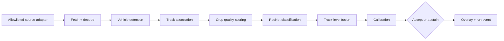

# CarFace: Low-Resolution Multi-Frame Vehicle Recognition

## Evidence status

**Locally validated deterministic profile.** The offline smoke trainer, hash-verified model bundle,
replay inference pipeline, Flask API, telemetry stream, and responsive browser UI are implemented.
Local validation passed 83 Python tests, Ruff, source compilation, one end-to-end smoke
train/package/evaluate run, one 30-frame replay through the live Flask API, and 8 active Playwright
checks across desktop and mobile; 2 viewport-specific checks were skipped as designed.

The smoke trainer and replay classifier are deterministic development fixtures. No ResNet-50
fine-tuning result, real-dataset accuracy, frozen-DETR recall, public-camera behavior, runtime SLO,
or production readiness is claimed.

## Quick start

From this project directory on Windows PowerShell:

```powershell
python -m venv .venv
.\.venv\Scripts\Activate.ps1
python -m pip install --upgrade pip
python -m pip install -e ".[ml,dev]"

Set-Location tests/browser
npm ci
npx playwright install chromium
Set-Location ../..
```

Start the deterministic replay application:

```powershell
python -m roadid.web
```

Open `http://127.0.0.1:5000`, select **Deterministic CarFace replay**, and start a run. The replay
uses the same source, tracking, fusion, decision, privacy-rendering, telemetry, and web boundaries as
the configurable runtime without claiming real-model accuracy.

Run the real TfL snapshot profile after reviewing the source terms:

```powershell
$env:ROADID_SOURCE_CONFIG = "configs/camera_sources.tfl.yaml"
$env:ROADID_INFERENCE_CONFIG = "configs/inference.detr.yaml"
python -m roadid.web
```

This profile polls an explicitly selected official TfL JamCam, runs the pinned pretrained DETR model,
tracks generic vehicles, and pixelates the public display after inference. It reports only `vehicle`;
make and model remain disabled until a calibrated classifier bundle is trained. The first run may
download the DETR checkpoint unless it is already cached.

MIO-TCD and CompCars intake is documented in [`data-manifests/README.md`](data-manifests/README.md).
Both corpora are restricted to non-commercial research use and raw data must not be committed.

Run the offline smoke training and verify the resulting bundle:

```powershell
python scripts/train.py --config configs/train_resnet50.yaml --smoke --output-root artifacts/smoke
$bundle = Get-ChildItem artifacts/smoke/models -Directory | Sort-Object LastWriteTime -Descending | Select-Object -First 1
python scripts/evaluate.py --bundle $bundle.FullName
```

Run the local checks:

```powershell
python -m ruff check src tests scripts
python -m pytest
npm --prefix tests/browser test
```

## Problem statement

**Can several weak, low-resolution views of a moving vehicle be combined to identify its body type, make, and model more reliably than any single frame?**

Traffic and city cameras often capture a vehicle as a small, blurred crop. One frame may preserve only a roofline, wheelbase, window profile, or tail-light shape. A sequence contains complementary views as the vehicle moves through the scene.

CarFace treats the **track**, not the frame, as the unit of evidence:

```text
public or local camera frames
-> detect vehicles
-> associate detections into tracks
-> score crop quality
-> classify usable crops
-> fuse evidence across time
-> calibrate confidence
-> accept body/make/model or abstain
```

The application is not license-plate recognition and does not attempt to identify drivers, passengers, or vehicle owners.

## Product goal

CarFace is a locally hosted Flask application where a user can:

1. Select an approved public traffic camera, a local webcam, or a prerecorded replay.
2. Start a near-real-time inference run.
3. Watch vehicle detections become tracks.
4. Inspect the best low-resolution crops collected for each track.
5. See body-type, make, and model-family confidence update as evidence accumulates.
6. See an explicit abstention when the available pixels do not support a reliable exact model.
7. Inspect the inference pipeline graph as each stage runs, including stage status, duration, warnings, and errors.
8. Export a privacy-safe run report without faces, plates, or long-lived location-linked trajectories.

## Why multi-frame inference

A single crop forces a classifier to guess from incomplete evidence. A moving track provides several observations:

```text
front-left view -> side view -> rear-left view -> rear view
```

Each view may reveal a different cue:

- vehicle proportions and body type;
- grille and headlight arrangement;
- wheelbase and roofline;
- side-window profile;
- rear-light geometry;
- color and trim, when resolution permits.

The first baseline will not generate a super-resolved image and classify that invented detail. Instead, it will classify original crops and fuse their features or logits. Optional restoration can be evaluated later as an ablation, but the accepted prediction must remain traceable to the original observations.

## Recognition hierarchy and abstention

The model should return the deepest label supported by calibrated evidence:

```json
{
  "track_id": "cam-014-track-00047",
  "body_type": {"label": "suv", "confidence": 0.94, "accepted": true},
  "make": {"label": "toyota", "confidence": 0.78, "accepted": true},
  "model_family": {"label": "rav4", "confidence": 0.54, "accepted": false},
  "decision": "ACCEPT_MAKE_ABSTAIN_MODEL",
  "usable_frames": 14,
  "median_crop_size": [18, 31]
}
```

Predictions must be hierarchically consistent. For example, `RAV4` cannot be accepted unless the accepted make is `Toyota`.

Coverage is a controlled output:

- High confidence: accept model family.
- Moderate confidence: accept make, abstain on model.
- Low confidence: accept body type only.
- Insufficient evidence: return `INSUFFICIENT_VISUAL_EVIDENCE`.

## Transfer-learning strategy

CarFace deliberately starts from models trained for broader visual tasks, then adapts them to fine-grained vehicles.

### Vehicle detector

Initial detector: [`facebook/detr-resnet-50`](https://huggingface.co/facebook/detr-resnet-50).

- Pretrained for generic COCO object detection.
- Uses a convolutional ResNet-50 backbone with a DETR detection head.
- Already recognizes broad road-object classes such as cars, trucks, and buses.
- Apache-2.0 model license.

The detector is initially frozen. Fine-tuning it is a separate decision driven by missed-vehicle measurements on target camera feeds.

Before release, detection is measured on a labeled low-resolution camera hold-out and reported by apparent vehicle height. Version 1 requires at least 90% vehicle recall on its named replay/target evaluation profile. If the frozen detector misses more than 10%, detector adaptation remains a release blocker rather than an undocumented future improvement.

### Fine-grained classifier

Transfer backbone: [`microsoft/resnet-50`](https://huggingface.co/microsoft/resnet-50).

- A generic ResNet-50 v1.5 image classifier pretrained on ImageNet-1k at 224 x 224.
- It has learned reusable edges, textures, contours, parts, and object composition from general images, not car-model labels.
- Apache-2.0 model license.
- The ImageNet classifier head will be replaced with CarFace's hierarchical body/make/model heads.

Training proceeds in two stages:

1. Freeze the backbone and train the new hierarchical heads.
2. Unfreeze selected later ResNet stages and fine-tune with a lower learning rate.

This makes the transfer-learning claim measurable: compare a random-init classifier, a frozen ImageNet backbone, and a partially unfrozen backbone on the same held-out tracks.

## Dataset strategy

No single dataset supplies realistic camera tracks, exact make/model labels, and unrestricted redistribution. CarFace therefore uses explicit dataset adapters and records source terms in every manifest.

### Supervised make/model sources

Candidate sources:

- **BoxCars116k:** fine-grained vehicle classes and surveillance-style views. Strong domain match; access and research-use terms must be reviewed before automated download.
- **CompCars surveillance subset:** make/model labels with web and surveillance imagery. Usage terms must be reviewed and accepted separately.
- **Stanford Cars:** 196 fine-grained classes and cleaner imagery. Useful as a reproducible transfer-learning baseline, but weaker as a low-resolution surveillance match.

Dataset files are never committed. Adapters require the user to provide or authorize a local dataset root, and write a manifest containing source, version, license reference, hashes, split, and label mapping.

### Low-resolution curriculum

Clean labeled crops are degraded during training to reproduce camera conditions:

```text
labeled vehicle crop
-> resize vehicle to a sampled apparent height
-> perspective and viewpoint perturbation
-> motion or defocus blur
-> compression artifacts
-> sensor noise
-> illumination/weather shift
-> optional partial occlusion
```

The clean label remains unchanged while the degradation recipe and random seed are recorded.

### Synthetic multi-frame tracks

When a dataset contains isolated labeled images rather than tracks, training constructs short pseudo-tracks from one image using controlled crops, perspective changes, blur, and subpixel shifts. These teach fusion mechanics but are labeled synthetic and evaluated separately from real tracks.

Synthetic variants are created only after the source image is assigned to one split. Their manifests retain the source-image hash, pseudo-track ID, transform sequence, and seed. Synthetic-track scores may support ablations but may not replace the separately reported real-track evaluation.

### Real track adaptation

Candidate tracking sources include CityFlow/AI City, UA-DETRAC, VeRi-776, and other appropriately licensed traffic-camera datasets. Identity annotations can supervise tracking and fusion even when exact model labels are incomplete.

Missing hierarchy labels are masked, not treated as negative classes. A sample with vehicle identity but no exact model label may supervise tracking or body type while contributing no model-family loss.

### Leakage prevention

Split before generating crops or degradations:

```text
vehicle identity or source track
-> train / validation / sealed test ownership
-> crop and degradation generation within that split only
```

Frames, adjacent crops, or synthetic variants from one source vehicle may never cross splits. Camera-disjoint and geography-disjoint evaluations should be reported separately.

## Training pipeline

Training is an offline, explicit Python pipeline. It does not run inside the Flask request process.


Training command after installing the project:

```powershell
python scripts/train.py --config configs/train_resnet50.yaml
```

### Training stages

1. **Inventory:** validate files, labels, licenses, and hashes.
2. **Normalize:** map source-specific labels into body type, make, model family, and optional generation.
3. **Split:** isolate by vehicle identity, track, source camera, and geography where metadata permits.
4. **Degrade:** create deterministic low-resolution samples and record every degradation parameter.
5. **Train frame baseline:** classify one crop at a time.
6. **Train track fusion:** fuse quality-weighted frame embeddings or logits.
7. **Fine-tune backbone:** unfreeze late ResNet stages only after the heads converge.
8. **Calibrate:** fit confidence calibration on validation data only.
9. **Select thresholds:** choose body/make/model abstention thresholds from validation data.
10. **Seal test:** evaluate once after model and thresholds are frozen.
11. **Package:** save weights, processor, label hierarchy, thresholds, metrics, and provenance.

Calibration and thresholds are bound to the validation split and dataset manifest by hash. The bundle loader rejects thresholds produced for a different validation identity. The sealed test split is never accepted as a calibration source.

### Model bundle contract

```text
artifacts/models/<model-version>/
├── classifier/
│   ├── config.json
│   ├── model.safetensors
│   └── preprocessor_config.json
├── labels.json
├── calibration.json
├── thresholds.json
├── training-manifest.json
└── evaluation-report.json
```

The Flask app refuses a bundle when required files, hashes, hierarchy, or versions are inconsistent.

## Real-time inference pipeline

"Real time" has two operating profiles:

- **Near-real-time public snapshots:** poll an authorized camera every 1-10 seconds, depending on provider terms and refresh rate.
- **Live local/replay video:** process frames at a configurable FPS from a local webcam or prerecorded file.



### Inference stages

1. **Source acquisition:** fetch a snapshot, local frame, or replay frame through a typed adapter.
2. **Frame validation:** enforce content type, dimensions, byte limit, timeout, and freshness.
3. **Detection:** identify broad vehicle boxes with the generic detector.
4. **Tracking:** associate boxes over time using motion, overlap, and optional appearance evidence.
5. **Quality scoring:** score resolution, blur, occlusion, exposure, and viewpoint.
6. **Frame classification:** run the fine-grained classifier only on usable crops.
7. **Track fusion:** combine evidence with quality weights and track disagreement.
8. **Calibration:** convert raw confidence into calibrated class confidence.
9. **Decision:** accept the deepest supported hierarchy level or abstain.
10. **Visualization:** render boxes, track IDs, predictions, confidence, and pipeline events.

Version 1 wraps ByteTrack as the production association baseline. A deterministic IoU/centroid double is used only in unit tests. Track configuration declares activation threshold, matching threshold, frame rate, and lost-track buffer. Tracking is evaluated with identity switches and IDF1/HOTA where annotations permit. Stored bounding boxes always use original-frame pixel coordinates, regardless of detector resize.

### Multi-frame fusion baseline

The first implementation uses quality-weighted averaging of frame logits or normalized embeddings. This baseline is inspectable and supports an honest ablation:

```text
latest frame
vs. best-quality frame
vs. average frame predictions
vs. quality-weighted track fusion
```

Temporal attention or a sequence model is optional until measured evidence shows the baseline is insufficient.

Every accepted track result retains a bounded evidence ledger containing crop ID, source frame ID, quality scores, fusion weight, and frame-level prediction. Replaying that ledger must reproduce the fused prediction within numerical tolerance.

## Camera source registry

The web app never accepts an arbitrary remote URL from the browser. That would create licensing ambiguity and an SSRF surface.

A server-owned registry exposes only reviewed adapters:

```yaml
sources:
  - id: replay-demo
    name: Licensed demo replay
    type: replay
    enabled: true

  - id: local-camera-0
    name: Local webcam
    type: local_camera
    device_index: 0
    enabled: false

  - id: tfl-jamcam
    name: Transport for London JamCam catalog
    type: tfl_jamcam
    enabled: false
    terms_url: https://tfl.gov.uk/corporate/terms-and-conditions/transport-data-service
```

Implemented adapters:

| Adapter | Purpose | Default status |
|---|---|---|
| `replay` | Guaranteed, deterministic demo and integration tests | Enabled |
| `local_camera` | User-owned live camera | Opt-in |
| `tfl_jamcam` | Candidate official public traffic-camera catalog through TfL APIs | Disabled until API access and image-use terms are validated |
| `snapshot_http` | Administrator-configured still-image endpoint | Disabled; allowlist only |
| `mjpeg` / `hls` | Administrator-configured stream | Optional after transport tests |

Each provider record stores attribution, terms URL, camera ID, refresh expectation, location precision policy, and whether frame caching is permitted. CarFace does not scrape Google Maps, arbitrary webcam directories, or web pages.

## Flask web application

The locally hosted Flask app is the operational surface for inference and review.

Start command:

```powershell
python -m roadid.web
```

Then open `http://127.0.0.1:5000`.

### Main view

The first screen is the working application, not a landing page:

```text
┌───────────────────────────────┬──────────────────────────────┐
│ Live/replay camera            │ Active tracks                │
│ Boxes + IDs + predictions     │ Track, evidence, confidence  │
│                               │ accept/abstain state          │
├───────────────────────────────┼──────────────────────────────┤
│ Inference pipeline graph      │ Selected track evidence      │
│ stage status + duration       │ best crops + hierarchy       │
└───────────────────────────────┴──────────────────────────────┘
```

Controls:

- source selector populated from `/api/sources`;
- start, pause, resume, and stop;
- processing FPS and confidence profile;
- tracked-vehicle list;
- selected-track evidence strip;
- body/make/model confidence with abstention reason;
- privacy-safe export.

The UI does not expose arbitrary URLs or credentials.

## Graphical execution trace

Every inference run emits structured pipeline events. The browser receives them over Server-Sent Events and updates a persistent directed graph.

```json
{
  "run_id": "run-20260813-001",
  "sequence_id": 1184,
  "frame_id": 184,
  "track_id": "track-47",
  "stage": "track_fusion",
  "status": "completed",
  "started_at": "2026-08-13T12:00:01.120Z",
  "duration_ms": 8.4,
  "input_summary": {"usable_crops": 14},
  "output_summary": {"accepted_level": "make"},
  "warning": null
}
```

`sequence_id` is monotonic within one run and is the ordering authority for SSE clients and JSONL exports. Timestamps are descriptive, not ordering keys.

Graph states:

- pending;
- running;
- completed;
- skipped;
- warning;
- failed.

Run states are separate from stage states:

```text
PENDING -> RUNNING -> PAUSED -> RUNNING
PENDING/RUNNING/PAUSED -> STOPPED
RUNNING -> COMPLETED
PENDING/RUNNING/PAUSED -> FAILED
```

Pause stops source consumption. Version 1 retains at most one replaceable pending frame, so it does not build an unbounded queue while paused. Stop is idempotent and terminal.

Selecting a graph node reveals its latest frame-level and track-level event, measured duration, model version, and bounded diagnostic details. Raw credentials, full remote URLs, faces, and plate text never enter event payloads.

Implemented endpoints:

| Endpoint | Method | Purpose |
|---|---|---|
| `/api/status` | GET | Model, device, and worker readiness |
| `/api/sources` | GET | Reviewed camera/source catalog |
| `/api/runs` | POST | Start an inference run from a source ID |
| `/api/runs/<run_id>` | GET | Current run state and summary |
| `/api/runs/<run_id>/events` | GET | SSE execution events |
| `/api/runs/<run_id>/stop` | POST | Stop a run cleanly |
| `/api/runs/<run_id>/tracks` | GET | Current track predictions |
| `/api/tracks/<track_id>` | GET | Evidence and prediction history |
| `/api/runs/<run_id>/report` | GET | Privacy-safe JSON report |

## Package structure

```text
projects/low-resolution-vehicle-recognition/
├── README.md
├── plan.md
├── pyproject.toml
├── requirements.txt
├── .env.example
├── configs/
│   ├── train_resnet50.yaml
│   ├── inference.yaml
│   └── camera_sources.example.yaml
├── scripts/
│   ├── prepare_dataset.py
│   ├── train.py
│   ├── evaluate.py
│   └── run_web.py
├── src/roadid/
│   ├── contracts.py
│   ├── training/
│   ├── inference/
│   ├── sources/
│   ├── telemetry/
│   └── web/
├── templates/
├── static/
├── tests/
└── artifacts/                 # ignored runtime output
```

## Evaluation

CarFace evaluates the full product, not only frame classification.

### Perception and tracking

- vehicle detection precision/recall and mAP;
- track HOTA, IDF1, or identity-switch count;
- usable-crop yield per track;
- duplicate track rate.

### Fine-grained recognition

- body-type top-1 accuracy;
- make top-1 and top-5 accuracy;
- model-family top-1 and top-5 accuracy;
- hierarchical consistency rate;
- frame-level versus track-level improvement;
- accuracy by apparent vehicle height, blur, viewpoint, weather, and camera;
- calibration error and negative log likelihood;
- selective accuracy at body/make/model coverage thresholds.

Primary product metric:

> At a fixed accepted coverage, how accurate are the accepted make and model predictions?

A second required metric is the improvement of quality-weighted track fusion over the best single frame.

### Runtime

- source fetch latency;
- detector latency;
- tracker latency;
- classifier latency;
- fusion latency;
- end-to-end frame latency;
- achieved processing FPS;
- dropped or stale frames;
- CPU/GPU memory.

## Privacy, security, and responsible use

CarFace is designed for vehicle-category research, not person or owner identification.

Required safeguards:

- no license-plate OCR;
- no face recognition;
- blur visible plates and faces in the browser and exports;
- do not retain raw public-camera frames by default;
- retain short track crops only when explicitly enabled for debugging;
- avoid precise location in exported reports unless the source terms and use case allow it;
- permit only server-side allowlisted sources;
- reject private-network and loopback URLs for remote adapters;
- enforce fetch timeouts, byte limits, content types, redirect limits, and DNS/IP checks;
- preserve provider attribution and terms references;
- document dataset and model licenses in generated manifests;
- present confidence and abstention rather than forced identity claims.

## Scope boundaries

### Version 1 implementation

- deterministic severe-degradation training;
- lazy wrappers and configuration for a generic HF detector and ImageNet-pretrained ResNet-50;
- a tiny local hierarchical classifier for offline pipeline validation;
- track-level quality-weighted fusion;
- calibration and abstention;
- replay and local-camera sources;
- one candidate public-camera adapter behind a disabled feature flag;
- Flask UI with live overlays, tracks, evidence, and execution graph;
- unit, integration, model-contract, and browser tests.

The real-model release profile still requires a licensed dataset, a fine-tuned ResNet-50 bundle,
locally cached DETR weights, detector recall measurements, real-track fusion results, privacy-redactor
coverage, and named hardware latency measurements.

### Version 1 will not claim

- reliable exact model-year identification from every low-resolution crop;
- unrestricted use of public camera imagery;
- license-plate, owner, driver, or passenger identification;
- forensic certainty;
- universal performance across cities, weather, or camera hardware;
- production surveillance readiness;
- that generated super-resolution detail is factual evidence.

## Suggested improvements built into the design

1. **Track-level classification instead of snapshot guessing.** Several weak views are more defensible than one enlarged crop.
2. **Hierarchical prediction and abstention.** The app can accept body type or make while withholding unsupported model detail.
3. **Raw-crop evidence remains primary.** Optional restoration is an ablation, not the source of truth.
4. **Camera adapters, not scraping.** Sources are reviewed, typed, attributed, and allowlisted.
5. **A replay mode is mandatory.** The project remains demoable when a public feed is offline or changes terms.
6. **Training and inference are separate processes.** Training produces a validated bundle; Flask performs bounded inference only.
7. **Execution is visible.** Every stage emits a structured event rendered in the browser graph.
8. **Evaluate by resolution and coverage.** Aggregate accuracy alone would hide the project's central limitation.
9. **Start with a strong transparent fusion baseline.** Add temporal attention only if measured evidence justifies it.
10. **Protect privacy by design.** Plates and faces are excluded rather than treated as future features.

## Success criteria

The first implementation is complete when it can demonstrate, with retained evidence:

- reproducible dataset manifests and identity-safe splits;
- a transfer-learned ResNet bundle loaded from a clean process;
- calibrated hierarchical predictions with an explicit abstention path;
- calibration and threshold artifacts cryptographically bound to the validation and dataset manifests;
- track fusion outperforming the best-frame baseline on the held-out track set;
- real-track results reported separately from synthetic pseudo-track results;
- at least 90% frozen-detector vehicle recall on the named low-resolution release profile, or detector adaptation retained as a documented release blocker;
- at least one real or replay camera source running through the same adapter interface;
- a Flask UI showing live detections, tracks, evidence, and the graphical execution path;
- clean stop/restart behavior and bounded source failures;
- tests for source security, model contracts, hierarchy, SSE ordering, and web workflows;
- documented licenses, limitations, and measured CPU/GPU runtime.
