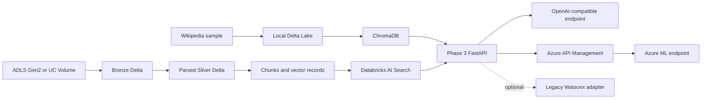

# RAG Knowledge Pipeline

This project separates document ingestion, vector indexing, and query serving into three independently runnable phases. It has two data-plane modes behind shared contracts:

- `local`: Wikipedia sample data to local Delta Lake, ChromaDB retrieval, and a caller-supplied OpenAI-compatible generation endpoint.
- `remote`: governed files in ADLS Gen2 or a Unity Catalog volume to Bronze/Silver/Gold Delta tables, Databricks AI Search, and a provider-neutral Azure ML, API Management, or Foundry generation endpoint.

Watsonx is not part of the default architecture. A lazy-loaded `watsonx_legacy` generation adapter remains available for existing users and is isolated from local, Databricks, and Azure configuration.

## Architecture



Phase 3 consumes normalized retrieval records. It does not import phase 1, phase 2, or Riverside implementation modules. The local Chroma adapter maps legacy `id` and `title` metadata to the serving subset. Remote retrieval first reconstructs and validates a complete `vector_index_record` v1 object, then rechecks tenant, ACL, region, classification, and deletion state after Databricks filtering.

The canonical v1 schemas live in [`../riverside-ai-platform/contracts/`](../riverside-ai-platform/contracts/). The relevant boundaries are:

- `parsed-document.schema.json` between remote ingestion and vectorization;
- `document-chunk.schema.json` and `vector-index-record.schema.json` between vectorization and retrieval;
- `app-chat-completion-request.schema.json`, `app-chat-completion-response.schema.json`, and `citation.schema.json` at the application API.

### Phase 3 contract pin

Phase 3 vendors the minimum frozen schema resources under [`shared/contracts/riverside-v1/`](shared/contracts/riverside-v1/) and identifies the adapter as `riverside-vector-index-record-v1@1.0.0`. This is a version-pinned copy, not a runtime import or path dependency on Riverside. Contract upgrades require an explicit replacement of the vendored resources and corresponding adapter tests.

Databricks AI Search returns flattened index columns. [`shared/vector_contract_v1.py`](shared/vector_contract_v1.py) reconstructs the closed v1 object before serving uses it. Validation rejects missing or malformed ACL fields, tenant/region/classification fields, deletion state, parent/source lineage, ingest/index timestamps, pipeline/index versions, embedding provenance, content hashes, and vectors. It also enforces the application invariants that parent and document IDs agree, content hashes match, vector length equals the declared dimensions, and vector values are finite. A malformed candidate fails the retrieval request; it is never silently treated as authorized or converted through attribute duck typing.

The local Chroma path remains compatible with its pre-v1 metadata. Its adapter emits deterministic development-only values and sets `lineage_kind` to `synthetic-local`; the `urn:riverside:local:*` URI, `legacy-local` source version, `0.1.0-legacy-local` index version, and epoch timestamp are synthetic compatibility markers, not production provenance.

## Capability Ledger

| Capability | Local mode | Remote mode | Evidence and limits |
|---|---|---|---|
| Ingestion | Implemented for the configured Wikipedia sample | Implemented for ADLS/Unity Catalog volume files: text, Markdown, JSON, HTML, PDF, and DOCX | Remote parsing, quarantine, deduplication, lineage, quality gates, and tombstones have source and local test coverage. No Databricks workspace run was performed. |
| Durable data | Local Delta table | Bronze, parsed-document Silver, quarantine, and quality-report Delta tables | Remote table creation and merge semantics are statically authored, not validated against a live Unity Catalog. |
| Vectorization | Sentence Transformers to ChromaDB | Pinned Databricks embedding endpoint to chunk/vector contract tables and Direct Vector Access index | Remote dimensions and immutable index version are required. Endpoint availability and model revision compatibility are unvalidated in cloud. |
| Retrieval | Similarity or MMR over ChromaDB | Similarity search with backend filters plus fail-closed application checks | Local records predate v1 and receive synthetic `urn:riverside:local:*`, `legacy-local`, and `0.1.0-legacy-local` values. They are not production lineage evidence. |
| Generation | OpenAI-compatible HTTP endpoint at `http://host.docker.internal:8001` by default | Managed-identity calls to APIM, Azure ML, or Foundry | The repository does not ship a local model server. Azure authentication, routing, quotas, and response behavior have not been exercised here. |
| Application API | Legacy `/query` and non-streaming `/v1/chat/completions` | Same routes and response models | Streaming requests return `501`; the streaming v1 schema is not implemented by this serving project. |
| Citations | Emitted only when generation returns valid `<cite:chunk_id>` markers | Same | Missing or invented markers are removed from citation output; no claim of citation quality is made without evaluation. |
| Authorization | Fixed synthetic `local` tenant/region and `public` classification | Trusted APIM-forwarded headers plus Databricks and application-side filtering | Direct remote exposure is unsafe unless networking prevents header spoofing and APIM overwrites the trusted headers. |
| Legacy provider | Optional `watsonx_legacy` | Optional `watsonx_legacy` | Not selected by either example and not required by the default architecture. Install `phase3-serve/requirements-legacy-watsonx.txt` to enable it. |

## Configuration

[`config.yaml`](config.yaml) is the local default. [`config.remote.example.yaml`](config.remote.example.yaml) is a complete non-secret Databricks plus APIM example.

Both files reference the Databricks deployment-owned values rather than containing URL-like examples:

```yaml
remote:
  workspace_url: ${DATABRICKS_HOST}
  vector_search_endpoint: ${RIVERSIDE_VECTOR_SEARCH_ENDPOINT}
```

Set both environment variables before loading a remote configuration. The loader fails closed if either reference remains unresolved or if a literal YAML/programmatic value differs from its environment value. `DATABRICKS_HOST` is the workspace base URL consumed by Databricks authentication; `RIVERSIDE_VECTOR_SEARCH_ENDPOINT` is the AI Search endpoint name. Neither value is a credential, but both are deployment-specific and intentionally absent from committed examples.

The two independent selectors are:

```yaml
mode: local  # local | remote
serving:
  retrieval:
    provider: auto  # resolves to local or databricks from mode
  generation:
    provider: openai_compatible  # openai_compatible | azure_endpoint | watsonx_legacy
```

For `azure_endpoint`, `serving.generation.endpoint.provider` is one of `apim`, `azure_ml`, or `foundry`. Azure URLs must use HTTPS and `token_scope` must be an Entra scope ending in `/.default`. API keys, tokens, connection strings, passwords, and client secrets are rejected when present in YAML.

Use environment or workload identity for credentials. [`.env.example`](.env.example) lists credential and ingestion variable names but no secrets; the deployment-specific Databricks values are documented above. Remote ingestion also requires:

- `RIVERSIDE_INGEST_SOURCE_URI`
- `RIVERSIDE_INGEST_TENANT_ID`
- `RIVERSIDE_INGEST_REGION`
- `RIVERSIDE_INGEST_CLASSIFICATION`

Remote serving expects these headers from a trusted gateway:

- `X-Riverside-Tenant-ID`
- `X-Riverside-Region`
- `X-Riverside-Classifications`
- optional `X-Riverside-Principal-ID`
- optional `X-Riverside-Group-IDs`

Request retrieval filters may narrow the trusted region, classifications, and source version. They cannot widen the trusted authorization scope.

## Local Development

The local data path remains:

```text
Wikipedia sample -> local Delta Lake -> ChromaDB -> phase 3
```

The Make targets remain available:

```bash
make local-setup
make local-ingest
make local-vectorize
make local-serve
```

Before starting phase 3, run an OpenAI-compatible model endpoint at the URL in `serving.generation.endpoint`. Docker uses `host.docker.internal:8001` by default. A bearer token can be supplied through an environment variable named by `bearer_token_env_var`; the token itself must not appear in YAML.

The local path is a development substitute, not an Azure emulator. It does not model Unity Catalog governance, Databricks AI Search filters, Entra identity, APIM policy, Azure ML readiness, private networking, autoscaling, throttling, regional capacity, or cloud cost.

## Databricks Data Plane

Remote ingestion assets are under [`databricks/ingestion/`](databricks/ingestion/). Remote indexing assets and operational notes are under [`databricks/indexing/`](databricks/indexing/).

The remote phase 1 implementation:

1. discovers binary files from ADLS or a Unity Catalog volume;
2. creates raw-document v1 records and quarantines parse failures;
3. deduplicates by governed document/version/content identity;
4. merges Bronze and parsed Silver Delta records;
5. persists quality evidence and fails configured quality thresholds.

The remote phase 2 implementation:

1. reads parsed-document v1 rows;
2. creates versioned chunks and embeddings;
3. merges document-chunk and vector-index-record v1 rows;
4. creates or updates a fixed-schema Direct Vector Access index;
5. removes stale/tombstoned IDs and writes durable quality/evaluation reports.

Changing the embedding revision, dimensions, index schema, or security metadata requires a new `index_version` and index. Do not mutate an existing production index contract in place.

## Serving API

`POST /query` preserves the original response shape:

```json
{
  "answer": "...",
  "question": "...",
  "sources_count": 6
}
```

`POST /v1/chat/completions` accepts the frozen Riverside request contract and returns normalized usage, citations, trace metadata, and deployment metadata. It currently supports non-streaming requests only.

The service exposes `/health` and `/status`, but a healthy process is not proof that remote identity, index permissions, APIM routing, or model capacity are correct.

## Validation Status

Validated locally on 2026-08-05: 55 tests passed, with 2 expected skips because
Delta dependencies were not installed. No Docker, Databricks workspace, Azure CLI,
cloud test, or live Azure/Databricks validation was run. These results establish
local source behavior only; they do not establish production readiness.

Static test source is under [`phase3-serve/tests/`](phase3-serve/tests/). A later authorized validation pass can run:

```bash
python -m pytest phase3-serve/tests/test_contract_adapters.py phase3-serve/tests/test_config.py
```

Those tests cover complete flattened-record normalization, missing security and lineage fields, malformed ACL JSON, non-active deletion state, environment-only Databricks deployment values, and deterministic synthetic local lineage. The two skips are the expected missing-Delta cases, not cloud validation.

Cloud behavior remains unvalidated, including Azure RBAC, managed identity token audiences, APIM header overwrite and policy order, Databricks filter syntax in the selected endpoint type, model-serving payload compatibility, quota, regional availability, private networking, latency, deletion propagation, and cost. Treat [`config.remote.example.yaml`](config.remote.example.yaml) as a statically validated template, not deployment evidence.# RAG Knowledge Pipeline

## Problem statement

**Can a fully local, containerised pipeline ingest an arbitrary text corpus, build a vector index, and serve accurate retrieval-augmented answers — with each stage independently deployable and replaceable?**

Most RAG demos are single-script prototypes: one file, one vector store, one LLM call. Real production systems need the ingest, vectorisation, and serving stages to be independently scalable, observable, and replaceable. This project builds that separation explicitly, using Delta Lake as the durable intermediate store between ingest and vectorisation, and ChromaDB as the vector store backing a FastAPI RAG server.

**Constraints we set for ourselves:**
- Each pipeline phase must be independently runnable (local venv or Docker) with no dependency on the other phases at runtime
- Durable intermediate storage between stages — not in-memory hand-offs
- The serving layer must not know anything about how the corpus was ingested or embedded

**Result:** A three-phase containerised pipeline (Wikipedia corpus → Delta Lake → ChromaDB → FastAPI RAG server) where each phase can be developed, tested, and deployed independently.

## Architecture

```
┌─────────────┐      ┌──────────────┐      ┌─────────────┐
│  Raw corpus │──1──▶│  Delta Lake  │──2──▶│  ChromaDB   │
│ (Wikipedia) │      │   (ACID)     │      │  (Vectors)  │
└─────────────┘      └──────────────┘      └──────┬──────┘
                                                   │ 3
                                                   ▼
                                            ┌─────────────┐
                                            │ RAG Server  │
                                            │  (FastAPI)  │
                                            └─────────────┘
```

| Phase | Input | Output | Key tech |
|---|---|---|---|
| **1 — Ingest** | Raw Wikipedia articles | Delta Lake parquet | PySpark, delta-spark |
| **2 — Vectorise** | Delta Lake | ChromaDB collection | sentence-transformers, chromadb |
| **3 — Serve** | ChromaDB + LLM | HTTP RAG responses | FastAPI, LangChain |

## Quick start

### Local (no Docker)

```bash
make local-setup    # creates venvs for all three phases
make local-ingest   # Phase 1: corpus → Delta Lake
make local-vectorize # Phase 2: Delta Lake → ChromaDB
make local-serve    # Phase 3: start FastAPI server
# or run all at once:
make local-full
```

### Docker

```bash
make docker-build   # build all three images
make docker-run     # run the complete pipeline
# or individually:
make docker-ingest && make docker-vectorize && make docker-serve
```

All phases share a mounted data volume. Delta Lake → ChromaDB communication happens through persisted storage, not in-memory.

## Project structure

```
rag-knowledge-pipeline/
├── phase1-ingest/          # corpus → Delta Lake
│   ├── Dockerfile
│   ├── requirements.txt
│   └── src/ingest.py
├── phase2-vectorize/       # Delta Lake → ChromaDB embeddings
│   ├── Dockerfile
│   ├── requirements.txt
│   └── src/vectorize.py
├── phase3-serve/           # FastAPI RAG query server
│   ├── Dockerfile
│   ├── requirements.txt
│   └── src/server.py
├── shared/                 # cross-phase config utilities
├── data/                   # shared volume mount point
├── docker-compose.yml
└── Makefile
```

## Limitations

The corpus is a static Wikipedia snapshot — there is no incremental update mechanism. Embedding quality is bounded by the chosen sentence-transformer model (no fine-tuning). The LLM used for generation is a local model via LangChain; answer quality depends entirely on what fits in the available compute budget.
