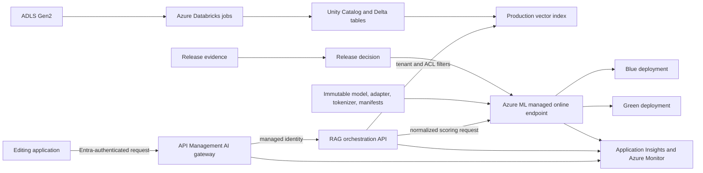

# Riverside AI Platform Architecture

## Status and claim boundary

This document describes the intended Azure production composition for Riverside
House. It is an architecture target, not a statement that the platform is
production ready.

Use these evidence classes throughout the documentation:

| Class | Meaning |
|---|---|
| Implemented source asset | The named file exists in the repository and can be inspected. Existence does not prove that it runs. |
| Static validation | A schema, fixture, policy, source test, or IaC check has run without using a live Azure data plane. Record the command, commit, and output before making this claim. |
| Modeled assumption | A sizing, reliability, security, cost, or service interaction assumption used to design the production profile. It is not measured evidence. |
| Live Azure validation required | The claim needs an authorized Azure environment, representative data and traffic, retained output, and an identified reviewer. |

As of 2026-08-05, implemented Riverside source assets include:

- Draft 2020-12 schemas and fixtures under [`../contracts/`](../contracts/) and
   [`../tests/fixtures/`](../tests/fixtures/);
- artifact verification, endpoint-client, RAG-orchestration, release-gate, and
   telemetry libraries under [`../src/`](../src/), with unit/contract tests;
- versioned evaluation inputs under [`../evaluations/`](../evaluations/);
- Azure ML endpoint, environment, blue/green deployment, scoring, sample, and
   rollout definitions under [`../azureml/`](../azureml/);
- APIM OpenAPI, backend, policy-fragment, and parameter assets under
   [`../apim/`](../apim/);
- staged Locust/Azure Load Testing assets and a result normalizer under
   [`../load-tests/`](../load-tests/);
- modular Bicep plus `azure.yaml` under [`../infra/`](../infra/) and the project
   root, including an internal Container Apps environment, RAG Container App,
   Entra-only ACR, managed identity, diagnostics, probes, and bounded scale source.

The Databricks data project now contains remote ingestion and Direct Vector Access
indexing source, bundles, and tests. The Riverside non-cloud suite passed 142 tests
with 5 cloud tests deselected, and the offline preflight passed 9 tests. No cloud
test, build, deployment, Bicep, `azd`, Azure CLI, Databricks job, or load command
was run, and no live Azure or Databricks evidence is linked here.

## System context

Riverside House needs grounded editorial assistance over authorized manuscript
content while preserving model and document lineage. The production boundary
starts when governed data-plane records and an immutable model release are made
available to the serving project. Training and ingestion implementation remain
outside this project.

The default model backend is an Azure Machine Learning managed online endpoint
because the source artifacts are a custom SmolLM2 base-plus-adapter release.
Microsoft Foundry Models may be added later behind the same application contract;
it is not the default or an implemented backend.

The RAG API target is an Azure Container App whose managed environment uses a
delegated subnet and internal load balancer. App ingress is VNet-facing through
that private load balancer, and APIM is the intended caller over approved private
routing and DNS. The Container App uses the
platform user-assigned identity for ACR pull, Databricks, and Azure ML token
acquisition. These are inspectable source properties, not deployed evidence.

## Ownership and integration boundaries

| Boundary | Owner | Contract exchanged | Prohibited coupling |
|---|---|---|---|
| Fine-tuning provenance | `checkpoints/` and the fine-tuning learning arc | Immutable release manifest references the unchanged experiment manifest | Serving must not rewrite a training manifest or promote an artifact because it exists. |
| Governed ingestion and indexing | `projects/rag-knowledge-pipeline/` remote production path | Raw document, parsed document, chunk, and vector-index v1 records | Serving must not import ingestion implementation. |
| Azure serving composition | `projects/riverside-ai-platform/` | Application API, deployment metadata, release report, and telemetry v1 contracts | Clients must not select physical deployments or supply authorization filters. |
| Operational concepts | `learning/ai-infrastructure/09-azure-operational-llm-serving/` | Copied/generated fixtures and the same logical contracts | Notebook code is not production source; all 13 code cells executed successfully locally and were then cleared, producing `HOLD_LOCAL_RELEASE` and `HOLD_AZURE_PROMOTION` from p95 gates. Local results do not validate Azure behavior. |

The RAG project preserves a local prototype that writes a local Delta table, builds
a Chroma collection, and serves a Watsonx-bound `/query` API. It now also contains
separate remote Databricks ingestion and indexing implementations that emit v1
records, carry governance/deletion lineage, create durable quality reports, and
target a Direct Vector Access index with fail-closed filters. Those are implemented
source assets with cloud-free tests; no Databricks bundle, Spark job, identity,
Unity Catalog table, embedding endpoint, AI Search index, or deletion behavior was
live-validated in this task. The local `/query` server remains outside the v1
`/v1/chat/completions` production boundary.

## Production profiles

The configuration contract permits only `dev`, `staging`, and `production`.
There is no local deployment profile.

| Profile | Purpose | Data | Traffic | Promotion authority |
|---|---|---|---|---|
| `dev` | Azure integration and contract smoke tests | Synthetic or approved non-customer data | Engineering only | No production promotion |
| `staging` | Release candidate evaluation, cloud smoke, bounded load, shadow, and rollback rehearsal | Representative approved evaluation data | Test and approved mirrored traffic | Release approver may authorize canary preparation |
| `production` | Customer workload | Governed customer data under tenant, ACL, region, classification, retention, and deletion controls | APIM-mediated client traffic | Named release approver plus change authority |

The exact subscriptions, resource groups, regions, SKUs, quotas, network topology,
and retention settings are environment inputs that have not been committed. A
profile is not deployable until those values, the generated what-if evidence, and
the required approvals are attached to a change record.

## Request path

1. API Management authenticates the client with Microsoft Entra ID, applies
   request and token bounds, assigns correlation context, and rejects unsupported
   routes or policies.
2. API Management authenticates to the RAG backend with managed identity. No API
   key is part of the environment contract.
3. The orchestrator derives tenant and authorization context from the trusted
   identity. It never accepts client-supplied tenant or ACL filters.
4. Retrieval queries one immutable `index_version` and enforces tenant, ACL,
   region, classification, and deletion state before content is returned.
5. The orchestrator builds a bounded model request and calls the stable model
   alias. The alias resolves to blue/green deployment traffic at the Azure ML
   endpoint.
6. The response uses the streaming or non-streaming v1 schema, including normalized
   usage, content-free citation lineage, trace metadata, and deployment metadata.
7. Metrics use only the allowlisted bounded-cardinality attributes. Prompts,
   completions, document text, source URIs, user IDs, request IDs, tenant IDs, and
   document/chunk IDs are excluded from metric labels.

The host duplicates APIM's 1 MiB body limit at the ASGI receive boundary and
requires telemetry, index readiness, profile/environment/region agreement, and
dependency deadlines shorter than the application and gateway deadlines. Startup
fails closed when runtime composition or dependency readiness fails.

This path is modeled. Live Azure validation must prove token acquisition, RBAC,
network reachability, filter enforcement, timeout behavior, streaming semantics,
and telemetry redaction end to end.

## Release path

1. Register immutable base, adapter, tokenizer, and unchanged training-provenance
   artifacts; compute digests outside the release manifest.
2. Verify model profile, precision, runtime interface, artifact digests, source
   commit, and release-report binding.
3. Produce a release report containing all eight required domains: data quality,
   retrieval quality, generation and citation quality, adaptation evidence, safety
   and authorization, operational SLOs, cost, and rollout comparison.
4. Reject promotion when a required metric fails, evidence is missing, the report
   and manifest disagree, or the decision is `hold` or `reject`.
5. Deploy the candidate to the inactive slot, verify readiness after artifact
   validation and warm-up, run cloud smoke and bounded load, then progress through
   shadow, canary, and broad rollout.
6. Retain the release manifest, report, deployment metadata, traffic changes,
   observations, approvals, and rollback target as one auditable evidence set.

Artifact validation, release-gate, evaluation, Azure ML, APIM, load-test, and IaC
source assets implement substantial parts of this path. The non-cloud suite and
offline preflight passed locally, but no retained authorized Azure deployment
proves the composed path. Cloud tests and live Azure/Databricks validation remain
outstanding.

## Failure containment

- APIM rejects invalid, unauthorized, over-limit, and policy-violating requests
  before model work begins.
- Retries are bounded to the config contract maximum of three and apply only to
  retry-safe failures within the request deadline. Overload responses carry a
  bounded `retry_after_seconds` value.
- The orchestrator returns normalized errors without backend exception text,
  credentials, or internal resource identifiers.
- Blue and green are independent release targets. Traffic changes are the primary
  model rollback mechanism; a data rollback selects a previously retained index
  version rather than mutating records in place.
- Readiness depends on release verification and warm-up. A process being alive is
  not sufficient evidence that it may receive traffic.
- Multi-region active-active is deferred. The initial modeled failure domain is
  one approved Azure region, so regional recovery objectives remain unproven.

## Availability and observability model

No SLO is committed yet. Candidate SLOs and alert thresholds must be derived from
business requirements, baseline measurements, bounded-load results, service-tier
capabilities, and an approved error budget. At minimum, evidence must separate:

- availability and deadline success;
- p50 and p95 time to first token, time per output token, and total latency;
- throughput and successful output tokens per second;
- rejection, timeout, backend-failure, and recovery rates;
- retrieval and citation quality by approved low-cardinality slice;
- cost per successful request and successful output token;
- current release ID, deployment slot, index version, runtime version, and source
  commit.

Azure Monitor and Application Insights behavior, retention, sampling, alerting,
and dashboard correctness all require live validation. The telemetry schema proves
only the intended attribute allowlist.

## Architecture evidence required before production use

| Claim | Minimum retained evidence |
|---|---|
| Artifacts are immutable and compatible | Digest verification, registry URI, runtime compatibility result, manifest/report binding, source commit |
| Authorization prevents cross-tenant retrieval | Negative tenant/ACL tests against the deployed index plus identity and role-assignment review |
| Private path is enforced | Resource configuration export and positive/negative network tests from approved and denied origins |
| Candidate meets quality gates | Machine-readable release report with versioned datasets/evaluators and reviewer approval |
| Candidate meets operational gates | Cloud smoke, bounded-load report, test-engine health, deployment logs, and metric queries |
| Rollback is viable | Timed staging rehearsal that restores prior traffic and index version without schema or citation regression |
| Capacity is sufficient | Regional quota evidence, SKU availability, concurrency/queue measurements, autoscale behavior, and headroom calculation |
| Cost is acceptable | Azure Cost Management export reconciled with successful requests/tokens and non-serving fixed costs |
| Residency requirements are met | Approved service/region matrix, data-flow review, diagnostic destinations, backup/replication settings, and vendor feature review |

Until these artifacts exist for a specific release and environment, the
architecture remains a production design with unvalidated Azure assumptions.
